<div align="center">


# 📊 CSV Sales Analyzer

**A Java Swing desktop application to read, process and analyze sales data from CSV files — with full Software Engineering documentation.**

<br>


<br>

🌐 **Choose Language / Selecione o idioma / Elija su idioma**

[](README.md)
[](README_PT.md)
[](README_ES.md)

</div>

---

## 📖 About the Project

> **CSV Sales Analyzer** is a desktop tool built in **Java** with a **Java Swing** GUI, developed as part of an Object-Oriented Programming (OOP) course assignment.

The application lets the user load a `.csv` file containing sales records and automatically processes the data to display relevant business analytics: **revenue per store**, the **best-selling product**, and a raw preview of the file contents. The project is managed with **Apache Maven** and follows the package `aula02.aplicacaoloja`.

This README also documents the **full Software Engineering artifact set** produced for this project — requirements, use cases, UML diagrams, data models, DFDs, architecture, personas and wireframes — click each section below to expand it.

---

## 🛠️ Tech Stack

| Technology | Role in the Project |
|:-----------|:---------------------|
| **Java 21+** | Core language — reading, processing and analyzing the data. |
| **Java Swing** | Desktop GUI (`JFrame`, `JFileChooser`, `JTextArea`, `JMenuBar`). |
| **Apache Maven** | Project, dependency and build lifecycle management. |

---

## 📚 Table of Contents

> Click any link below to jump to a section, then click the section title to expand/collapse it.

| # | Section |
|:-:|:--------|
| 1 | [📋 Requirements](#1-requirements) |
| 2 | [🧩 Use Cases](#2-use-cases) |
| 3 | [🔗 Requirements Traceability Matrix](#3-requirements-traceability-matrix) |
| 4 | [📄 Software Requirements Specification (SRS)](#4-software-requirements-specification-srs) |
| 5 | [🗺️ UML & Structural Diagrams](#5-uml--structural-diagrams) |
| 6 | [🗄️ Data Model & Data Dictionary](#6-data-model--data-dictionary) |
| 7 | [🔄 Data Flow Diagram (DFD)](#7-data-flow-diagram-dfd) |
| 8 | [🏗️ Architecture Diagram & Flowchart](#8-architecture-diagram--flowchart) |
| 9 | [👤 Persona & User Journey Map](#9-persona--user-journey-map) |
| 10 | [🎨 Wireframes & Mockups](#10-wireframes--mockups) |

---

<details>
<summary><h2>1. Requirements 📋</h2></summary>

### ✅ Functional Requirements (FR)

| ID | Description |
|:---|:------------|
| **FR01** | The system shall allow the user to select a `.csv` file via a file chooser dialog (*File → Browse...*). |
| **FR02** | The system shall read and parse a `;`-delimited CSV file, skipping the header row. |
| **FR03** | The system shall display the raw content of the CSV file in a text area (*File → Open...*). |
| **FR04** | The system shall calculate the total revenue (`quantity × unit price`) per store. |
| **FR05** | The system shall display the revenue of up to 4 distinct stores in separate fields. |
| **FR06** | The system shall identify the product with the highest total quantity sold across all rows. |
| **FR07** | The system shall display the best-selling product's name and total quantity sold. |
| **FR08** | The system shall provide a **CLEAR** action that resets all result fields and the preview area. |
| **FR09** | The system shall provide an **Exit** action (*File → Exit*) that terminates the application. |
| **FR10** | The system shall provide a **Save** action (*File → Save*) as a legacy/extra menu item. |

### ⚙️ Non-Functional Requirements (NFR)

| ID | Category | Description |
|:---|:---------|:------------|
| **NFR01** | Usability | The GUI must be menu-driven, with keyboard shortcuts (`Ctrl+P`, `Ctrl+A`, `Ctrl+S`, `Esc`). |
| **NFR02** | Portability | The application must run on any OS with **JDK 21+** installed (cross-platform Swing). |
| **NFR03** | Performance | The CSV must be processed in a single pass (`O(n)`) entirely in memory. |
| **NFR04** | Maintainability | The codebase must be organized as a Maven project under package `aula02.aplicacaoloja`. |
| **NFR05** | Reliability | I/O errors must be caught and reported to the user via `JOptionPane` dialogs. |
| **NFR06** | Encoding | CSV files should use **UTF-8** encoding for correct character rendering. |

### 📐 Business Rules (BR)

| ID | Rule |
|:---|:-----|
| **BR01** | The CSV delimiter **must** be a semicolon (`;`). |
| **BR02** | The **first line** of the CSV is always treated as a header and skipped. |
| **BR03** | Revenue per store = **sum of (quantity × unit price)** for every row belonging to that store. |
| **BR04** | Only the **first 4 distinct stores** found in the file are shown (one per result field). |
| **BR05** | The best-selling product is the one with the **highest cumulative quantity** across all rows. |
| **BR06** | A store is identified by an **exact string match** on the store name column. |

### 🌐 Domain Requirements

- **Domain**: Retail sales analytics for small/medium businesses with multiple store branches.
- **Glossary**: `Loja` = Store, `Produto` = Product, `Venda` = Sale, `Faturamento` = Revenue, `Quantidade` = Quantity.
- The system assumes each row of the CSV represents **one sale transaction** of one product at one store.

### 🗃️ Data Requirements

- **Input**: a single `.csv` file, `;`-delimited, UTF-8 encoded, with a header row + data rows (see [Data Dictionary](#6-data-model--data-dictionary)).
- **Output**: in-memory only — results are shown in the GUI and **not persisted** to disk (no database).
- **Volume**: designed for small-to-medium files that fit comfortably in memory.

### 🖥️ Interface Requirements

- **Graphical**: a single `JFrame` window with a `JMenuBar` (`Arquivo`: *Procurar*, *Abrir*, *Salvar*, *Sair*), a `JTextArea` for the raw preview, five `JTextField`s for results, and a `JButton` (`LIMPAR`).
- **File System**: integration via `JFileChooser` (file selection) and `java.io.BufferedReader`/`FileReader` (file reading).
- **No network or external API interfaces** are required.

</details>

---

<details>
<summary><h2>2. Use Cases 🧩</h2></summary>

### 🎭 Actors

| Actor | Description |
|:------|:-------------|
| **User** | The store employee/manager who loads and analyzes the sales CSV file. |

### 📋 Use Case Summary

| ID | Use Case | Actor | Description |
|:---|:---------|:------|:-------------|
| **UC01** | Select CSV File | User | Opens a file chooser to pick the `.csv` file to analyze. |
| **UC02** | Open & Process CSV File | User | Reads, parses and aggregates the selected file's data. |
| **UC03** | Calculate Revenue per Store | *(included by UC02)* | Sums `quantity × unit price` grouped by store. |
| **UC04** | Identify Best-Selling Product | *(included by UC02)* | Finds the product with the highest cumulative quantity. |
| **UC05** | Clear Results | User | Resets all fields and the preview area. |
| **UC06** | Exit Application | User | Closes the application. |

### 🗺️ Use Case Diagram

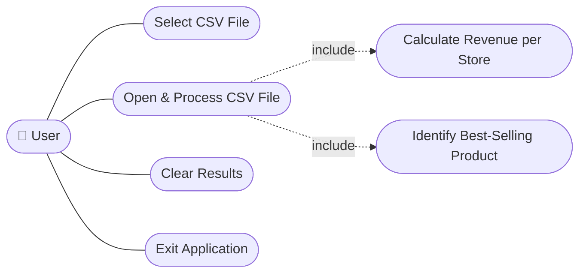

### 📝 Detailed Use Case — UC02: Open & Process CSV File

| Field | Description |
|:------|:-------------|
| **Preconditions** | A valid `.csv` file path has been set via UC01. |
| **Main Flow** | 1. User clicks *File → Open...* <br> 2. System reads the file line by line <br> 3. System skips the header row <br> 4. System splits each row by `;` <br> 5. System updates the revenue-per-store list <br> 6. System updates the best-seller product map <br> 7. System displays the raw content and computed results |
| **Alternative Flow** | If the file cannot be read, the system shows an error dialog (`JOptionPane.ERROR_MESSAGE`). |
| **Postconditions** | Result fields and preview area show updated values. |

</details>

---

<details>
<summary><h2>3. Requirements Traceability Matrix 🔗</h2></summary>

| Requirement | Use Case | Class / Method | Diagram(s) | Verification |
|:------------|:---------|:----------------|:-----------|:--------------|
| FR01 / BR06 | UC01 | `Painel.jMenuProcurarActionPerformed()` | Use Case, Sequence | Manual GUI test |
| FR02 / BR01 / BR02 | UC02 | `Painel.jMenuAbrirActionPerformed()` | Activity, DFD | Manual GUI test |
| FR03 | UC02 | `Painel.textArea` | Sequence, Wireframe | Manual GUI test |
| FR04 / BR03 | UC02, UC03 | `Venda.precoUnitario`, `comercio` list | Class, Activity, DFD | Manual GUI test |
| FR05 / BR04 | UC03 | `textField1`–`textField4` | Sequence, Wireframe | Manual GUI test |
| FR06 / BR05 | UC02, UC04 | `produtosVendidos` map | Activity, DFD, Data Lineage | Manual GUI test |
| FR07 | UC04 | `textField5` | Sequence, Wireframe | Manual GUI test |
| FR08 | UC05 | `Painel.jButtonClearActionPerformed()` | State Machine, Use Case | Manual GUI test |
| FR09 | UC06 | `Painel.jMenuSairActionPerformed()` | State Machine, Use Case | Manual GUI test |
| FR10 | — | `Painel.jMenuSalvarActionPerformed()` | Use Case | Manual GUI test |
| NFR01 | All | `Painel` (menu bar, shortcuts) | Component, Wireframe | Manual review |
| NFR02 | — | Maven `pom.xml` | Deployment | Build check (`mvn compile`) |
| NFR03 | UC02 | `jMenuAbrirActionPerformed()` (single loop) | Activity | Code review |
| NFR05 | UC02 | `try/catch` + `JOptionPane` | Sequence | Manual GUI test (invalid file) |

</details>

---

<details>
<summary><h2>4. Software Requirements Specification (SRS) 📄</h2></summary>

### 1. Introduction

- **Purpose**: Describe the functional and non-functional requirements for the CSV Sales Analyzer, a desktop application that computes sales analytics from a CSV file.
- **Scope**: Single-user desktop application; reads one CSV file per session; no persistence layer; no network communication.
- **Definitions**: see [Domain Requirements](#1-requirements) glossary.

### 2. Overall Description

- **Product Perspective**: Standalone Java Swing application, packaged with Maven, entry point `Painel.main()`.
- **User Classes**: A single class of user — store staff performing sales analysis.
- **Operating Environment**: Any desktop OS with JDK 21+ (Windows, Linux, macOS).
- **Constraints**: CSV must be `;`-delimited; first 4 stores only are displayed; in-memory processing only.

### 3. Specific Requirements

- See [Section 1 — Requirements](#1-requirements) for the full **FR / NFR / BR / Domain / Data / Interface** requirements.
- See [Section 2 — Use Cases](#2-use-cases) for behavioral specification.
- See [Section 6 — Data Model & Data Dictionary](#6-data-model--data-dictionary) for data specification.

### 4. Appendices

- [UML & Structural Diagrams](#5-uml--structural-diagrams)
- [Data Flow Diagram (DFD)](#7-data-flow-diagram-dfd)
- [Architecture Diagram & Flowchart](#8-architecture-diagram--flowchart)
- [Persona & User Journey Map](#9-persona--user-journey-map)
- [Wireframes & Mockups](#10-wireframes--mockups)

</details>

---

<details>
<summary><h2>5. UML & Structural Diagrams 🗺️</h2></summary>

### 🧍 Use Case Diagram

> See [Section 2 — Use Case Diagram](#2-use-cases).

### 🧱 Class Diagram

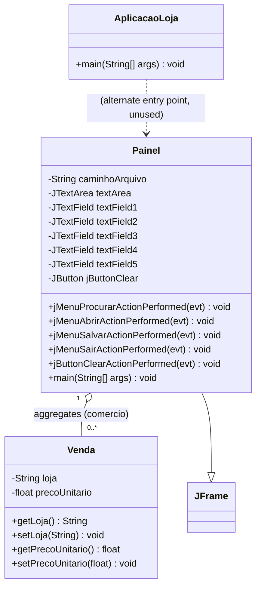

### 🔵 Object Diagram

> Example runtime snapshot after processing a sample CSV with 2 stores.

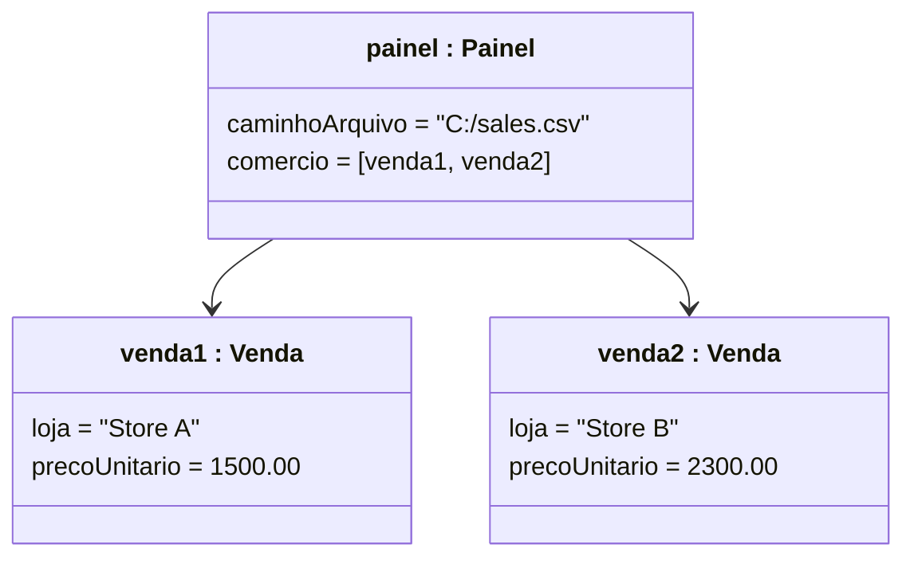

### 🔁 Sequence Diagram — Open & Process CSV

```mermaid
sequenceDiagram
    actor User
    participant Painel as Painel (JFrame)
    participant FS as File System
    participant Venda as Venda (model)

    User->>Painel: click "Abrir..." (Open)
    Painel->>FS: new BufferedReader(caminhoArquivo)
    FS-->>Painel: file stream
    loop for each CSV line
        Painel->>Painel: split line by ";"
        Painel->>Venda: new Venda(loja, total)
        Painel->>Painel: update comercio list & produtosVendidos map
    end
    Painel->>Painel: update textField1-5 & textArea
    Painel-->>User: display revenue & best seller
```

### 💬 Communication Diagram

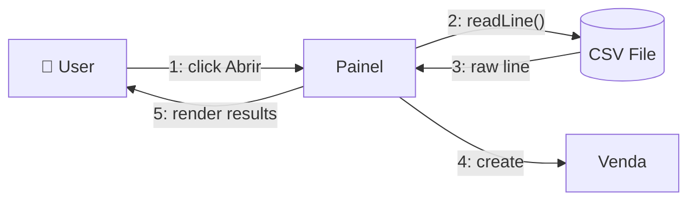

### 🔄 Activity Diagram — Parse & Aggregate Algorithm

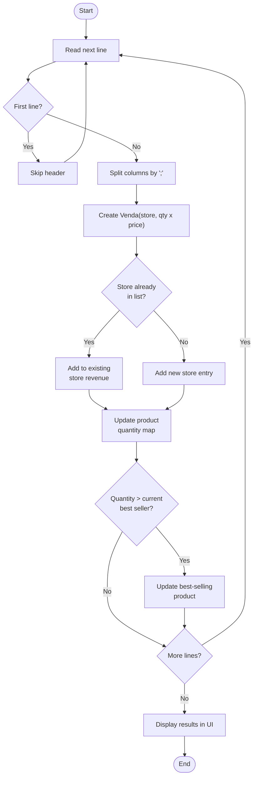

### 🔀 State Machine Diagram — Application State

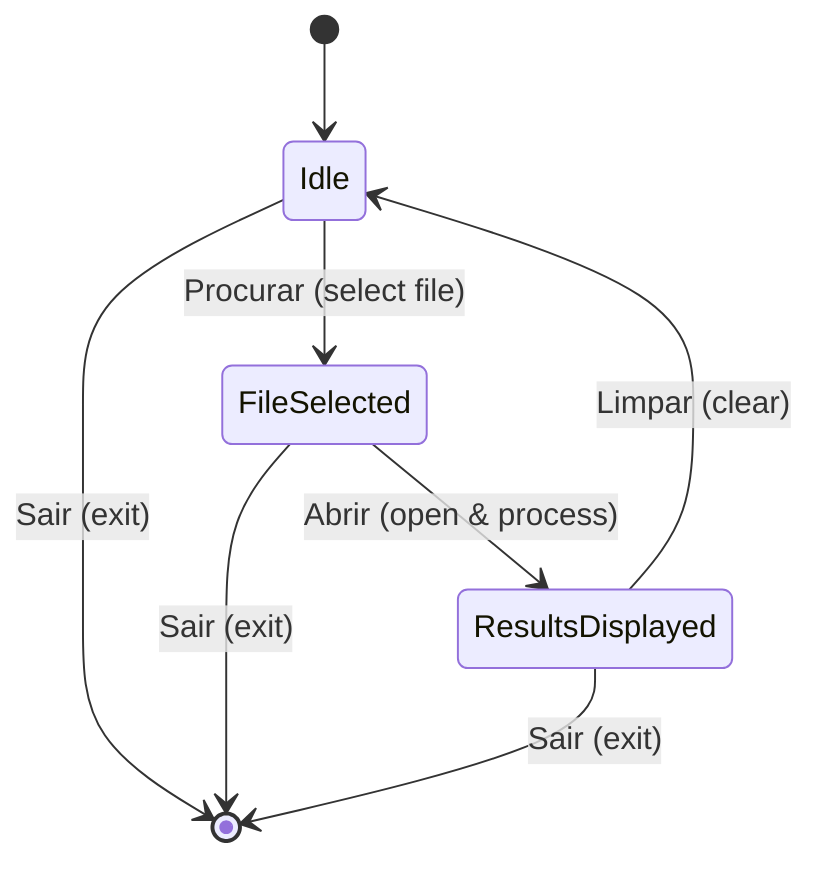

### 🧩 Component Diagram

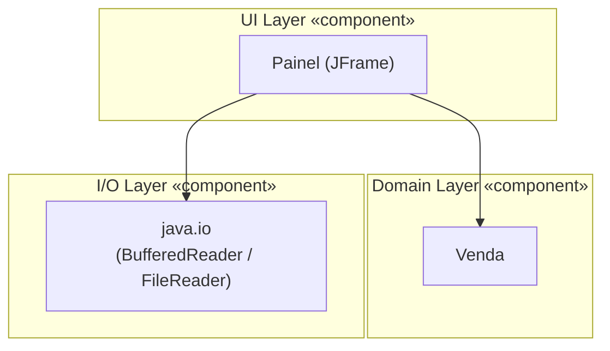

### 🖥️ Deployment Diagram

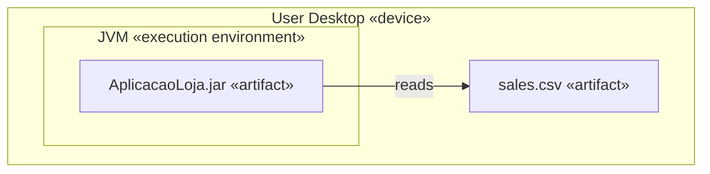

### 📦 Package Diagram

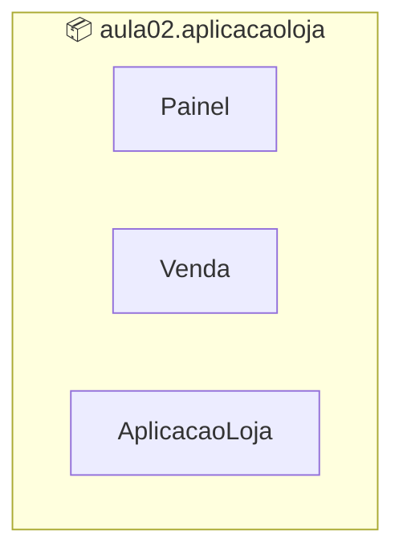

### 🧬 Composite Structure Diagram — Painel Internals

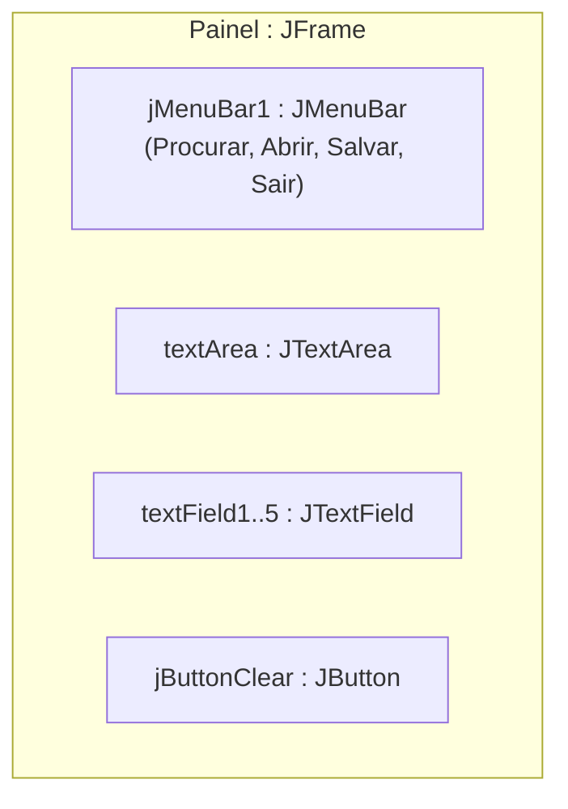

### 🖼️ Interaction Overview Diagram

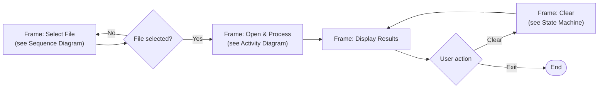

### ⏱️ Timing Diagram — UI Fields over Time

| Time | `textField1`–`4` (Revenue per Store) | `textField5` (Best Seller) | `textArea` (Raw Preview) |
|:-----|:--------------------------------------|:-----------------------------|:---------------------------|
| t0 — App start | empty | empty | empty |
| t1 — File selected (`Procurar`) | empty | empty | empty |
| t2 — File opened (`Abrir`) | empty | empty | raw CSV content |
| t3 — During parsing | progressively filled (1 per store) | empty | raw CSV content |
| t4 — Parsing finished | revenue per store (up to 4) | product / quantity | raw CSV content |
| t5 — `LIMPAR` clicked | empty | empty | empty |

</details>

---

<details>
<summary><h2>6. Data Model & Data Dictionary 🗄️</h2></summary>

### 🔗 Entity-Relationship Diagram (ER)

> The CSV is a flat file, but conceptually each row represents a relationship between a **Store**, a **Product** and a **Sale**.

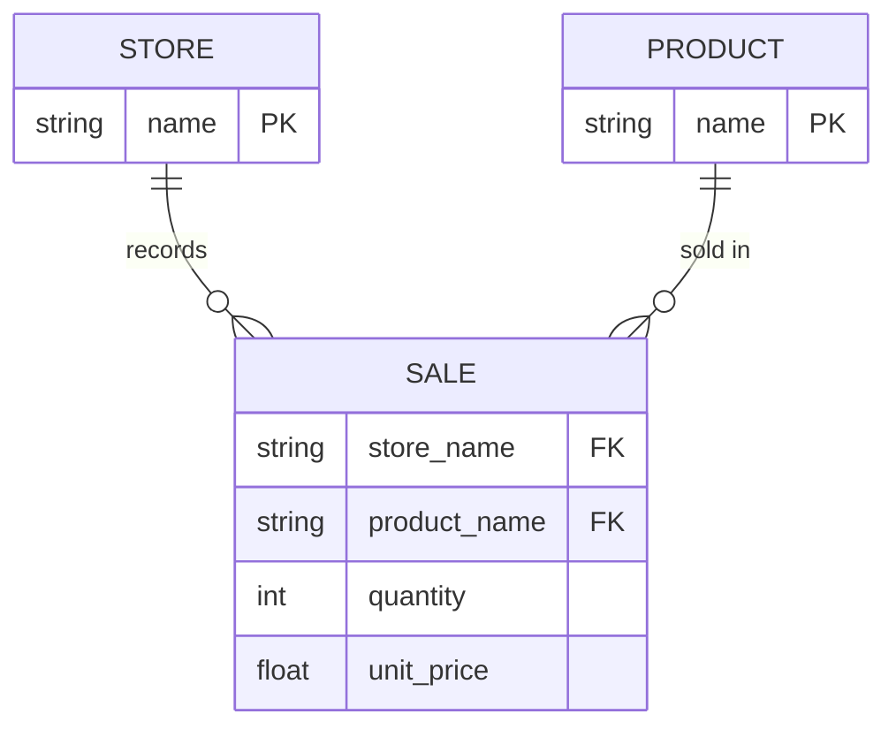

### 🧠 Conceptual Data Model

- **Store** — a sales location, identified by its name.
- **Product** — an item that can be sold, identified by its name.
- **Sale** — a transaction linking one Store and one Product, with a quantity and a unit price.

### 🧩 Logical Data Model

| Entity | Attribute | Type | Key |
|:-------|:----------|:-----|:----|
| `STORE` | `name` | String | PK |
| `PRODUCT` | `name` | String | PK |
| `SALE` | `store_name` | String | FK → STORE |
| `SALE` | `product_name` | String | FK → PRODUCT |
| `SALE` | `quantity` | Integer | — |
| `SALE` | `unit_price` | Decimal | — |

### 💽 Physical Data Model (as implemented)

- **Storage**: single flat `.csv` file, `;`-delimited, no schema enforcement.
- **In-memory representation**:
  - `Venda` class → `loja: String`, `precoUnitario: float` (pre-multiplied `quantity × unit price`).
  - `ArrayList<Venda> comercio` → one aggregated entry per distinct store.
  - `HashMap<String, Integer> produtosVendidos` → product name → cumulative quantity sold.

### 📖 Data Dictionary (CSV columns, as read by `Painel.jMenuAbrirActionPerformed`)

| Index | Column | Type | Description | Used? |
|:-----:|:-------|:-----|:-------------|:------|
| 0 | *(not used)* | String | Reserved / row identifier in source file | ❌ |
| 1 | *(not used)* | String | Reserved / date field in source file | ❌ |
| 2 | `loja` | String | Store name | ✅ `Venda.loja` |
| 3 | *(not used)* | String | Reserved / category field in source file | ❌ |
| 4 | `produto` | String | Product name | ✅ best-seller map key |
| 5 | `quantidade` | Integer | Quantity sold in this row | ✅ `Integer.parseInt(colunas[5])` |
| 6 | `preco_unitario` | Float | Unit price (decimal point `.`) | ✅ `Float.parseFloat(colunas[6])` |

> ⚠️ Columns 0, 1 and 3 must still be present in the file (so column indices line up), even though the current logic does not use their values.

</details>

---

<details>
<summary><h2>7. Data Flow Diagram (DFD) 🔄</h2></summary>

### 🌐 Level 0 — Context Diagram

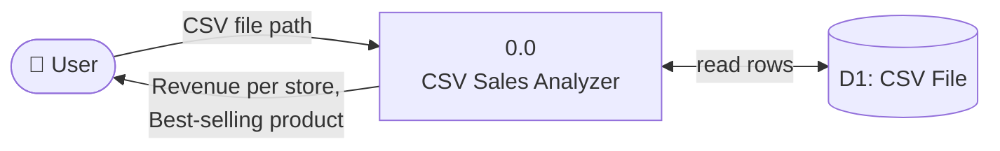

### 🔬 Level 1 — Detailed DFD

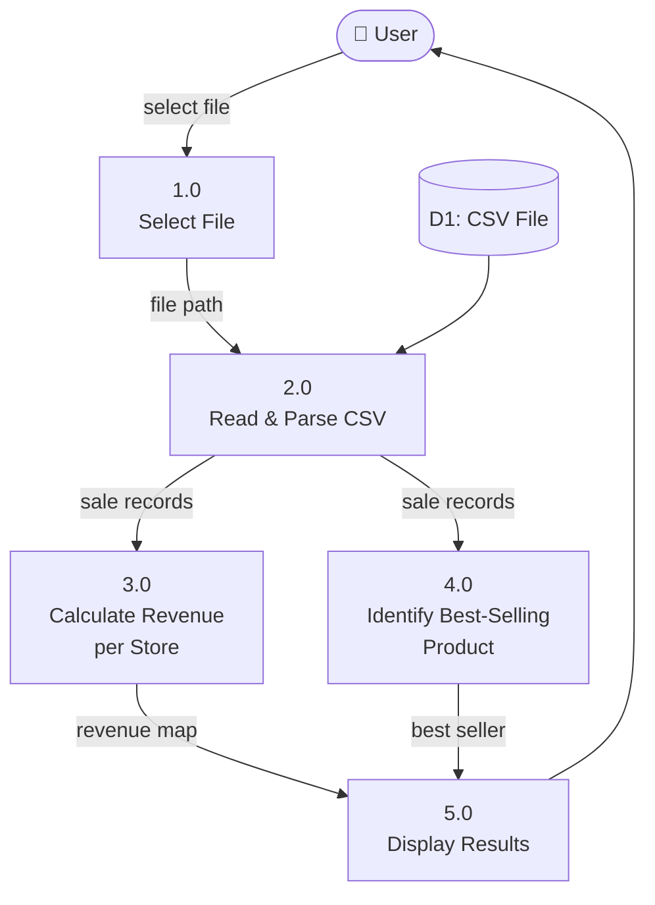

### 🧵 Data Lineage Diagram

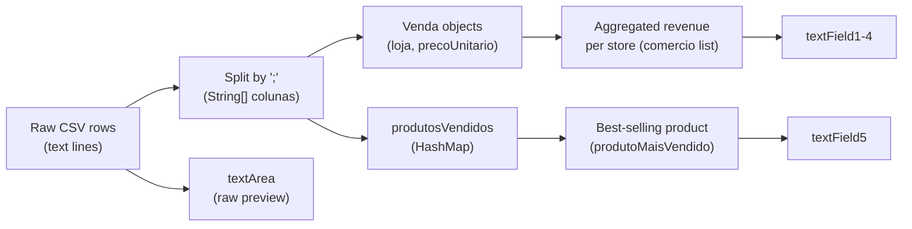

</details>

---

<details>
<summary><h2>8. Architecture Diagram & Flowchart 🏗️</h2></summary>

### 🏛️ Architecture Overview

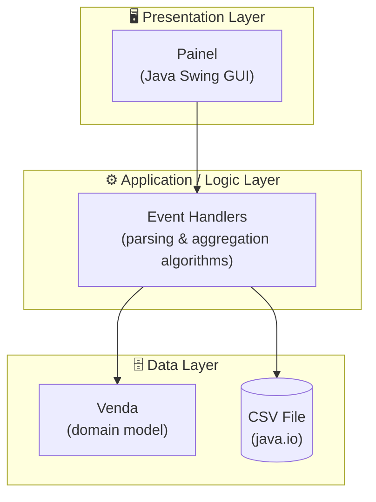

### 🧭 Application Flowchart

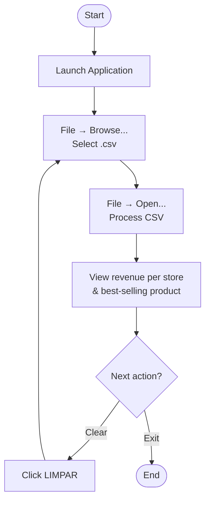

</details>

---

<details>
<summary><h2>9. Persona & User Journey Map 👤</h2></summary>

### 🧑 Persona

| Field | Description |
|:------|:-------------|
| **Name** | Marcos Oliveira |
| **Role** | Sales Supervisor at a small retail chain |
| **Age** | 38 |
| **Tech comfort** | Medium — comfortable with desktop apps and spreadsheets |
| **Goal** | Quickly compare weekly revenue across store branches and spot the best-selling product |
| **Frustration** | Manually building pivot tables in spreadsheets every week |
| **Quote** | *"I just need the numbers, fast — without opening Excel."* |

### 🗺️ User Journey Map

| Stage | Action | Touchpoint | Thoughts | Emotion | Opportunity |
|:------|:-------|:-----------|:----------|:--------|:--------------|
| 1. Need arises | Wants a weekly sales comparison | Export from POS system | "I need this fast" | 😐 Neutral | — |
| 2. Launch app | Opens CSV Sales Analyzer | Desktop shortcut | "Simple window, looks easy" | 🙂 Curious | — |
| 3. Select file | `File → Browse...` | `JFileChooser` | "Easy to find my file" | 🙂 Confident | — |
| 4. Process | `File → Open...` | App window | "Instant totals, nice!" | 😀 Satisfied | — |
| 5. Analyze | Reads revenue per store & best seller | Result fields | "Matches what I expected" | 😀 Satisfied | Add export to PDF/Excel |
| 6. Reset / Close | Clicks `LIMPAR` or exits | Button / menu | "Ready for next file" | 🙂 Confident | — |

</details>

---

<details>
<summary><h2>10. Wireframes & Mockups 🎨</h2></summary>

### 📐 Low-Fidelity Wireframe

```text
+---------------------------------------------------------------+
| ARQUIVO (File)                                                 |
+---------------------------------------------------------------+
|  TOTAL DE VENDAS POR LOJA                                      |
|                                                                 |
|  LOJA: [ Store A / 1500.00 ]      +-----------------------+    |
|  LOJA: [ Store B / 2300.00 ]      |                       |    |
|  LOJA: [ Store C / 980.00  ]      |   Raw CSV preview     |    |
|  LOJA: [ Store D / 1120.00 ]      |   (textArea)          |    |
|                                    +-----------------------+    |
+---------------------------------------------------------------+
|  QUANTIDADES                                                   |
|  [ Best seller name / qty units ]            ( LIMPAR )       |
+---------------------------------------------------------------+
```

### 🎯 Mockup Notes

- **Background**: black (`Color(0, 0, 0)`), high-contrast bold labels — matches `Painel.initComponents()`.
- **Typography**: section labels (`LOJA:`, `TOTAL DE VENDAS POR LOJA`, `QUANTIDADES`) in bold, large font (`Dialog`/`Segoe UI`, 24–36pt).
- **Primary action**: `LIMPAR (CLEAR)` button, font size 24, positioned bottom-right next to the best-seller field.
- **Menu bar**: single top-level menu `ARQUIVO` with items *Procurar*, *Abrir*, *Salvar*, *Sair* (shortcuts `Ctrl+P`, `Ctrl+A`, `Ctrl+S`, `Esc`).

</details>

---

## 📋 Expected CSV Format

> For correct processing, the CSV file must follow the structure below (see [Data Dictionary](#6-data-model--data-dictionary)).

| Property | Expected Value |
|:---------|:----------------|
| **Delimiter** | Semicolon (`;`) |
| **Columns** | 7 columns (indices 0–6) — only indices `2`, `4`, `5`, `6` are used |
| **Header** | The **first line** is always skipped |
| **Encoding** | UTF-8 recommended |

### 📄 Example CSV File

```csv
id;data;loja;categoria;produto;quantidade;preco_unitario
1;2024-01-01;Store A;General;Product X;10;25.00
2;2024-01-01;Store A;General;Product Y;5;40.00
3;2024-01-02;Store B;General;Product X;20;25.00
4;2024-01-02;Store B;General;Product Z;8;15.00
5;2024-01-03;Store C;General;Product Y;12;40.00
6;2024-01-03;Store D;General;Product Z;3;15.00
```

---

## 📂 Project Structure

```plaintext
AplicacaoLoja/
│
├── 📄 pom.xml                                  # ⚙️  Maven configuration & dependencies
│
└── 📁 src/
    └── 📁 main/
        └── 📁 java/
            └── 📁 aula02/
                └── 📁 aplicacaoloja/
                    ├── 📄 AplicacaoLoja.java   # 🚀 Alternate entry point (placeholder)
                    ├── 📄 Painel.java          # 🖥️  Main GUI (JFrame) ← CORE
                    └── 📄 Venda.java           # 🏛️  Domain model — Sale (store + price)
```

---

## 🚀 Installation & Execution

### 📋 Prerequisites

| Requirement | Detail |
|:------------|:--------|
| **JDK** | Version **21 or higher**, installed and configured in `PATH`. |
| **Apache Maven** | Installed and configured in `PATH`. |
| **Git** | To clone the repository. |

---

### 💻 Option 1 — Command Line

**1. Clone the repository and enter the project folder:**

```bash
git clone https://github.com/VictorHJesusSantiago/AplicacaoLoja.git
cd AplicacaoLoja
```

**2. Build the project with Maven:**

```bash
mvn compile
```

**3. Run the main class:**

```bash
# Windows / Linux / macOS
java -cp "target/classes" aula02.aplicacaoloja.Painel
```

---

### 🖥️ Option 2 — IDE (Recommended)

```
1. Open your favorite IDE (IntelliJ IDEA, NetBeans or Eclipse)
2. File → Open → Import as "Existing Maven Project"
3. Wait for Maven to sync dependencies
4. Locate: src/main/java/aula02/aplicacaoloja/Painel.java
5. Right-click → "Run" (or press Shift + F10)
```

---

### 🎯 How to Use the Application

| Step | Action |
|:----:|:-------|
| 1️⃣ | Start the application using the steps above. |
| 2️⃣ | Click **File → Browse...** and select your `.csv` file. |
| 3️⃣ | Click **File → Open...** to process and view the results. |
| 4️⃣ | Check the **revenue per store** and **best-selling product** in the result fields. |
| 5️⃣ | Use the **CLEAR** button to reset all fields and load a new file. |

---

## 🤝 Contributing

> Contributions are very welcome! Follow the steps below to collaborate.

| Step | Action | Command |
|:----:|:-------|:--------|
| 1️⃣ | **Fork** the repository to your account. | — |
| 2️⃣ | Create your feature branch from `main`. | `git checkout -b feature/NewFeature` |
| 3️⃣ | Commit your changes with a clear, semantic message. | `git commit -m 'feat: Add NewFeature'` |
| 4️⃣ | Push the branch to the remote repository. | `git push origin feature/NewFeature` |
| 5️⃣ | Open a Pull Request detailing your changes. | — |

<div align="center">

<br>

**If this project was useful for your studies, leave a star ⭐️ on the repository!**

</div>

---

## 👨‍💻 Author

<div align="center">

<br>

**Victor H. J. Santiago**

<br>

[](https://github.com/VictorHJesusSantiago)
[](https://www.linkedin.com/in/victor-henrique-de-jesus-santiago/)

</div>

---

## 📄 License

<div align="center">

This project is distributed under the **MIT License**.
See the [`LICENSE`](./LICENSE) file in the repository for more information.


</div>

---

<div align="center">

*Made with 📊 and Java by **Victor H. J. Santiago***

</div>
