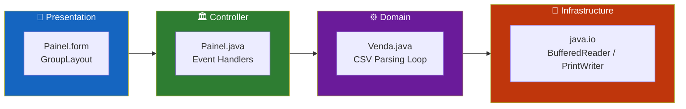
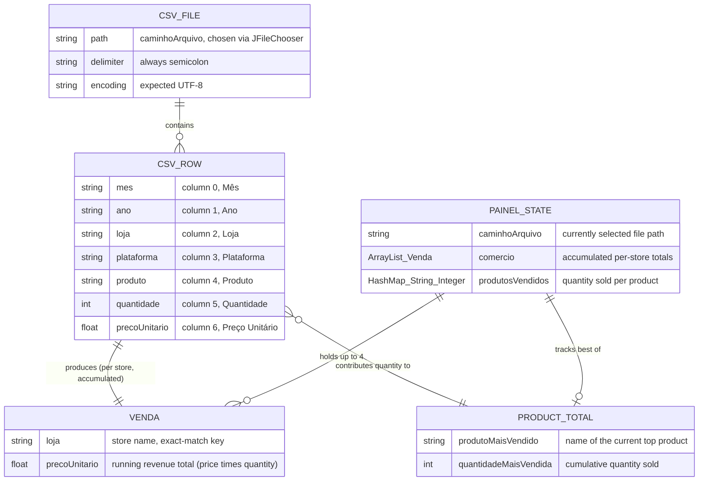
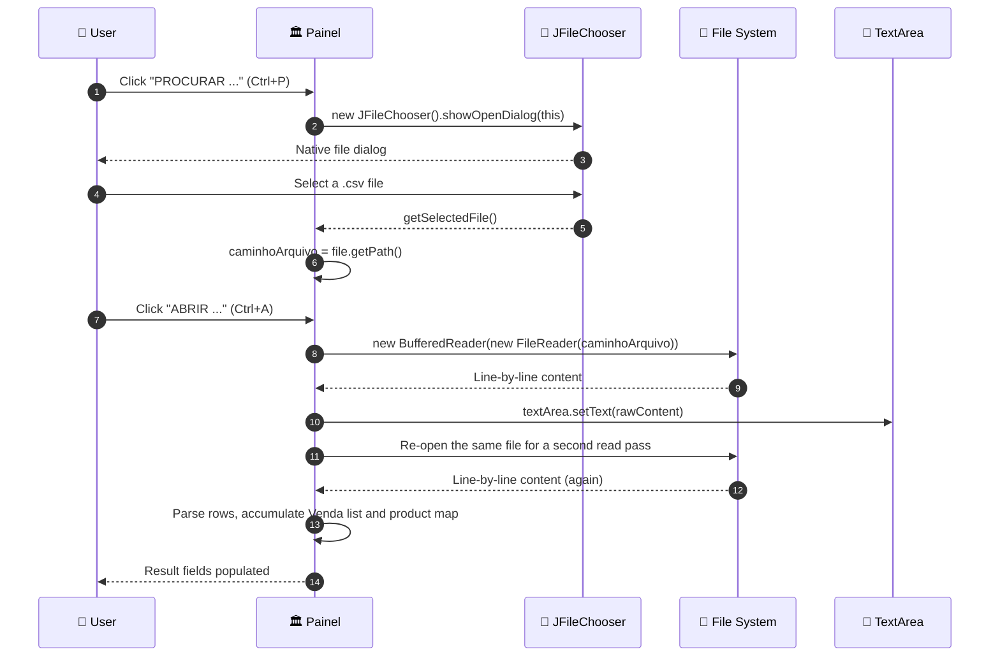
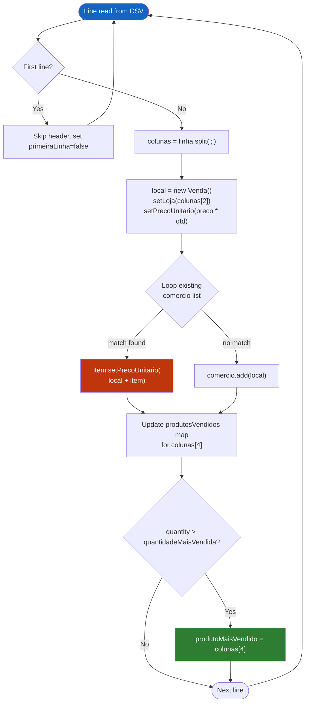
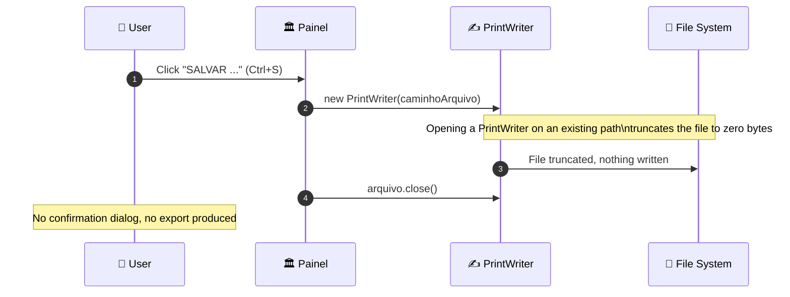
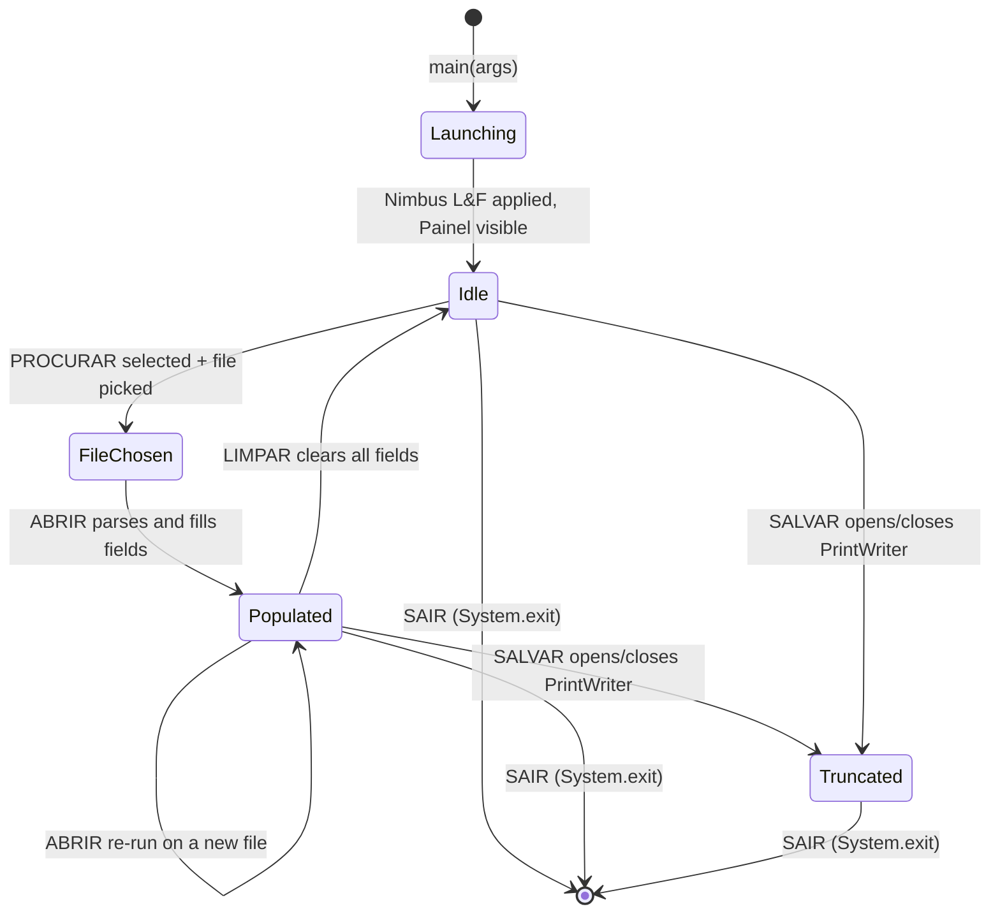
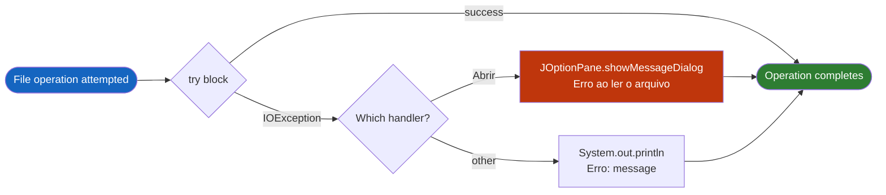
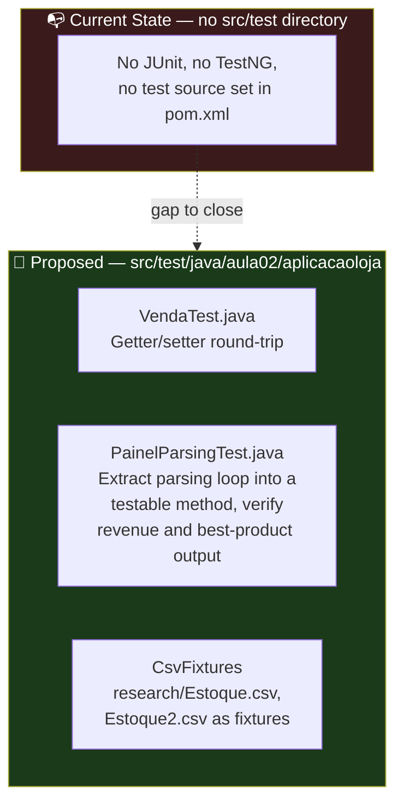

<div align="center">

**🌐 Choose Language / Selecione o Idioma / Elija el Idioma**

[](README.md)&nbsp;&nbsp;&nbsp;[](README_PT.md)&nbsp;&nbsp;&nbsp;[](README_ES.md)

</div>

---

<div align="center">

```
██╗      ██████╗      ██████╗███████╗██╗   ██╗
██║     ██╔═══██╗    ██╔════╝██╔════╝██║   ██║
██║     ██║   ██║    ██║     ███████╗██║   ██║
██║     ██║   ██║    ██║     ╚════██║╚██╗ ██╔╝
███████╗╚██████╔╝    ╚██████╗███████║ ╚████╔╝
╚══════╝ ╚═════╝      ╚═════╝╚══════╝  ╚═══╝
        Java Swing Desktop CSV Sales Reader
```

---

[](https://openjdk.org/)
[](https://docs.oracle.com/javase/tutorial/uiswing/)
[](https://maven.apache.org/)
[]()
[-217346?style=for-the-badge)]()
[]()

<br/>

> **A Java Swing desktop application that reads semicolon-delimited sales CSV files**
> and computes revenue per store and the best-selling product entirely in memory.

<br/>


</div>

---

## 📑 Table of Contents

<details>
<summary>▶️ <strong>Click to expand / collapse this section</strong></summary>

<table>
<tr>
<td valign="top" width="50%">

**🏗️ System**
- [Overview](#-overview)
- [System Architecture](#-system-architecture)
- [Technology Stack](#-technology-stack)
- [Design Patterns](#-design-patterns-applied)
- [Project Structure](#-project-structure)

**📦 Modules**
- [Painel — Main Window](#-painel--main-window-controller)
- [Venda — Sale Record](#-venda--sale-record-model)
- [AplicacaoLoja — Entry Point Stub](#-aplicacaoloja--entry-point-stub)
- [totalLoja1 — Unused Stub](#-totalloja1--unused-stub)
- [Research Assets](#-research-assets--icons--sample-data)

</td>
<td valign="top" width="50%">

**💼 Business**
- [Business Rules](#-business-rules)
- [Functional Requirements](#-functional-requirements)
- [Non-Functional Requirements](#-non-functional-requirements)

**📐 Design**
- [Data Model](#-data-model)
- [System Flows](#-system-flows)

**🔐 Security & Ops**
- [Security](#-security)
- [Installation & Execution](#-installation--execution)
- [Automated Tests](#-automated-tests)
- [Metrics & Monitoring](#-metrics--monitoring)
- [Known Limitations](#-known-limitations)

</td>
</tr>
</table>

---

</details>

## 🌟 Overview

<details>
<summary>▶️ <strong>Click to expand / collapse this section</strong></summary>

**AplicacaoLoja** (packaged in this repository as *leitor_de_arquivo_csv*, "CSV file reader") is a small desktop application written in **Java** using the **Swing** toolkit. It was built as a coursework assignment (`aula02`, "class 02") for an Object-Oriented Programming module, under the author name recorded in the source header, Victor Henrique de Jesus Santiago.

The application opens a single window (`Painel`, a `JFrame`) with a menu bar offering four actions: browse for a CSV file, open and parse it, "save" it, and exit. Once a file is opened, the raw text is dumped into a scrollable text area and, in the same pass, the code walks every data row to accumulate **revenue per store** (unit price × quantity) and to determine the **best-selling product** by cumulative quantity sold. Results are shown in plain `TextField`/`JTextField` components rather than a table or chart.

There is no database, no network access, and no external library beyond the JDK itself — the entire persistence model is "read a `.csv` file from disk, compute in memory, show the numbers." The `pom.xml` declares no dependencies at all, so the whole feature set is implemented with `java.io`, `java.util` and `javax.swing` from the standard library.

### 🎯 System Objectives

| Objective | Description |
|-----------|-------------|
| 📂 **File Selection** | Let the user pick a `.csv` file from disk via `JFileChooser` (menu *ARQUIVO → PROCURAR*) |
| 📖 **Raw Preview** | Display the unparsed file content in a scrollable `TextArea` (menu *ARQUIVO → ABRIR*) |
| 🧮 **Revenue Aggregation** | Sum `Preço Unitário × Quantidade` per distinct store name found in the file |
| 🏆 **Best-Seller Detection** | Track cumulative quantity sold per product name and report the highest one |
| 🖥️ **Result Display** | Show up to four store totals in dedicated text fields and the top product in a fifth |
| 🧹 **Reset** | Clear the preview and every result field with one **LIMPAR (CLEAR)** button |
| 🚪 **Exit** | Terminate the JVM cleanly from the *SAIR* menu item or the `Esc` key |
| 🎓 **Educational Scope** | Demonstrate file I/O, Swing event handling and simple in-memory aggregation, not production robustness |

---

</details>

## 🏗️ System Architecture

<details>
<summary>▶️ <strong>Click to expand / collapse this section</strong></summary>

### Module Diagram

```mermaid
flowchart TB
    subgraph UI["📱  PRESENTATION LAYER"]
        direction LR
        FORM["🪟 Painel.form\n─────────────\nNetBeans GroupLayout\nJMenuBar x2\nTextArea + 5 fields"]
        MENU["📋 Menu Actions\n─────────────\nPROCURAR · ABRIR\nSALVAR · SAIR"]
    end

    subgraph CTRL["🏛️  CONTROLLER"]
        MAIN["Painel.java\n─────────────────────\n• Event listeners\n• File path state\n• CSV parsing loop\n• Aggregation logic"]
    end

    subgraph CORE["⚙️  DOMAIN"]
        direction TB
        PARSE["🔍 CSV Line Split\nString.split(\";\")\n────────────\n7 columns per row"]
        AGG["🧮 Aggregation\nHashMap + ArrayList\n────────────\nRevenue per store\nQuantity per product"]
        MODEL["📦 Venda.java\nSale Record\n────────────\nloja : String\nprecoUnitario : float"]
    end

    subgraph SYS["💾  FILE SYSTEM"]
        direction LR
        CSVFILE[("📄 Selected .csv\nUser-chosen path\n─────────────\n;-delimited, UTF-8")]
    end

    subgraph OUT["🖥️  OUTPUT"]
        FIELDS["📊 Result Fields\n──────────────────────\ntextField1-4 : store totals\ntextField5 : best product"]
    end

    FORM -->|"addActionListener"| MAIN
    MENU -->|"actionPerformed"| MAIN
    MAIN -->|"JFileChooser"| CSVFILE
    MAIN --> PARSE
    PARSE --> MODEL
    PARSE --> AGG
    MODEL --> AGG
    AGG --> FIELDS
    CSVFILE -->|"BufferedReader"| PARSE
    MAIN -->|"setText"| FIELDS

    style UI fill:#1e3a5f,color:#fff,stroke:#4a90d9
    style CTRL fill:#1a3a1a,color:#fff,stroke:#4caf50
    style CORE fill:#3a1a1a,color:#fff,stroke:#e57373
    style SYS fill:#3a2a1a,color:#fff,stroke:#ffb74d
    style OUT fill:#2a1a3a,color:#fff,stroke:#ce93d8
```

### Architecture Layers



---

</details>

## 🛠️ Technology Stack

<details>
<summary>▶️ <strong>Click to expand / collapse this section</strong></summary>

<table>
<thead>
<tr>
<th>Layer</th>
<th>Technology</th>
<th>Version</th>
<th>Purpose</th>
</tr>
</thead>
<tbody>
<tr>
<td rowspan="2"><strong>🧠 Language</strong></td>
<td>Java</td>
<td>21</td>
<td>Application source language (<code>maven.compiler.source</code>/<code>target</code> in <code>pom.xml</code>)</td>
</tr>
<tr>
<td>XML</td>
<td>—</td>
<td><code>Painel.form</code> (NetBeans GUI descriptor), <code>pom.xml</code>, <code>nbactions.xml</code></td>
</tr>
<tr>
<td rowspan="3"><strong>🖥️ UI Toolkit</strong></td>
<td>Java Swing</td>
<td>JDK-bundled</td>
<td><code>JFrame</code>, <code>JMenuBar</code>, <code>JFileChooser</code>, <code>JOptionPane</code></td>
</tr>
<tr>
<td>AWT</td>
<td>JDK-bundled</td>
<td>Legacy <code>java.awt.TextField</code>, <code>java.awt.TextArea</code>, <code>java.awt.Label</code> components mixed into the form</td>
</tr>
<tr>
<td>NetBeans GUI Builder</td>
<td>Form v1.3</td>
<td>Generated the <code>GroupLayout</code> in <code>initComponents()</code></td>
</tr>
<tr>
<td rowspan="2"><strong>💾 I/O</strong></td>
<td><code>java.io</code></td>
<td>JDK-bundled</td>
<td><code>BufferedReader</code>, <code>FileReader</code>, <code>PrintWriter</code> for reading/writing the CSV file</td>
</tr>
<tr>
<td><code>java.util</code></td>
<td>JDK-bundled</td>
<td><code>ArrayList&lt;Venda&gt;</code>, <code>HashMap&lt;String,Integer&gt;</code> for in-memory aggregation</td>
</tr>
<tr>
<td rowspan="2"><strong>🔧 Build</strong></td>
<td>Apache Maven</td>
<td>model 4.0.0</td>
<td><code>pom.xml</code> — groupId <code>Aula02</code>, artifactId <code>AplicacaoLoja</code>, packaging <code>jar</code></td>
</tr>
<tr>
<td>exec-maven-plugin</td>
<td>3.0.0</td>
<td>Referenced by <code>nbactions.xml</code> to run/debug <code>Painel</code> directly from the IDE</td>
</tr>
<tr>
<td><strong>🧪 Testing</strong></td>
<td>None</td>
<td>—</td>
<td>No <code>src/test</code> directory or test dependency exists in this project</td>
</tr>
</tbody>
</table>

---

</details>

## 🎨 Design Patterns Applied

<details>
<summary>▶️ <strong>Click to expand / collapse this section</strong></summary>

| Pattern | Where | Rationale |
|---------|-------|-----------|
| 👂 **Observer / Callback** | `addActionListener` on every button, menu item and field in `initComponents()` | Swing's event model drives all user interaction through registered listeners |
| 🧭 **Facade (thin)** | `jMenuAbrirActionPerformed` | One handler hides the file read, the raw-text render and the full aggregation pass behind a single menu click |
| 📦 **Simple Data Holder (POJO)** | `Venda.java` | A minimal getter/setter class carrying `loja` and `precoUnitario`, used as the aggregation unit |
| 🗺️ **Accumulator / Map-Reduce (manual)** | `HashMap<String, Integer> produtosVendidos` in `jMenuAbrirActionPerformed` | Running totals per product key, updated on every row, mirroring a manual reduce step |
| 🚦 **Guard Clause (partial)** | `if (!primeiraLinha)` skip of the header row | Early skip keeps the parsing body free of header-handling branches |
| 🏷️ **State Field** | `caminhoArquivo` instance field | Holds the chosen file path between the "Procurar" and "Abrir" menu actions |
| 🔁 **Linear Scan Lookup** | `for (int i=0; i<comercio.size(); i++)` inside `jMenuAbrirActionPerformed` | Existing-store lookup by iterating the `ArrayList<Venda>` rather than using a map, consistent with the class's small, teaching-oriented scale |

---

</details>

## 📁 Project Structure

<details>
<summary>▶️ <strong>Click to expand / collapse this section</strong></summary>

```
leitor_de_arquivo_csv/
│
├── 📄 .gitignore                              # Ignores target/, *.class, secrets, OS/IDE files
│
├── 📂 AplicacaoLoja/                          # ★ The actual Maven project (real source root)
│   ├── 📄 pom.xml                             # Maven descriptor: Java 21, jar packaging, no dependencies
│   ├── 📄 nbactions.xml                       # NetBeans run/debug/profile actions (main class = Painel)
│   ├── 📄 aplicacao_loja.txt                  # Earlier draft revision of Painel.java, kept for reference
│   ├── 📄 atribuicoes_icon.txt                # Flaticon attribution list for every menu/panel icon
│   ├── 📄 AplicacaoLoja-1.0-SNAPSHOT.jar      # Pre-built jar artifact checked into the repo
│   │
│   ├── 📂 research/                           # 📊 Sample data and icon assets used by the UI
│   │   ├── 📄 Estoque.csv                     # Sample sales CSV (Mês;Ano;Loja;Plataforma;Produto;Quantidade;Preço)
│   │   ├── 📄 Estoque2.csv                    # Second sample sales CSV
│   │   ├── 📄 leituraCSV.csv                  # Larger unrelated municipality dataset used for read testing
│   │   └── 📄 *.png                           # abrir/salvar/sair/procurar/mes/ano/lojas/... menu icons
│   │
│   ├── 📂 src/main/java/
│   │   ├── 📄 totalLoja1.java                 # Empty package-less stub class (unused)
│   │   └── 📂 aula02/aplicacaoloja/
│   │       ├── 📄 AplicacaoLoja.java          # Entry-point stub declared in pom.xml, empty main()
│   │       ├── 📄 Painel.java                 # ★ Main JFrame — GUI, events, CSV parsing, aggregation (449 lines)
│   │       ├── 📄 Painel.form                 # NetBeans GroupLayout descriptor consumed by initComponents()
│   │       ├── 📄 Venda.java                  # POJO: loja (String) + precoUnitario (float)
│   │       └── 📄 library_folder_20326.ico    # Application icon asset
│   │
│   └── 📂 target/                             # Maven build output (compiled .class files, archiver metadata)
│
├── 📄 README.md                                # 🇺🇸 English (primary)
├── 📄 README_PT.md                             # 🇧🇷 Português
└── 📄 README_ES.md                             # 🇪🇸 Español
```

---

</details>

## 📦 System Modules

<details>
<summary>▶️ <strong>Click to expand / collapse this section</strong></summary>

### 🏛️ Painel — Main Window Controller

`Painel` (`aula02.aplicacaoloja.Painel`) extends `javax.swing.JFrame` and is the only visual class in the application. It owns the file path state, every event handler, and the CSV parsing/aggregation logic in one 449-line file.

| Responsibility | Implementation |
|-----------------|----------------|
| Window setup | `initComponents()` — NetBeans-generated `GroupLayout`, two `JMenuBar`s, one visible (`jMenuBar1`) |
| File path state | `String caminhoArquivo` — set by the Procurar handler, read by Abrir and Salvar |
| Entry point | `public static void main(String[] args)` — sets the Nimbus look-and-feel if available, then `new Painel().setVisible(true)` |
| Menu actions | `jMenuProcurarActionPerformed`, `jMenuAbrirActionPerformed`, `jMenuSalvarActionPerformed`, `jMenuSairActionPerformed` |
| Reset action | `jButtonClearActionPerformed` — clears the text area and all five result fields |
| Unused stubs | `textField1ActionPerformed` … `textField5ActionPerformed` — empty listener bodies auto-generated by the form editor |

---

### 📦 Venda — Sale Record Model

`Venda` is a package-private POJO used to accumulate one running total per store while the CSV is being scanned.

| Field | Type | Accessors |
|-------|------|-----------|
| `loja` | `String` | `getLoja()` / `setLoja(String)` |
| `precoUnitario` | `float` | `getPrecoUnitario()` / `setPrecoUnitario(float)` — despite the name ("unit price"), this field is reused to hold the **running revenue total** for the store |

> [!NOTE]
> The field name `precoUnitario` ("unit price") is misleading: in `Painel.jMenuAbrirActionPerformed` it is assigned `Float.parseFloat(colunas[6]) * Integer.parseInt(colunas[5])`, i.e. price × quantity, so it actually holds accumulated revenue, not a per-unit price.

---

### 🚪 AplicacaoLoja — Entry Point Stub

`AplicacaoLoja` (`aula02.aplicacaoloja.AplicacaoLoja`) is the class declared as `exec.mainClass` in `pom.xml`. Its `main(String[] args)` body is empty — the application is actually launched through `Painel.main()`, as overridden by `nbactions.xml` for IDE run/debug/profile actions.

| Property | Value |
|----------|-------|
| Declared main class (pom.xml) | `aula02.aplicacaoloja.AplicacaoLoja` |
| Actual launched class (nbactions.xml) | `aula02.aplicacaoloja.Painel` |
| Body | Empty — does nothing if invoked directly |

---

### 🧩 totalLoja1 — Unused Stub

A package-less class at `src/main/java/totalLoja1.java`, generated from a NetBeans class template and never referenced anywhere else in the codebase. It carries only a doc comment and no members.

---

### 🖼️ Research Assets — Icons & Sample Data

The `research/` directory supplies the menu icons (`procurar.png`, `abrir.png`, `salvar.png`, `sair.png`) referenced by absolute Windows paths in `initComponents()` (e.g. `E:\IFPR\POO I\AplicacaoLoja\research\procurar.png`), plus category icons (`mes.png`, `ano.png`, `lojas.png`, `plataforma.png`, `produtos.png`, `quantidade.png`, `preco.png`, `moeda.png`) that are not currently wired into any Swing component, and two sample CSVs (`Estoque.csv`, `Estoque2.csv`) matching the `Mês;Ano;Loja;Plataforma;Produto;Quantidade;Preço Unitário` schema the parser expects.

> [!WARNING]
> The icon paths hard-coded in `Painel.java` (`E:\IFPR\POO I\AplicacaoLoja\research\*.png`) point to the original author's local machine and will silently fail to load on any other computer, leaving the menu items without icons but otherwise functional.

---

</details>

## 💼 Business Rules

<details>
<summary>▶️ <strong>Click to expand / collapse this section</strong></summary>

### 📄 CSV Format Rules

| # | Rule | Enforcement |
|---|------|-------------|
| BR-01 | Columns must be separated by a semicolon (`;`) | `String divisorCSV = ";"` used in `linha.split(divisorCSV)` |
| BR-02 | The first line of the file is always treated as a header and skipped | `Boolean primeiraLinha` flag, checked before parsing each line |
| BR-03 | Each data row must have at least 7 columns (index 0-6) | `colunas[2]`, `colunas[4]`, `colunas[5]`, `colunas[6]` are accessed directly, with no length check |
| BR-04 | Column 2 is the store name, column 4 the product, column 5 the quantity, column 6 the unit price | Fixed column indices in `jMenuAbrirActionPerformed` |

### 🧮 Aggregation Rules

| # | Rule | Enforcement |
|---|------|-------------|
| BR-05 | Store revenue = sum of `(unit price × quantity)` across every row for that store | `local.setPrecoUnitario(Float.parseFloat(colunas[6]) * Integer.parseInt(colunas[5]))` then merged into the existing `Venda` when the store repeats |
| BR-06 | A store is identified by an exact string match on its name | `item.getLoja().equals(local.getLoja())` |
| BR-07 | The best-selling product is the one with the highest cumulative quantity across all rows | `HashMap<String, Integer> produtosVendidos`, updated with `quantidadeMaisVendida` tracked as the running maximum |
| BR-08 | Only the first four distinct stores encountered are shown, one per result field | The result-field assignment inside the `comercio` loop only handles indices `0`-`3` |

### 🖱️ UI Behavior Rules

| # | Rule | Enforcement |
|---|------|-------------|
| BR-09 | The **CLEAR** button resets the preview and all five result fields | `jButtonClearActionPerformed` calls `setText("")` on `textArea` and `textField1`-`textField5` |
| BR-10 | The **SALVAR** menu item truncates the currently opened file instead of writing content back to it | `new PrintWriter(caminhoArquivo)` opens (and thereby empties) the file, then immediately closes it without writing |
| BR-11 | The **SAIR** menu item terminates the JVM immediately | `System.exit(0)` |
| BR-12 | Opening a file with no prior selection, or an unreadable path, shows an error dialog rather than crashing the UI thread | `try/catch (IOException e)` around the read, reported via `JOptionPane.showMessageDialog` |

---

</details>

## ✅ Functional Requirements

<details>
<summary>▶️ <strong>Click to expand / collapse this section</strong></summary>

| ID | Requirement | Priority | Status |
|----|-------------|----------|--------|
| **RF-01** | The system shall let the user browse and select a `.csv` file via a file chooser dialog | 🔴 High | ✅ Implemented |
| **RF-02** | The system shall read the selected file's raw content into a scrollable text area | 🔴 High | ✅ Implemented |
| **RF-03** | The system shall parse the file as `;`-delimited, skipping the first (header) line | 🔴 High | ✅ Implemented |
| **RF-04** | The system shall compute total revenue per store as unit price × quantity, summed across rows | 🔴 High | ✅ Implemented |
| **RF-05** | The system shall display up to four distinct store totals in separate fields | 🟡 Medium | ✅ Implemented |
| **RF-06** | The system shall determine the product with the highest cumulative quantity sold | 🔴 High | ✅ Implemented |
| **RF-07** | The system shall display the best-selling product's name and total quantity | 🟡 Medium | ✅ Implemented |
| **RF-08** | The system shall provide a CLEAR action that resets the preview and all result fields | 🟢 Low | ✅ Implemented |
| **RF-09** | The system shall provide an EXIT action that terminates the application | 🟢 Low | ✅ Implemented |
| **RF-10** | The system shall provide a SAVE menu item under the ARQUIVO menu | 🟢 Low | ✅ Implemented |
| **RF-11** | The SAVE action shall persist edited results back to the source CSV | 🟡 Medium | ⬜ Planned |
| **RF-12** | The system shall report parsing/read errors to the user via a dialog instead of failing silently | 🟡 Medium | ✅ Implemented |
| **RF-13** | The system shall bind keyboard accelerators (`Ctrl+P`, `Ctrl+A`, `Ctrl+S`, `Esc`) to the four menu actions | 🟢 Low | ✅ Implemented |
| **RF-14** | The system shall apply the Nimbus look-and-feel when available at startup | 🟢 Low | ✅ Implemented |
| **RF-15** | The system shall reject or safely handle CSV rows with fewer than 7 columns | 🟡 Medium | ⬜ Planned |
| **RF-16** | The system shall support more than four distinct stores in the result display | 🟢 Low | ⬜ Planned |
| **RF-17** | The system shall avoid reading the selected file twice per "Open" action | 🟡 Medium | ⬜ Planned |
| **RF-18** | The system shall present results in a sortable table rather than fixed text fields | 🟢 Low | ⬜ Planned |

---

</details>

## ⚡ Non-Functional Requirements

<details>
<summary>▶️ <strong>Click to expand / collapse this section</strong></summary>

| ID | Category | Requirement | Target |
|----|----------|-------------|--------|
| **RNF-01** | ⚡ Performance | CSV parsing runs in a single in-memory pass per read | `O(n)` over the row count, `O(n·k)` for the linear store lookup where `k` ≤ 4 |
| **RNF-02** | 📦 Footprint | No external runtime dependency beyond the JDK | `pom.xml` declares zero `<dependencies>` |
| **RNF-03** | 🧠 Memory | Entire file is buffered as text plus one `Venda` per distinct store | Bounded by input file size; no streaming for very large files |
| **RNF-04** | 📱 Portability | Runs on any OS with a compatible JDK and Swing support | Requires **JDK 21** (`maven.compiler.source`/`target`) |
| **RNF-05** | 🎨 Usability | Menu actions are reachable via keyboard accelerators | `Ctrl+P`, `Ctrl+A`, `Ctrl+S`, `Esc` |
| **RNF-06** | 🔧 Maintainability | Codebase organized as a Maven project under a single package | `aula02.aplicacaoloja` |
| **RNF-07** | 🔧 Build Reproducibility | Build described declaratively with a fixed Maven model version | `pom.xml` `modelVersion 4.0.0` |
| **RNF-08** | 🔐 Reliability | I/O errors are caught and surfaced, not swallowed silently | `try/catch (IOException e)` around every file operation |
| **RNF-09** | 🌍 Encoding | Source files declare UTF-8 as the build encoding | `project.build.sourceEncoding = UTF-8` in `pom.xml` |
| **RNF-10** | ♿ Accessibility | UI text is legible at a large default font size | `label2`-`label5` use 36pt, `jLabel1`/`jLabel2` use 24pt bold |
| **RNF-11** | 🧪 Testability | Automated regression coverage for the parsing/aggregation logic | Not currently present (see [Automated Tests](#-automated-tests)) |
| **RNF-12** | 📐 Consistency | Icon assets ship alongside the code with documented attribution | `atribuicoes_icon.txt` lists the Flaticon source for every icon |

---

</details>

## 🗄️ Data Model

<details>
<summary>▶️ <strong>Click to expand / collapse this section</strong></summary>

This project has **no database and no persistence layer**. The "data model" is the shape of the CSV file it reads and the in-memory Java objects built while parsing it.

### Entity-Relationship Diagram



### CSV Column Specification

| # | Column (PT header) | Java type used | Consumed by |
|---|---------------------|-----------------|-------------|
| 0 | `Mês` | not parsed | Displayed only in the raw preview |
| 1 | `Ano` | not parsed | Displayed only in the raw preview |
| 2 | `Loja` | `String` | `local.setLoja(colunas[2])` — store grouping key |
| 3 | `Plataforma` | not parsed | Displayed only in the raw preview |
| 4 | `Produto` | `String` | Key of `produtosVendidos` map |
| 5 | `Quantidade` | `int` (`Integer.parseInt`) | Multiplied into revenue; accumulated per product |
| 6 | `Preço Unitário` | `float` (`Float.parseFloat`) | Multiplied by quantity to get row revenue |

### In-Memory State Shape

| Structure | Type | Lifetime | Purpose |
|-----------|------|----------|---------|
| `comercio` | `ArrayList<Venda>` | Local to `jMenuAbrirActionPerformed`, rebuilt on every "Abrir" click | Holds one `Venda` per distinct store seen so far |
| `produtosVendidos` | `HashMap<String, Integer>` | Local to `jMenuAbrirActionPerformed`, rebuilt on every "Abrir" click | Running quantity total per product name |
| `caminhoArquivo` | `String` (instance field) | Lives for the lifetime of the `Painel` window | The single source-of-truth file path shared by Procurar/Abrir/Salvar |

---

</details>

## 🔄 System Flows

<details>
<summary>▶️ <strong>Click to expand / collapse this section</strong></summary>

### File Selection and Parsing Flow



### Revenue Aggregation Flow



### Save Action Flow



### Window Lifecycle State Machine



### Error Handling Flow



---

</details>

## 🔐 Security

<details>
<summary>▶️ <strong>Click to expand / collapse this section</strong></summary>

### Implemented Controls

| Control | Implementation | Effect |
|---------|-----------------|--------|
| 🗂️ **User-driven file selection** | `JFileChooser` restricted to `FILES_ONLY` | The user, not an external input, chooses which file is read |
| 🔐 **No network access** | No socket, HTTP client, or network permission anywhere in the codebase | Data never leaves the local machine through this application |
| 📵 **No third-party dependency** | `pom.xml` declares zero `<dependencies>` | Zero third-party supply-chain surface |
| 🧾 **Error containment** | `try/catch (IOException e)` around every file read | A malformed or missing file cannot crash the Swing event thread |
| 🔒 **No dynamic code execution** | No reflection-based class loading, no scripting engine | The parser only ever calls `String.split`, `Integer.parseInt`, `Float.parseFloat` |

### Known Security Limitations

> [!WARNING]
> This is an educational prototype. The following gaps should be closed before any production or multi-user use.

| Limitation | Risk | Mitigation path |
|------------|------|-----------------|
| 🗑️ **SALVAR truncates the file without confirmation** | A misclick on the SALVAR menu item silently wipes the currently open CSV to zero bytes | Require an explicit "Save As" dialog and never open a `PrintWriter` on the original path without writing content back |
| 🧨 **No column-count validation** | A malformed row with fewer than 7 columns throws an uncaught `ArrayIndexOutOfBoundsException`, propagating out of the parsing loop | Validate `colunas.length >= 7` before indexing and skip/report bad rows |
| 🔢 **`NumberFormatException` not caught during parsing** | A non-numeric `Quantidade` or `Preço Unitário` cell crashes the parse instead of being reported to the user | Wrap `Integer.parseInt` / `Float.parseFloat` in their own try/catch with a user-facing message |
| 🖥️ **Hard-coded absolute icon paths** | Paths like `E:\IFPR\POO I\AplicacaoLoja\research\procurar.png` leak the original author's local directory layout and fail on any other machine | Load icons as classpath resources (e.g. via `getClass().getResource(...)`) instead of absolute filesystem paths |
| 📄 **No path or file-type validation** | `JFileChooser` accepts any file, not just `.csv`; a huge or binary file would be read fully into memory | Add a `FileNameExtensionFilter("CSV", "csv")` and a size guard before reading |
| 🧵 **File I/O runs on the Swing Event Dispatch Thread** | A very large CSV freezes the UI while it is read and parsed | Move file I/O to a background thread (e.g. `SwingWorker`) |
| 📦 **Pre-built jar committed to the repository** | `AplicacaoLoja-1.0-SNAPSHOT.jar` is versioned alongside source, which can drift out of sync with the code and bloats the repository | Build artifacts on demand via `mvn package`; exclude `*.jar` from version control |

---

</details>

## 🚀 Installation & Execution

<details>
<summary>▶️ <strong>Click to expand / collapse this section</strong></summary>

### Prerequisites

```bash
# Java Development Kit 21 or newer (matches pom.xml compiler settings)
java -version         # expect 21+

# Apache Maven 3.8+ (any recent version works; no plugin pinning beyond exec-maven-plugin 3.0.0)
mvn -version
```

### Build

```bash
# From the AplicacaoLoja/ directory (the real Maven project root)
cd AplicacaoLoja

# Compile the sources
mvn compile

# Package into a runnable jar (no dependencies to shade — plain jar)
mvn package
# Output: target/AplicacaoLoja-1.0-SNAPSHOT.jar

# Remove all build output
mvn clean
```

### Execution

```bash
# Recommended: run the actual GUI class directly (matches nbactions.xml)
mvn compile exec:java -Dexec.mainClass=aula02.aplicacaoloja.Painel

# Alternative: run the class declared in pom.xml (currently an empty stub)
mvn compile exec:java -Dexec.mainClass=aula02.aplicacaoloja.AplicacaoLoja

# Or launch the packaged jar's Painel class from the classpath
java -cp target/classes aula02.aplicacaoloja.Painel
```

**In-app usage**

1. Launch the application — the `Painel` window opens with an empty preview area.
2. Menu **ARQUIVO → PROCURAR ...** (`Ctrl+P`) → pick a `.csv` file, e.g. `research/Estoque.csv`.
3. Menu **ARQUIVO → ABRIR ...** (`Ctrl+A`) → the raw file content fills the text area and the result fields populate with store totals and the top-selling product.
4. Press **LIMPAR (CLEAR)** to reset the preview and all result fields.
5. Menu **ARQUIVO → SAIR ...** (`Esc`) to close the application.

> [!WARNING]
> Avoid the **SALVAR** menu item on a file you want to keep — see [Known Security Limitations](#-security).

### Maven Targets

| Target | Purpose |
|--------|---------|
| `mvn compile` | Compile all Java sources under `src/main/java` |
| `mvn package` | Produce `target/AplicacaoLoja-1.0-SNAPSHOT.jar` |
| `mvn clean` | Delete the `target/` directory |
| `mvn exec:java -Dexec.mainClass=aula02.aplicacaoloja.Painel` | Launch the actual GUI (recommended) |
| `mvn exec:java -Dexec.mainClass=aula02.aplicacaoloja.AplicacaoLoja` | Launch the empty entry-point stub declared in `pom.xml` |

### Build Configuration

| Setting | Value | Declared in |
|---------|-------|-------------|
| `groupId` | `Aula02` | `pom.xml` |
| `artifactId` | `AplicacaoLoja` | `pom.xml` |
| `version` | `1.0-SNAPSHOT` | `pom.xml` |
| `packaging` | `jar` | `pom.xml` |
| `project.build.sourceEncoding` | `UTF-8` | `pom.xml` |
| `maven.compiler.source` / `target` | `21` | `pom.xml` |
| `exec.mainClass` (pom default) | `aula02.aplicacaoloja.AplicacaoLoja` | `pom.xml` |
| `exec.mainClass` (IDE override) | `aula02.aplicacaoloja.Painel` | `nbactions.xml` |

---

</details>

## 🧪 Automated Tests

<details>
<summary>▶️ <strong>Click to expand / collapse this section</strong></summary>

### Test Architecture



| Source set | Status | Notes |
|------------|--------|-------|
| `src/test/java` | ❌ Does not exist | No `<dependencies>` for JUnit/TestNG in `pom.xml` either |
| Instrumented / UI tests | ❌ None | No Espresso/AssertJ-Swing/FEST equivalent configured |

### Running the Tests

```bash
# There is currently no test source set to run.
# Once tests are added under src/test/java, they would run with:
mvn test
```

### Manual Acceptance Checklist

Until automated tests exist, the following manual checklist is the de facto regression suite:

| # | Scenario | Expected result |
|---|----------|-----------------|
| 1 | Launch the app | `Painel` window opens, all fields empty |
| 2 | PROCURAR → select `research/Estoque.csv` | `caminhoArquivo` set, no visible change yet |
| 3 | ABRIR after selecting a valid CSV | Raw text fills the text area, `textField1`-`textField4` show up to four store totals, `textField5` shows the best product |
| 4 | ABRIR without ever using PROCURAR | `caminhoArquivo` is `null`, an error dialog is shown (`FileReader(null)` throws) |
| 5 | ABRIR a CSV with more than 4 distinct stores | Only the last four processed indices (0-3) end up reflected in the four fields, per BR-08 |
| 6 | LIMPAR after ABRIR | Text area and all five fields reset to empty |
| 7 | SALVAR on the currently open file | The file is silently truncated to 0 bytes (see Security section) |
| 8 | SAIR / `Esc` | Application window closes and the JVM exits |
| 9 | Open a CSV row with a non-numeric quantity or price | Application throws an uncaught `NumberFormatException` in the console, aggregation halts for the file |
| 10 | Open a CSV row with fewer than 7 columns | Application throws an uncaught `ArrayIndexOutOfBoundsException` |

---

</details>

## 📊 Metrics & Monitoring

<details>
<summary>▶️ <strong>Click to expand / collapse this section</strong></summary>

### Codebase Metrics

| Metric | Value |
|--------|-------|
| Java source files | 4 (`Painel.java`, `Venda.java`, `AplicacaoLoja.java`, `totalLoja1.java`) |
| Lines of Java (`Painel.java`) | 449 |
| Lines of Java (`Venda.java`) | 27 |
| Packages | 1 (`aula02.aplicacaoloja`) + 1 package-less class (`totalLoja1`) |
| GUI windows (`JFrame`) | 1 (`Painel`) |
| Menu actions wired to logic | 4 (`Procurar`, `Abrir`, `Salvar`, `Sair`) + 1 button (`Limpar`) |
| External runtime dependencies | 0 |
| Sample CSV fixtures | 2 dedicated (`Estoque.csv`, `Estoque2.csv`) + 1 unrelated large dataset (`leituraCSV.csv`) |
| Automated tests | 0 |

### Runtime Signals

| Signal | Source | Where to observe |
|--------|--------|------------------|
| File read errors | `catch (IOException e)` in `jMenuAbrirActionPerformed` | `JOptionPane` dialog titled "Erro" |
| Parsing/aggregation errors | Same `catch` block, second try around `BufferedReader br` | `System.out.println("Erro: " + e.getMessage())` |
| Save errors | `catch (IOException e)` in `jMenuSalvarActionPerformed` | `System.out.println("Ocorreu um erro: " + e.getMessage())` |
| Application exit | `System.exit(0)` in `jMenuSairActionPerformed` | Process exit code `0` |

### Useful Diagnostic Commands

```bash
# Confirm the JDK version matches pom.xml's compiler target
java -version

# List declared dependencies (expect an empty list)
mvn dependency:tree

# Compile with verbose output to catch encoding/warning issues
mvn -X compile

# Watch console output while running the GUI (catches println-based error logs)
mvn exec:java -Dexec.mainClass=aula02.aplicacaoloja.Painel
```

### Standardized Return / Exit Codes

| Code | Origin | Meaning |
|------|--------|---------|
| `0` | `System.exit(0)` in `jMenuSairActionPerformed` | Normal application exit via the SAIR menu item |
| non-zero | JVM default | Uncaught exception (e.g. `ArrayIndexOutOfBoundsException`, `NumberFormatException`) propagating out of an event handler |

---

</details>

## ⚠️ Known Limitations

<details>
<summary>▶️ <strong>Click to expand / collapse this section</strong></summary>

> [!IMPORTANT]
> This project was built as an Object-Oriented Programming coursework exercise. It intentionally favors demonstrating file I/O and Swing event handling over production hardening.

| Category | Issue | Status |
|----------|-------|--------|
| 🗑️ **Data loss** | The SALVAR menu item truncates the open file to zero bytes instead of saving anything | ⚠️ Open |
| 📖 **Double file read** | `jMenuAbrirActionPerformed` opens and reads `caminhoArquivo` twice per click — once for the raw preview, once for parsing | ⚠️ Open |
| 🧨 **No column-count guard** | Rows with fewer than 7 columns throw `ArrayIndexOutOfBoundsException` | ⚠️ Open |
| 🔢 **No numeric validation** | Non-numeric quantity/price cells throw `NumberFormatException` uncaught | ⚠️ Open |
| 🔒 **Store cap of four** | Only the first four distinct stores are ever shown; a fifth store is silently dropped from the display | ⚠️ Open |
| 🖥️ **Hard-coded absolute icon paths** | Icons reference `E:\IFPR\POO I\...`, breaking on any machine but the original author's | ⚠️ Open |
| 🧵 **Blocking I/O on the UI thread** | Large files freeze the Swing event dispatch thread while reading | ⚠️ Open |
| 🧪 **No automated tests** | No `src/test` directory or test dependency exists | ⚠️ Open |
| 🚪 **Empty declared entry point** | `pom.xml`'s `exec.mainClass` (`AplicacaoLoja`) does nothing; the real app is `Painel` | ⚠️ Open |
| 🧩 **Unused stub class** | `totalLoja1.java` has no members and is referenced nowhere | ➕ Intentional (leftover scaffold, harmless) |
| 📦 **Pre-built jar versioned in git** | `AplicacaoLoja-1.0-SNAPSHOT.jar` can drift from source | ⚠️ Open |
| 🌍 **UI strings hard-coded in Portuguese** | Labels, toasts and dialogs are Portuguese literals inside `Painel.java` | ➕ Intentional (matches the assignment's language) |

> [!TIP]
> The single highest-value fix is correcting the **SALVAR** action: today it destroys the user's data on every click. Replacing `new PrintWriter(caminhoArquivo)` with an explicit "Save As" flow that actually writes content would remove the most dangerous behavior in the application.

</details>

---

<div align="center">

---

### 📊 AplicacaoLoja — CSV Sales Reader

*Read the sheet, sum the stores, name the best seller*


<br/>

```
"A spreadsheet is just a story about a business,
 told one semicolon at a time."
```

</div>
