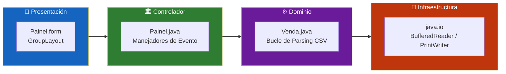
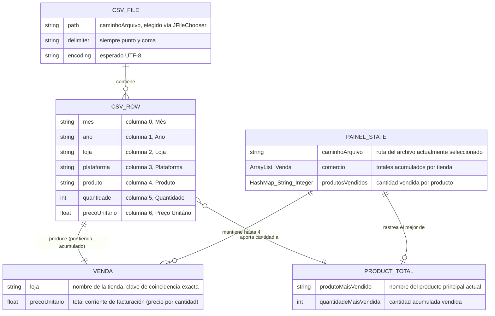
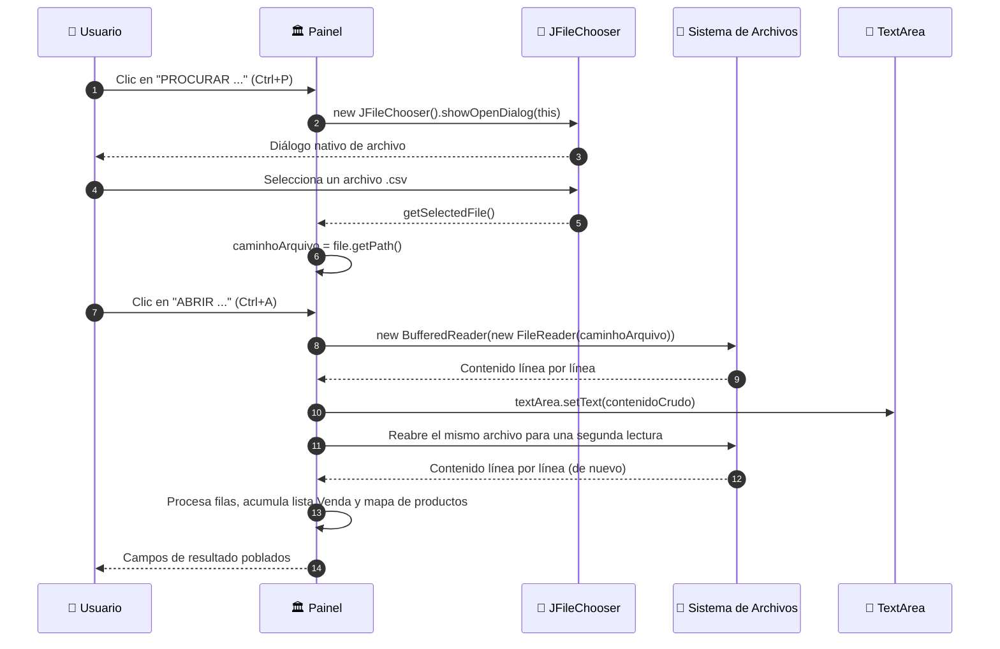
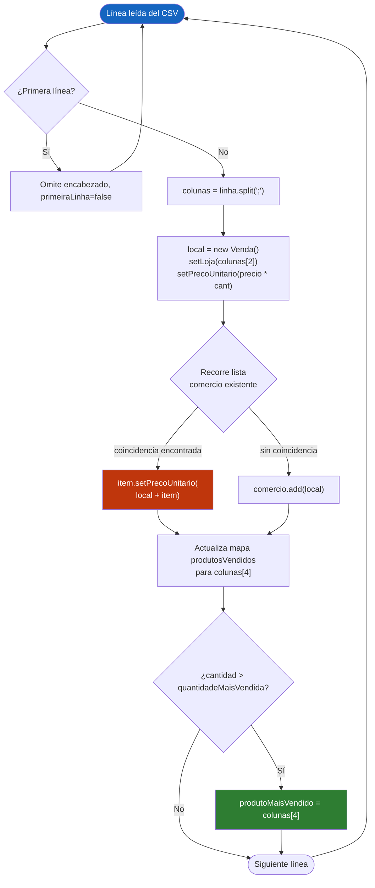
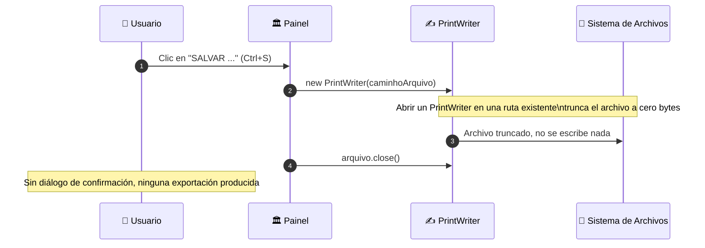
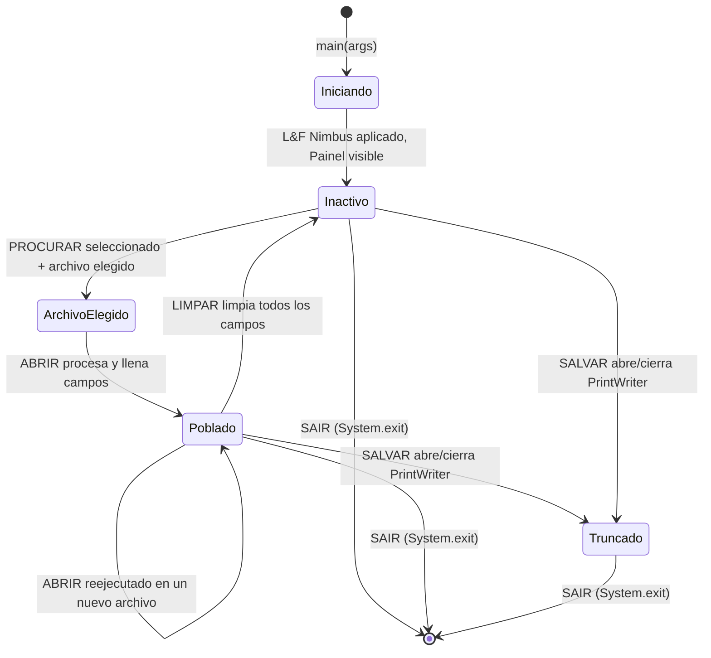
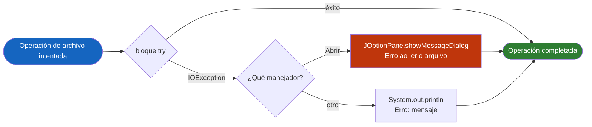
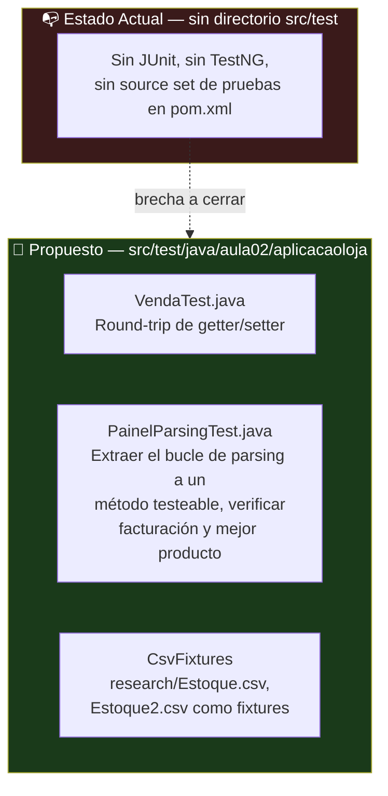

<div align="center">

**🌐 Choose Language / Selecione o Idioma / Elija el Idioma**

[](README.md)&nbsp;&nbsp;&nbsp;[](README_PT.md)&nbsp;&nbsp;&nbsp;[](README_ES.md)

</div>

---

<div align="center">

```
██╗      ██████╗      ██████╗███████╗██╗   ██╗
██║     ██╔═══██╗    ██╔════╝██╔════╝██║   ██║
██║     ██║   ██║    ██║     ███████╗██║   ██║
██║     ██║   ██║    ██║     ╚════██║╚██╗ ██╔╝
███████╗╚██████╔╝    ╚██████╗███████║ ╚████╔╝
╚══════╝ ╚═════╝      ╚═════╝╚══════╝  ╚═══╝
        Lector de Ventas en CSV con Java Swing
```

---

[](https://openjdk.org/)
[](https://docs.oracle.com/javase/tutorial/uiswing/)
[](https://maven.apache.org/)
[]()
[-217346?style=for-the-badge)]()
[]()

<br/>

> **Una aplicación de escritorio en Java Swing que lee archivos CSV de ventas delimitados por punto y coma**
> y calcula la facturación por tienda y el producto más vendido, enteramente en memoria.

<br/>


</div>

---

## 📑 Tabla de Contenidos

<details>
<summary>▶️ <strong>Haga clic para expandir / contraer esta sección</strong></summary>

<table>
<tr>
<td valign="top" width="50%">

**🏗️ Sistema**
- [Visión General](#-visión-general)
- [Arquitectura del Sistema](#-arquitectura-del-sistema)
- [Stack Tecnológico](#-stack-tecnológico)
- [Patrones de Diseño Aplicados](#-patrones-de-diseño-aplicados)
- [Estructura del Proyecto](#-estructura-del-proyecto)

**📦 Módulos**
- [Painel — Ventana Principal](#-painel--controlador-de-la-ventana-principal)
- [Venda — Modelo de Registro](#-venda--modelo-del-registro-de-venta)
- [AplicacaoLoja — Stub de Entrada](#-aplicacaoloja--stub-del-punto-de-entrada)
- [totalLoja1 — Stub No Usado](#-totalloja1--stub-no-utilizado)
- [Activos de Investigación](#-activos-de-investigación--íconos-y-datos-de-ejemplo)

</td>
<td valign="top" width="50%">

**💼 Negocio**
- [Reglas de Negocio](#-reglas-de-negocio)
- [Requisitos Funcionales](#-requisitos-funcionales)
- [Requisitos No Funcionales](#-requisitos-no-funcionales)

**📐 Diseño**
- [Modelo de Datos](#-modelo-de-datos)
- [Flujos del Sistema](#-flujos-del-sistema)

**🔐 Seguridad y Operaciones**
- [Seguridad](#-seguridad)
- [Instalación & Ejecución](#-instalación--ejecución)
- [Pruebas Automatizadas](#-pruebas-automatizadas)
- [Métricas & Monitoreo](#-métricas--monitoreo)
- [Limitaciones Conocidas](#-limitaciones-conocidas)

</td>
</tr>
</table>

---

</details>

## 🌟 Visión General

<details>
<summary>▶️ <strong>Haga clic para expandir / contraer esta sección</strong></summary>

**AplicacaoLoja** (empaquetado en este repositorio como *leitor_de_arquivo_csv*) es una pequeña aplicación de escritorio escrita en **Java** usando el toolkit **Swing**. Fue construida como un trabajo de curso (`aula02`) para una materia de Programación Orientada a Objetos, bajo el nombre de autor registrado en el encabezado del código fuente, Victor Henrique de Jesus Santiago.

La aplicación abre una única ventana (`Painel`, un `JFrame`) con una barra de menús que ofrece cuatro acciones: buscar un archivo CSV, abrirlo y analizarlo, "guardarlo" y salir. Una vez abierto el archivo, el texto sin procesar se vuelca en un área de texto desplazable y, en la misma pasada, el código recorre cada fila de datos para acumular la **facturación por tienda** (precio unitario × cantidad) y determinar el **producto más vendido** por la cantidad acumulada. Los resultados se muestran en componentes simples de `TextField`/`JTextField`, no en una tabla o gráfico.

No hay base de datos, acceso a red, ni ninguna biblioteca externa además del propio JDK: todo el modelo de persistencia es "leer un archivo `.csv` del disco, calcular en memoria, mostrar los números". El `pom.xml` no declara ninguna dependencia, por lo que todo el conjunto de funcionalidades se implementa con `java.io`, `java.util` y `javax.swing` de la biblioteca estándar.

### 🎯 Objetivos del Sistema

| Objetivo | Descripción |
|-----------|-------------|
| 📂 **Selección de Archivo** | Permitir que el usuario elija un archivo `.csv` del disco vía `JFileChooser` (menú *ARQUIVO → PROCURAR*) |
| 📖 **Vista Previa Cruda** | Mostrar el contenido sin procesar del archivo en un `TextArea` desplazable (menú *ARQUIVO → ABRIR*) |
| 🧮 **Agregación de Facturación** | Sumar `Preço Unitário × Quantidade` por nombre de tienda distinto encontrado en el archivo |
| 🏆 **Detección del Más Vendido** | Rastrear la cantidad acumulada vendida por nombre de producto y reportar la mayor |
| 🖥️ **Visualización de Resultados** | Mostrar hasta cuatro totales de tienda en campos de texto dedicados y el producto principal en un quinto |
| 🧹 **Reinicio** | Limpiar la vista previa y todos los campos de resultado con un botón **LIMPAR (CLEAR)** |
| 🚪 **Salida** | Terminar la JVM de forma limpia desde el elemento de menú *SAIR* o la tecla `Esc` |
| 🎓 **Alcance Educativo** | Demostrar E/S de archivos, manejo de eventos Swing y agregación simple en memoria, no robustez de producción |

---

</details>

## 🏗️ Arquitectura del Sistema

<details>
<summary>▶️ <strong>Haga clic para expandir / contraer esta sección</strong></summary>

### Diagrama de Módulos

```mermaid
flowchart TB
    subgraph UI["📱  CAPA DE PRESENTACIÓN"]
        direction LR
        FORM["🪟 Painel.form\n─────────────\nGroupLayout de NetBeans\nJMenuBar x2\nTextArea + 5 campos"]
        MENU["📋 Acciones de Menú\n─────────────\nPROCURAR · ABRIR\nSALVAR · SAIR"]
    end

    subgraph CTRL["🏛️  CONTROLADOR"]
        MAIN["Painel.java\n─────────────────────\n• Listeners de eventos\n• Estado de la ruta del archivo\n• Bucle de parsing CSV\n• Lógica de agregación"]
    end

    subgraph CORE["⚙️  DOMINIO"]
        direction TB
        PARSE["🔍 División de Línea CSV\nString.split(\";\")\n────────────\n7 columnas por fila"]
        AGG["🧮 Agregación\nHashMap + ArrayList\n────────────\nFacturación por tienda\nCantidad por producto"]
        MODEL["📦 Venda.java\nRegistro de Venta\n────────────\nloja : String\nprecoUnitario : float"]
    end

    subgraph SYS["💾  SISTEMA DE ARCHIVOS"]
        direction LR
        CSVFILE[("📄 .csv Seleccionado\nRuta elegida por el usuario\n─────────────\nDelimitado por ; UTF-8")]
    end

    subgraph OUT["🖥️  SALIDA"]
        FIELDS["📊 Campos de Resultado\n──────────────────────\ntextField1-4 : totales por tienda\ntextField5 : mejor producto"]
    end

    FORM -->|"addActionListener"| MAIN
    MENU -->|"actionPerformed"| MAIN
    MAIN -->|"JFileChooser"| CSVFILE
    MAIN --> PARSE
    PARSE --> MODEL
    PARSE --> AGG
    MODEL --> AGG
    AGG --> FIELDS
    CSVFILE -->|"BufferedReader"| PARSE
    MAIN -->|"setText"| FIELDS

    style UI fill:#1e3a5f,color:#fff,stroke:#4a90d9
    style CTRL fill:#1a3a1a,color:#fff,stroke:#4caf50
    style CORE fill:#3a1a1a,color:#fff,stroke:#e57373
    style SYS fill:#3a2a1a,color:#fff,stroke:#ffb74d
    style OUT fill:#2a1a3a,color:#fff,stroke:#ce93d8
```

### Capas de la Arquitectura



---

</details>

## 🛠️ Stack Tecnológico

<details>
<summary>▶️ <strong>Haga clic para expandir / contraer esta sección</strong></summary>

<table>
<thead>
<tr>
<th>Capa</th>
<th>Tecnología</th>
<th>Versión</th>
<th>Propósito</th>
</tr>
</thead>
<tbody>
<tr>
<td rowspan="2"><strong>🧠 Lenguaje</strong></td>
<td>Java</td>
<td>21</td>
<td>Lenguaje del código fuente (<code>maven.compiler.source</code>/<code>target</code> en <code>pom.xml</code>)</td>
</tr>
<tr>
<td>XML</td>
<td>—</td>
<td><code>Painel.form</code> (descriptor de GUI de NetBeans), <code>pom.xml</code>, <code>nbactions.xml</code></td>
</tr>
<tr>
<td rowspan="3"><strong>🖥️ Toolkit de UI</strong></td>
<td>Java Swing</td>
<td>Incluido en el JDK</td>
<td><code>JFrame</code>, <code>JMenuBar</code>, <code>JFileChooser</code>, <code>JOptionPane</code></td>
</tr>
<tr>
<td>AWT</td>
<td>Incluido en el JDK</td>
<td>Componentes heredados <code>java.awt.TextField</code>, <code>java.awt.TextArea</code>, <code>java.awt.Label</code> mezclados en el formulario</td>
</tr>
<tr>
<td>NetBeans GUI Builder</td>
<td>Form v1.3</td>
<td>Generó el <code>GroupLayout</code> en <code>initComponents()</code></td>
</tr>
<tr>
<td rowspan="2"><strong>💾 E/S</strong></td>
<td><code>java.io</code></td>
<td>Incluido en el JDK</td>
<td><code>BufferedReader</code>, <code>FileReader</code>, <code>PrintWriter</code> para leer/escribir el archivo CSV</td>
</tr>
<tr>
<td><code>java.util</code></td>
<td>Incluido en el JDK</td>
<td><code>ArrayList&lt;Venda&gt;</code>, <code>HashMap&lt;String,Integer&gt;</code> para agregación en memoria</td>
</tr>
<tr>
<td rowspan="2"><strong>🔧 Build</strong></td>
<td>Apache Maven</td>
<td>model 4.0.0</td>
<td><code>pom.xml</code> — groupId <code>Aula02</code>, artifactId <code>AplicacaoLoja</code>, packaging <code>jar</code></td>
</tr>
<tr>
<td>exec-maven-plugin</td>
<td>3.0.0</td>
<td>Referenciado en <code>nbactions.xml</code> para ejecutar/depurar <code>Painel</code> directamente desde el IDE</td>
</tr>
<tr>
<td><strong>🧪 Pruebas</strong></td>
<td>Ninguna</td>
<td>—</td>
<td>No existe directorio <code>src/test</code> ni dependencia de pruebas en el proyecto</td>
</tr>
</tbody>
</table>

---

</details>

## 🎨 Patrones de Diseño Aplicados

<details>
<summary>▶️ <strong>Haga clic para expandir / contraer esta sección</strong></summary>

| Patrón | Dónde | Justificación |
|---------|-------|-----------|
| 👂 **Observer / Callback** | `addActionListener` en cada botón, elemento de menú y campo en `initComponents()` | El modelo de eventos de Swing conduce toda la interacción del usuario a través de listeners registrados |
| 🧭 **Facade (ligero)** | `jMenuAbrirActionPerformed` | Un único manejador oculta la lectura del archivo, el renderizado del texto crudo y toda la pasada de agregación detrás de un solo clic de menú |
| 📦 **Contenedor de Datos Simple (POJO)** | `Venda.java` | Una clase mínima de getters/setters que porta `loja` y `precoUnitario`, usada como unidad de agregación |
| 🗺️ **Acumulador / Map-Reduce (manual)** | `HashMap<String, Integer> produtosVendidos` en `jMenuAbrirActionPerformed` | Totales corrientes por clave de producto, actualizados en cada fila, reflejando un paso de reduce manual |
| 🚦 **Cláusula de Guardia (parcial)** | `if (!primeiraLinha)` para omitir la línea de encabezado | El salto anticipado mantiene el cuerpo del parsing libre de ramas de manejo del encabezado |
| 🏷️ **Campo de Estado** | Campo de instancia `caminhoArquivo` | Mantiene la ruta del archivo elegido entre las acciones de menú "Procurar" y "Abrir" |
| 🔁 **Búsqueda por Barrido Lineal** | `for (int i=0; i<comercio.size(); i++)` dentro de `jMenuAbrirActionPerformed` | Búsqueda de tienda existente iterando el `ArrayList<Venda>` en vez de usar un mapa, coherente con la escala pequeña y didáctica de la clase |

---

</details>

## 📁 Estructura del Proyecto

<details>
<summary>▶️ <strong>Haga clic para expandir / contraer esta sección</strong></summary>

```
leitor_de_arquivo_csv/
│
├── 📄 .gitignore                              # Ignora target/, *.class, secretos, archivos de SO/IDE
│
├── 📂 AplicacaoLoja/                          # ★ El proyecto Maven real (raíz de código fuente verdadera)
│   ├── 📄 pom.xml                             # Descriptor Maven: Java 21, empaquetado jar, sin dependencias
│   ├── 📄 nbactions.xml                       # Acciones run/debug/profile de NetBeans (clase principal = Painel)
│   ├── 📄 aplicacao_loja.txt                  # Revisión de borrador anterior de Painel.java, conservada como referencia
│   ├── 📄 atribuicoes_icon.txt                # Lista de atribuciones de Flaticon para cada ícono de menú/panel
│   ├── 📄 AplicacaoLoja-1.0-SNAPSHOT.jar      # Artefacto jar pre-construido versionado en el repositorio
│   │
│   ├── 📂 research/                           # 📊 Datos de ejemplo e íconos usados por la interfaz
│   │   ├── 📄 Estoque.csv                     # CSV de ventas de ejemplo (Mês;Ano;Loja;Plataforma;Produto;Quantidade;Preço)
│   │   ├── 📄 Estoque2.csv                    # Segundo CSV de ventas de ejemplo
│   │   ├── 📄 leituraCSV.csv                  # Conjunto de datos mayor y no relacionado de municipios, usado para probar la lectura
│   │   └── 📄 *.png                           # Íconos de menú abrir/salvar/sair/procurar/mes/ano/lojas/...
│   │
│   ├── 📂 src/main/java/
│   │   ├── 📄 totalLoja1.java                 # Clase stub sin paquete, vacía (no utilizada)
│   │   └── 📂 aula02/aplicacaoloja/
│   │       ├── 📄 AplicacaoLoja.java          # Stub de entrada declarado en pom.xml, main() vacío
│   │       ├── 📄 Painel.java                 # ★ JFrame principal — GUI, eventos, parsing CSV, agregación (449 líneas)
│   │       ├── 📄 Painel.form                 # Descriptor de GroupLayout de NetBeans consumido por initComponents()
│   │       ├── 📄 Venda.java                  # POJO: loja (String) + precoUnitario (float)
│   │       └── 📄 library_folder_20326.ico    # Ícono de la aplicación
│   │
│   └── 📂 target/                             # Salida de build de Maven (archivos .class compilados, metadatos)
│
├── 📄 README.md                                # 🇺🇸 English (principal)
├── 📄 README_PT.md                             # 🇧🇷 Português
└── 📄 README_ES.md                             # 🇪🇸 Español
```

---

</details>

## 📦 Módulos del Sistema

<details>
<summary>▶️ <strong>Haga clic para expandir / contraer esta sección</strong></summary>

### 🏛️ Painel — Controlador de la Ventana Principal

`Painel` (`aula02.aplicacaoloja.Painel`) extiende `javax.swing.JFrame` y es la única clase visual de la aplicación. Guarda el estado de la ruta del archivo, todos los manejadores de eventos y la lógica de parsing/agregación de CSV en un único archivo de 449 líneas.

| Responsabilidad | Implementación |
|-----------------|----------------|
| Configuración de la ventana | `initComponents()` — `GroupLayout` generado por NetBeans, dos `JMenuBar`, una visible (`jMenuBar1`) |
| Estado de la ruta del archivo | `String caminhoArquivo` — establecido por el manejador de Procurar, leído por Abrir y Salvar |
| Punto de entrada | `public static void main(String[] args)` — aplica el look-and-feel Nimbus si está disponible, luego `new Painel().setVisible(true)` |
| Acciones de menú | `jMenuProcurarActionPerformed`, `jMenuAbrirActionPerformed`, `jMenuSalvarActionPerformed`, `jMenuSairActionPerformed` |
| Acción de limpieza | `jButtonClearActionPerformed` — limpia el área de texto y los cinco campos de resultado |
| Stubs no usados | `textField1ActionPerformed` … `textField5ActionPerformed` — cuerpos de listener vacíos generados automáticamente por el editor de formularios |

---

### 📦 Venda — Modelo del Registro de Venta

`Venda` es un POJO con visibilidad de paquete usado para acumular un total corriente por tienda mientras se recorre el CSV.

| Campo | Tipo | Accesores |
|-------|------|-----------|
| `loja` | `String` | `getLoja()` / `setLoja(String)` |
| `precoUnitario` | `float` | `getPrecoUnitario()` / `setPrecoUnitario(float)` — a pesar del nombre ("precio unitario"), este campo se reutiliza para guardar el **total corriente de facturación** de la tienda |

> [!NOTE]
> El nombre del campo `precoUnitario` es engañoso: en `Painel.jMenuAbrirActionPerformed` recibe `Float.parseFloat(colunas[6]) * Integer.parseInt(colunas[5])`, es decir, precio × cantidad, por lo que en realidad almacena la facturación acumulada, no un precio por unidad.

---

### 🚪 AplicacaoLoja — Stub del Punto de Entrada

`AplicacaoLoja` (`aula02.aplicacaoloja.AplicacaoLoja`) es la clase declarada como `exec.mainClass` en `pom.xml`. Su cuerpo de `main(String[] args)` está vacío — la aplicación en realidad se inicia mediante `Painel.main()`, según lo sobrescrito por `nbactions.xml` en las acciones de run/debug/profile del IDE.

| Propiedad | Valor |
|----------|-------|
| Clase principal declarada (pom.xml) | `aula02.aplicacaoloja.AplicacaoLoja` |
| Clase realmente iniciada (nbactions.xml) | `aula02.aplicacaoloja.Painel` |
| Cuerpo | Vacío — no hace nada si se invoca directamente |

---

### 🧩 totalLoja1 — Stub No Utilizado

Una clase sin paquete en `src/main/java/totalLoja1.java`, generada a partir de una plantilla de clase de NetBeans y nunca referenciada en ningún otro lugar del código. Contiene solo un comentario de documentación y ningún miembro.

---

### 🖼️ Activos de Investigación — Íconos y Datos de Ejemplo

El directorio `research/` provee los íconos de menú (`procurar.png`, `abrir.png`, `salvar.png`, `sair.png`) referenciados por rutas absolutas de Windows en `initComponents()` (p. ej. `E:\IFPR\POO I\AplicacaoLoja\research\procurar.png`), además de íconos de categoría (`mes.png`, `ano.png`, `lojas.png`, `plataforma.png`, `produtos.png`, `quantidade.png`, `preco.png`, `moeda.png`) que actualmente no están conectados a ningún componente Swing, y dos CSV de ejemplo (`Estoque.csv`, `Estoque2.csv`) que siguen el esquema `Mês;Ano;Loja;Plataforma;Produto;Quantidade;Preço Unitário` esperado por el parser.

> [!WARNING]
> Las rutas de ícono fijas en `Painel.java` (`E:\IFPR\POO I\AplicacaoLoja\research\*.png`) apuntan a la máquina local del autor original y fallarán silenciosamente al cargar en cualquier otro equipo, dejando los elementos de menú sin íconos, pero funcionales.

---

</details>

## 💼 Reglas de Negocio

<details>
<summary>▶️ <strong>Haga clic para expandir / contraer esta sección</strong></summary>

### 📄 Reglas de Formato CSV

| # | Regla | Aplicación |
|---|------|-------------|
| RN-01 | Las columnas deben estar separadas por punto y coma (`;`) | `String divisorCSV = ";"` usado en `linha.split(divisorCSV)` |
| RN-02 | La primera línea del archivo siempre se trata como encabezado y se omite | Bandera `Boolean primeiraLinha`, verificada antes de procesar cada línea |
| RN-03 | Cada fila de datos debe tener al menos 7 columnas (índices 0-6) | `colunas[2]`, `colunas[4]`, `colunas[5]`, `colunas[6]` se acceden directamente, sin verificación de longitud |
| RN-04 | La columna 2 es el nombre de la tienda, la 4 el producto, la 5 la cantidad y la 6 el precio unitario | Índices de columna fijos en `jMenuAbrirActionPerformed` |

### 🧮 Reglas de Agregación

| # | Regla | Aplicación |
|---|------|-------------|
| RN-05 | Facturación de la tienda = suma de `(precio unitario × cantidad)` de todas las filas de esa tienda | `local.setPrecoUnitario(Float.parseFloat(colunas[6]) * Integer.parseInt(colunas[5]))`, fusionado al `Venda` existente cuando la tienda se repite |
| RN-06 | Una tienda se identifica por coincidencia exacta de cadena en el nombre | `item.getLoja().equals(local.getLoja())` |
| RN-07 | El producto más vendido es el que tiene la mayor cantidad acumulada en todas las filas | `HashMap<String, Integer> produtosVendidos`, con `quantidadeMaisVendida` rastreado como el máximo corriente |
| RN-08 | Solo se muestran las primeras cuatro tiendas distintas encontradas, una por campo de resultado | La asignación de campos de resultado dentro del bucle de `comercio` solo maneja los índices `0`-`3` |

### 🖱️ Reglas de Comportamiento de la Interfaz

| # | Regla | Aplicación |
|---|------|-------------|
| RN-09 | El botón **LIMPAR** reinicia la vista previa y los cinco campos de resultado | `jButtonClearActionPerformed` llama a `setText("")` en `textArea` y `textField1`-`textField5` |
| RN-10 | El elemento de menú **SALVAR** trunca el archivo actualmente abierto en lugar de escribir contenido en él | `new PrintWriter(caminhoArquivo)` abre (y así vacía) el archivo, luego lo cierra inmediatamente sin escribir |
| RN-11 | El elemento de menú **SAIR** termina la JVM inmediatamente | `System.exit(0)` |
| RN-12 | Abrir un archivo sin selección previa, o con una ruta ilegible, muestra un diálogo de error en lugar de bloquear el hilo de la UI | `try/catch (IOException e)` alrededor de la lectura, reportado vía `JOptionPane.showMessageDialog` |

---

</details>

## ✅ Requisitos Funcionales

<details>
<summary>▶️ <strong>Haga clic para expandir / contraer esta sección</strong></summary>

| ID | Requisito | Prioridad | Estado |
|----|-------------|----------|--------|
| **RF-01** | El sistema debe permitir al usuario buscar y seleccionar un archivo `.csv` mediante un diálogo de selección de archivo | 🔴 Alta | ✅ Implementado |
| **RF-02** | El sistema debe leer el contenido crudo del archivo seleccionado en un área de texto desplazable | 🔴 Alta | ✅ Implementado |
| **RF-03** | El sistema debe procesar el archivo delimitado por `;`, omitiendo la primera línea (encabezado) | 🔴 Alta | ✅ Implementado |
| **RF-04** | El sistema debe calcular la facturación total por tienda como precio unitario × cantidad, sumado entre filas | 🔴 Alta | ✅ Implementado |
| **RF-05** | El sistema debe mostrar hasta cuatro totales de tiendas distintas en campos separados | 🟡 Media | ✅ Implementado |
| **RF-06** | El sistema debe determinar el producto con mayor cantidad acumulada vendida | 🔴 Alta | ✅ Implementado |
| **RF-07** | El sistema debe mostrar el nombre del producto más vendido y la cantidad total | 🟡 Media | ✅ Implementado |
| **RF-08** | El sistema debe proveer una acción LIMPAR que reinicia la vista previa y todos los campos de resultado | 🟢 Baja | ✅ Implementado |
| **RF-09** | El sistema debe proveer una acción SAIR que termina la aplicación | 🟢 Baja | ✅ Implementado |
| **RF-10** | El sistema debe proveer un elemento de menú SALVAR bajo el menú ARQUIVO | 🟢 Baja | ✅ Implementado |
| **RF-11** | La acción SALVAR debe persistir los resultados editados de vuelta al CSV de origen | 🟡 Media | ⬜ Planeado |
| **RF-12** | El sistema debe reportar errores de lectura/parsing al usuario vía diálogo, en lugar de fallar silenciosamente | 🟡 Media | ✅ Implementado |
| **RF-13** | El sistema debe vincular aceleradores de teclado (`Ctrl+P`, `Ctrl+A`, `Ctrl+S`, `Esc`) a las cuatro acciones de menú | 🟢 Baja | ✅ Implementado |
| **RF-14** | El sistema debe aplicar el look-and-feel Nimbus cuando esté disponible al iniciar | 🟢 Baja | ✅ Implementado |
| **RF-15** | El sistema debe rechazar o manejar de forma segura filas CSV con menos de 7 columnas | 🟡 Media | ⬜ Planeado |
| **RF-16** | El sistema debe soportar más de cuatro tiendas distintas en la visualización de resultados | 🟢 Baja | ⬜ Planeado |
| **RF-17** | El sistema debe evitar leer el archivo seleccionado dos veces por acción "Abrir" | 🟡 Media | ⬜ Planeado |
| **RF-18** | El sistema debe presentar resultados en una tabla ordenable en lugar de campos de texto fijos | 🟢 Baja | ⬜ Planeado |

---

</details>

## ⚡ Requisitos No Funcionales

<details>
<summary>▶️ <strong>Haga clic para expandir / contraer esta sección</strong></summary>

| ID | Categoría | Requisito | Objetivo |
|----|----------|-------------|--------|
| **RNF-01** | ⚡ Rendimiento | El parsing del CSV corre en una única pasada en memoria por lectura | `O(n)` sobre la cantidad de filas, `O(n·k)` para la búsqueda lineal de tiendas, donde `k` ≤ 4 |
| **RNF-02** | 📦 Huella | Ninguna dependencia externa en tiempo de ejecución además del JDK | `pom.xml` declara cero `<dependencies>` |
| **RNF-03** | 🧠 Memoria | Todo el archivo se almacena como texto más un `Venda` por tienda distinta | Limitado por el tamaño del archivo de entrada; sin streaming para archivos muy grandes |
| **RNF-04** | 📱 Portabilidad | Corre en cualquier SO con un JDK compatible y soporte para Swing | Requiere **JDK 21** (`maven.compiler.source`/`target`) |
| **RNF-05** | 🎨 Usabilidad | Las acciones de menú son accesibles mediante aceleradores de teclado | `Ctrl+P`, `Ctrl+A`, `Ctrl+S`, `Esc` |
| **RNF-06** | 🔧 Mantenibilidad | Código organizado como un proyecto Maven bajo un único paquete | `aula02.aplicacaoloja` |
| **RNF-07** | 🔧 Reproducibilidad de Build | Build descrito declarativamente con versión de modelo Maven fija | `pom.xml` `modelVersion 4.0.0` |
| **RNF-08** | 🔐 Confiabilidad | Los errores de E/S se capturan y exponen, no se tragan silenciosamente | `try/catch (IOException e)` alrededor de cada operación de archivo |
| **RNF-09** | 🌍 Codificación | Los archivos fuente declaran UTF-8 como codificación de build | `project.build.sourceEncoding = UTF-8` en `pom.xml` |
| **RNF-10** | ♿ Accesibilidad | El texto de la interfaz es legible en un tamaño de fuente predeterminado grande | `label2`-`label5` usan 36pt, `jLabel1`/`jLabel2` usan 24pt en negrita |
| **RNF-11** | 🧪 Testabilidad | Cobertura de regresión automatizada para la lógica de parsing/agregación | Actualmente ausente (ver [Pruebas Automatizadas](#-pruebas-automatizadas)) |
| **RNF-12** | 📐 Consistencia | Los activos de íconos se distribuyen junto al código con atribución documentada | `atribuicoes_icon.txt` lista la fuente en Flaticon de cada ícono |

---

</details>

## 🗄️ Modelo de Datos

<details>
<summary>▶️ <strong>Haga clic para expandir / contraer esta sección</strong></summary>

Este proyecto **no tiene base de datos ni capa de persistencia**. El "modelo de datos" es la forma del archivo CSV que lee y los objetos Java en memoria construidos durante el parsing.

### Diagrama Entidad-Relación



### Especificación de Columnas del CSV

| # | Columna (encabezado PT) | Tipo Java usado | Consumido por |
|---|---------------------|-----------------|-------------|
| 0 | `Mês` | no procesado | Mostrado solo en la vista previa cruda |
| 1 | `Ano` | no procesado | Mostrado solo en la vista previa cruda |
| 2 | `Loja` | `String` | `local.setLoja(colunas[2])` — clave de agrupación por tienda |
| 3 | `Plataforma` | no procesado | Mostrado solo en la vista previa cruda |
| 4 | `Produto` | `String` | Clave del mapa `produtosVendidos` |
| 5 | `Quantidade` | `int` (`Integer.parseInt`) | Multiplicado en la facturación; acumulado por producto |
| 6 | `Preço Unitário` | `float` (`Float.parseFloat`) | Multiplicado por la cantidad para obtener la facturación de la fila |

### Forma del Estado en Memoria

| Estructura | Tipo | Ciclo de vida | Propósito |
|-----------|------|----------|---------|
| `comercio` | `ArrayList<Venda>` | Local a `jMenuAbrirActionPerformed`, reconstruido en cada clic en "Abrir" | Mantiene un `Venda` por tienda distinta vista hasta el momento |
| `produtosVendidos` | `HashMap<String, Integer>` | Local a `jMenuAbrirActionPerformed`, reconstruido en cada clic en "Abrir" | Total corriente de cantidad por nombre de producto |
| `caminhoArquivo` | `String` (campo de instancia) | Vive durante el ciclo de vida de la ventana `Painel` | La única ruta de archivo de referencia compartida por Procurar/Abrir/Salvar |

---

</details>

## 🔄 Flujos del Sistema

<details>
<summary>▶️ <strong>Haga clic para expandir / contraer esta sección</strong></summary>

### Flujo de Selección y Parsing de Archivo



### Flujo de Agregación de Facturación



### Flujo de la Acción Guardar



### Máquina de Estados del Ciclo de Vida de la Ventana



### Flujo de Manejo de Errores



---

</details>

## 🔐 Seguridad

<details>
<summary>▶️ <strong>Haga clic para expandir / contraer esta sección</strong></summary>

### Controles Implementados

| Control | Implementación | Efecto |
|---------|-----------------|--------|
| 🗂️ **Selección de archivo controlada por el usuario** | `JFileChooser` restringido a `FILES_ONLY` | El usuario, y no una entrada externa, elige qué archivo se lee |
| 🔐 **Sin acceso a red** | Ningún socket, cliente HTTP o permiso de red en todo el código | Los datos nunca salen de la máquina local a través de esta aplicación |
| 📵 **Sin dependencias de terceros** | `pom.xml` declara cero `<dependencies>` | Superficie de cadena de suministro de terceros igual a cero |
| 🧾 **Contención de errores** | `try/catch (IOException e)` alrededor de cada lectura de archivo | Un archivo malformado o ausente no bloquea el hilo de eventos de Swing |
| 🔒 **Sin ejecución dinámica de código** | Ninguna carga de clases vía reflection, ningún motor de scripting | El parser solo llama a `String.split`, `Integer.parseInt`, `Float.parseFloat` |

### Limitaciones de Seguridad Conocidas

> [!WARNING]
> Este es un prototipo educativo. Las siguientes brechas deben cerrarse antes de cualquier uso en producción o multiusuario.

| Limitación | Riesgo | Camino de mitigación |
|------------|------|-----------------|
| 🗑️ **SALVAR trunca el archivo sin confirmación** | Un clic accidental en el elemento de menú SALVAR borra silenciosamente el CSV abierto a cero bytes | Exigir un diálogo explícito de "Guardar Como" y nunca abrir un `PrintWriter` en la ruta original sin escribir contenido de vuelta |
| 🧨 **Sin validación de número de columnas** | Una fila malformada con menos de 7 columnas lanza una `ArrayIndexOutOfBoundsException` no capturada, propagándose fuera del bucle de parsing | Validar `colunas.length >= 7` antes de indexar y omitir/reportar filas inválidas |
| 🔢 **`NumberFormatException` no capturada durante el parsing** | Una celda no numérica de `Quantidade` o `Preço Unitário` detiene el parsing en lugar de reportarse al usuario | Envolver `Integer.parseInt` / `Float.parseFloat` en su propio try/catch con un mensaje orientado al usuario |
| 🖥️ **Rutas absolutas de íconos fijas en el código** | Rutas como `E:\IFPR\POO I\AplicacaoLoja\research\procurar.png` filtran la estructura de directorios local del autor original y fallan en cualquier otra máquina | Cargar íconos como recursos del classpath (p. ej. vía `getClass().getResource(...)`) en lugar de rutas absolutas del sistema de archivos |
| 📄 **Sin validación de ruta o tipo de archivo** | `JFileChooser` acepta cualquier archivo, no solo `.csv`; un archivo enorme o binario se leería por completo en memoria | Agregar un `FileNameExtensionFilter("CSV", "csv")` y una protección de tamaño antes de leer |
| 🧵 **La E/S de archivos corre en el Event Dispatch Thread de Swing** | Un CSV muy grande congela la UI mientras se lee y procesa | Mover la E/S de archivos a un hilo en segundo plano (p. ej. `SwingWorker`) |
| 📦 **Jar pre-construido versionado en el repositorio** | `AplicacaoLoja-1.0-SNAPSHOT.jar` está versionado junto al código fuente, pudiendo desactualizarse respecto a él e inflar el repositorio | Construir artefactos bajo demanda vía `mvn package`; excluir `*.jar` del control de versiones |

---

</details>

## 🚀 Instalación & Ejecución

<details>
<summary>▶️ <strong>Haga clic para expandir / contraer esta sección</strong></summary>

### Prerrequisitos

```bash
# Java Development Kit 21 o superior (coincide con las configuraciones del compilador en pom.xml)
java -version         # se espera 21+

# Apache Maven 3.8+ (cualquier versión reciente funciona; sin fijación de plugins además de exec-maven-plugin 3.0.0)
mvn -version
```

### Build

```bash
# Desde el directorio AplicacaoLoja/ (la raíz real del proyecto Maven)
cd AplicacaoLoja

# Compila los fuentes
mvn compile

# Empaqueta en un jar ejecutable (sin dependencias que incluir — jar simple)
mvn package
# Salida: target/AplicacaoLoja-1.0-SNAPSHOT.jar

# Elimina toda la salida de build
mvn clean
```

### Ejecución

```bash
# Recomendado: ejecuta la clase de GUI real directamente (coincide con nbactions.xml)
mvn compile exec:java -Dexec.mainClass=aula02.aplicacaoloja.Painel

# Alternativa: ejecuta la clase declarada en pom.xml (actualmente un stub vacío)
mvn compile exec:java -Dexec.mainClass=aula02.aplicacaoloja.AplicacaoLoja

# O ejecute la clase Painel del jar empaquetado desde el classpath
java -cp target/classes aula02.aplicacaoloja.Painel
```

**Uso en la aplicación**

1. Inicie la aplicación — la ventana `Painel` se abre con el área de vista previa vacía.
2. Menú **ARQUIVO → PROCURAR ...** (`Ctrl+P`) → elija un archivo `.csv`, p. ej. `research/Estoque.csv`.
3. Menú **ARQUIVO → ABRIR ...** (`Ctrl+A`) → el contenido crudo del archivo llena el área de texto y los campos de resultado se pueblan con los totales de las tiendas y el producto más vendido.
4. Presione **LIMPAR (CLEAR)** para reiniciar la vista previa y todos los campos de resultado.
5. Menú **ARQUIVO → SAIR ...** (`Esc`) para cerrar la aplicación.

> [!WARNING]
> Evite el elemento de menú **SALVAR** en un archivo que desee conservar — vea [Limitaciones de Seguridad Conocidas](#-seguridad).

### Objetivos de Maven

| Objetivo | Propósito |
|--------|---------|
| `mvn compile` | Compila todos los fuentes Java bajo `src/main/java` |
| `mvn package` | Produce `target/AplicacaoLoja-1.0-SNAPSHOT.jar` |
| `mvn clean` | Elimina el directorio `target/` |
| `mvn exec:java -Dexec.mainClass=aula02.aplicacaoloja.Painel` | Ejecuta la GUI real (recomendado) |
| `mvn exec:java -Dexec.mainClass=aula02.aplicacaoloja.AplicacaoLoja` | Ejecuta el stub de punto de entrada vacío declarado en `pom.xml` |

### Configuración de Build

| Configuración | Valor | Declarado en |
|---------|-------|-------------|
| `groupId` | `Aula02` | `pom.xml` |
| `artifactId` | `AplicacaoLoja` | `pom.xml` |
| `version` | `1.0-SNAPSHOT` | `pom.xml` |
| `packaging` | `jar` | `pom.xml` |
| `project.build.sourceEncoding` | `UTF-8` | `pom.xml` |
| `maven.compiler.source` / `target` | `21` | `pom.xml` |
| `exec.mainClass` (por defecto del pom) | `aula02.aplicacaoloja.AplicacaoLoja` | `pom.xml` |
| `exec.mainClass` (sobrescrito por el IDE) | `aula02.aplicacaoloja.Painel` | `nbactions.xml` |

---

</details>

## 🧪 Pruebas Automatizadas

<details>
<summary>▶️ <strong>Haga clic para expandir / contraer esta sección</strong></summary>

### Arquitectura de Pruebas



| Source set | Estado | Notas |
|------------|--------|-------|
| `src/test/java` | ❌ No existe | Tampoco hay `<dependencies>` de JUnit/TestNG en `pom.xml` |
| Pruebas instrumentadas / de UI | ❌ Ninguna | Ningún equivalente a Espresso/AssertJ-Swing/FEST configurado |

### Ejecutando las Pruebas

```bash
# Actualmente no hay source set de pruebas para ejecutar.
# Una vez que se agreguen pruebas bajo src/test/java, correrían con:
mvn test
```

### Checklist de Aceptación Manual

Hasta que existan pruebas automatizadas, el siguiente checklist es la suite de regresión de facto:

| # | Escenario | Resultado esperado |
|---|----------|-----------------|
| 1 | Iniciar la aplicación | La ventana `Painel` se abre, todos los campos vacíos |
| 2 | PROCURAR → seleccionar `research/Estoque.csv` | `caminhoArquivo` establecido, aún sin cambio visible |
| 3 | ABRIR después de seleccionar un CSV válido | El texto crudo llena el área de texto, `textField1`-`textField4` muestran hasta cuatro totales de tienda, `textField5` muestra el mejor producto |
| 4 | ABRIR sin haber usado nunca PROCURAR | `caminhoArquivo` es `null`, se muestra un diálogo de error (`FileReader(null)` lanza excepción) |
| 5 | ABRIR un CSV con más de 4 tiendas distintas | Solo los últimos cuatro índices procesados (0-3) terminan reflejados en los cuatro campos, según RN-08 |
| 6 | LIMPAR después de ABRIR | El área de texto y los cinco campos se reinician vacíos |
| 7 | SALVAR en el archivo actualmente abierto | El archivo se trunca silenciosamente a 0 bytes (ver sección de Seguridad) |
| 8 | SAIR / `Esc` | La ventana de la aplicación se cierra y la JVM termina |
| 9 | Abrir una fila CSV con cantidad o precio no numérico | La aplicación lanza una `NumberFormatException` no capturada en la consola, la agregación se detiene para ese archivo |
| 10 | Abrir una fila CSV con menos de 7 columnas | La aplicación lanza una `ArrayIndexOutOfBoundsException` no capturada |

---

</details>

## 📊 Métricas & Monitoreo

<details>
<summary>▶️ <strong>Haga clic para expandir / contraer esta sección</strong></summary>

### Métricas del Código

| Métrica | Valor |
|--------|-------|
| Archivos fuente Java | 4 (`Painel.java`, `Venda.java`, `AplicacaoLoja.java`, `totalLoja1.java`) |
| Líneas de Java (`Painel.java`) | 449 |
| Líneas de Java (`Venda.java`) | 27 |
| Paquetes | 1 (`aula02.aplicacaoloja`) + 1 clase sin paquete (`totalLoja1`) |
| Ventanas de GUI (`JFrame`) | 1 (`Painel`) |
| Acciones de menú conectadas a lógica | 4 (`Procurar`, `Abrir`, `Salvar`, `Sair`) + 1 botón (`Limpar`) |
| Dependencias externas en tiempo de ejecución | 0 |
| Fixtures de CSV de ejemplo | 2 dedicadas (`Estoque.csv`, `Estoque2.csv`) + 1 conjunto de datos grande no relacionado (`leituraCSV.csv`) |
| Pruebas automatizadas | 0 |

### Señales de Runtime

| Señal | Fuente | Dónde observar |
|--------|--------|------------------|
| Errores de lectura de archivo | `catch (IOException e)` en `jMenuAbrirActionPerformed` | Diálogo `JOptionPane` titulado "Erro" |
| Errores de parsing/agregación | Mismo bloque `catch`, segundo try alrededor de `BufferedReader br` | `System.out.println("Erro: " + e.getMessage())` |
| Errores de guardado | `catch (IOException e)` en `jMenuSalvarActionPerformed` | `System.out.println("Ocorreu um erro: " + e.getMessage())` |
| Salida de la aplicación | `System.exit(0)` en `jMenuSairActionPerformed` | Código de salida del proceso `0` |

### Comandos de Diagnóstico Útiles

```bash
# Confirma que la versión del JDK coincide con el target del compilador en pom.xml
java -version

# Lista las dependencias declaradas (se espera lista vacía)
mvn dependency:tree

# Compila con salida detallada para detectar problemas de codificación/advertencias
mvn -X compile

# Observa la salida de consola mientras se ejecuta la GUI (captura logs de error vía println)
mvn exec:java -Dexec.mainClass=aula02.aplicacaoloja.Painel
```

### Códigos de Retorno / Salida Estandarizados

| Código | Origen | Significado |
|------|--------|---------|
| `0` | `System.exit(0)` en `jMenuSairActionPerformed` | Salida normal de la aplicación vía el elemento de menú SAIR |
| distinto de cero | Por defecto de la JVM | Excepción no capturada (p. ej. `ArrayIndexOutOfBoundsException`, `NumberFormatException`) propagándose desde un manejador de eventos |

---

</details>

## ⚠️ Limitaciones Conocidas

<details>
<summary>▶️ <strong>Haga clic para expandir / contraer esta sección</strong></summary>

> [!IMPORTANT]
> Este proyecto fue construido como ejercicio de curso de Programación Orientada a Objetos. Favorece intencionalmente la demostración de E/S de archivos y manejo de eventos Swing por encima del endurecimiento de producción.

| Categoría | Problema | Estado |
|----------|-------|--------|
| 🗑️ **Pérdida de datos** | El elemento de menú SALVAR trunca el archivo abierto a cero bytes en lugar de guardar cualquier cosa | ⚠️ Abierto |
| 📖 **Doble lectura de archivo** | `jMenuAbrirActionPerformed` abre y lee `caminhoArquivo` dos veces por clic — una para la vista previa cruda, otra para el parsing | ⚠️ Abierto |
| 🧨 **Sin protección de número de columnas** | Filas con menos de 7 columnas lanzan `ArrayIndexOutOfBoundsException` | ⚠️ Abierto |
| 🔢 **Sin validación numérica** | Celdas de cantidad/precio no numéricas lanzan `NumberFormatException` no capturada | ⚠️ Abierto |
| 🔒 **Límite de cuatro tiendas** | Solo se muestran las primeras cuatro tiendas distintas; una quinta tienda se descarta silenciosamente de la visualización | ⚠️ Abierto |
| 🖥️ **Rutas absolutas de íconos fijas** | Los íconos referencian `E:\IFPR\POO I\...`, fallando en cualquier máquina que no sea la del autor original | ⚠️ Abierto |
| 🧵 **E/S bloqueante en el hilo de la UI** | Archivos grandes congelan el hilo de despacho de eventos de Swing durante la lectura | ⚠️ Abierto |
| 🧪 **Sin pruebas automatizadas** | No existe directorio `src/test` ni dependencia de pruebas | ⚠️ Abierto |
| 🚪 **Punto de entrada declarado vacío** | El `exec.mainClass` del `pom.xml` (`AplicacaoLoja`) no hace nada; la aplicación real es `Painel` | ⚠️ Abierto |
| 🧩 **Clase stub no utilizada** | `totalLoja1.java` no tiene miembros y no se referencia en ningún lugar | ➕ Intencional (resto de andamiaje, inofensivo) |
| 📦 **Jar pre-construido versionado en git** | `AplicacaoLoja-1.0-SNAPSHOT.jar` puede desactualizarse respecto al código fuente | ⚠️ Abierto |
| 🌍 **Cadenas de UI fijas en portugués** | Etiquetas, mensajes y diálogos son literales en portugués dentro de `Painel.java` | ➕ Intencional (coincide con el idioma del trabajo académico) |

> [!TIP]
> La corrección de mayor valor es arreglar la acción **SALVAR**: hoy destruye los datos del usuario en cada clic. Reemplazar `new PrintWriter(caminhoArquivo)` por un flujo explícito de "Guardar Como" que realmente escriba contenido eliminaría el comportamiento más peligroso de la aplicación.

</details>

---

<div align="center">

---

### 📊 AplicacaoLoja — Lector de Ventas en CSV

*Lea la planilla, sume las tiendas, nombre al más vendido*


<br/>

```
"Una planilla es solo la historia de un negocio,
 contada un punto y coma a la vez."
```

</div>
