<div align="center">


# 📊 Analizador de Ventas CSV

**Una aplicación de escritorio en Java Swing para leer, procesar y analizar datos de ventas a partir de archivos CSV — con documentación completa de Ingeniería de Software.**

<br>


<br>

🌐 **Choose Language / Selecione o idioma / Elija su idioma**

[](README.md)
[](README_PT.md)
[](README_ES.md)

</div>

---

## 📖 Acerca del Proyecto

> El **Analizador de Ventas CSV** es una herramienta de escritorio construida en **Java** con interfaz gráfica en **Java Swing**, desarrollada como parte de una asignatura de Programación Orientada a Objetos (POO).

La aplicación permite al usuario cargar un archivo `.csv` con registros de ventas y procesa automáticamente los datos para mostrar análisis relevantes: **facturación por tienda**, el **producto más vendido** y una vista previa del contenido bruto del archivo. El proyecto se gestiona con **Apache Maven** y sigue el paquete `aula02.aplicacaoloja`.

Este README también documenta el **conjunto completo de artefactos de Ingeniería de Software** producidos para el proyecto — requisitos, casos de uso, diagramas UML, modelos de datos, DFDs, arquitectura, personas y wireframes — haga clic en cada sección para expandirla.

---

## 🛠️ Pila Tecnológica

| Tecnología | Función en el Proyecto |
|:-----------|:-------------------------|
| **Java 21+** | Lenguaje principal — lectura, procesamiento y análisis de los datos. |
| **Java Swing** | Interfaz gráfica de escritorio (`JFrame`, `JFileChooser`, `JTextArea`, `JMenuBar`). |
| **Apache Maven** | Gestión del proyecto, dependencias y ciclo de compilación. |

---

## 📚 Tabla de Contenidos

> Haga clic en cualquier enlace para ir a la sección y luego en el título de la sección para expandir/contraer.

| # | Sección |
|:-:|:--------|
| 1 | [📋 Requisitos](#1-requisitos) |
| 2 | [🧩 Casos de Uso](#2-casos-de-uso) |
| 3 | [🔗 Matriz de Trazabilidad de Requisitos](#3-matriz-de-trazabilidad-de-requisitos) |
| 4 | [📄 Especificación de Requisitos de Software (SRS)](#4-especificación-de-requisitos-de-software-srs) |
| 5 | [🗺️ Diagramas UML y Estructurales](#5-diagramas-uml-y-estructurales) |
| 6 | [🗄️ Modelo de Datos y Diccionario de Datos](#6-modelo-de-datos-y-diccionario-de-datos) |
| 7 | [🔄 Diagrama de Flujo de Datos (DFD)](#7-diagrama-de-flujo-de-datos-dfd) |
| 8 | [🏗️ Diagrama de Arquitectura y Diagrama de Flujo](#8-diagrama-de-arquitectura-y-diagrama-de-flujo) |
| 9 | [👤 Persona y Mapa de Viaje del Usuario](#9-persona-y-mapa-de-viaje-del-usuario) |
| 10 | [🎨 Wireframes y Mockups](#10-wireframes-y-mockups) |

---

<details>
<summary><h2>1. Requisitos 📋</h2></summary>

### ✅ Requisitos Funcionales (RF)

| ID | Descripción |
|:---|:------------|
| **RF01** | El sistema debe permitir al usuario seleccionar un archivo `.csv` mediante un cuadro de diálogo (*Archivo → Buscar...*). |
| **RF02** | El sistema debe leer y procesar un archivo CSV delimitado por `;`, omitiendo la fila de encabezado. |
| **RF03** | El sistema debe mostrar el contenido bruto del archivo CSV en un área de texto (*Archivo → Abrir...*). |
| **RF04** | El sistema debe calcular la facturación total (`cantidad × precio unitario`) por tienda. |
| **RF05** | El sistema debe mostrar la facturación de hasta 4 tiendas distintas en campos separados. |
| **RF06** | El sistema debe identificar el producto con la mayor cantidad total vendida en todas las filas. |
| **RF07** | El sistema debe mostrar el nombre y la cantidad total vendida del producto más vendido. |
| **RF08** | El sistema debe proporcionar una acción **LIMPIAR** que restablece todos los campos de resultado y el área de vista previa. |
| **RF09** | El sistema debe proporcionar una acción **Salir** (*Archivo → Salir*) que cierra la aplicación. |
| **RF10** | El sistema debe proporcionar una acción **Guardar** (*Archivo → Guardar*) como elemento de menú heredado/extra. |

### ⚙️ Requisitos No Funcionales (RNF)

| ID | Categoría | Descripción |
|:---|:----------|:------------|
| **RNF01** | Usabilidad | La interfaz debe estar orientada a menús, con atajos de teclado (`Ctrl+P`, `Ctrl+A`, `Ctrl+S`, `Esc`). |
| **RNF02** | Portabilidad | La aplicación debe ejecutarse en cualquier SO con **JDK 21+** instalado (Swing multiplataforma). |
| **RNF03** | Rendimiento | El CSV debe procesarse en una sola pasada (`O(n)`), completamente en memoria. |
| **RNF04** | Mantenibilidad | El código debe organizarse como proyecto Maven bajo el paquete `aula02.aplicacaoloja`. |
| **RNF05** | Confiabilidad | Los errores de E/S deben capturarse y mostrarse al usuario mediante diálogos `JOptionPane`. |
| **RNF06** | Codificación | Los archivos CSV deben usar codificación **UTF-8** para una visualización correcta de los caracteres. |

### 📐 Reglas de Negocio (RN)

| ID | Regla |
|:---|:------|
| **RN01** | El delimitador del CSV **debe** ser punto y coma (`;`). |
| **RN02** | La **primera línea** del CSV siempre se trata como encabezado y se omite. |
| **RN03** | Facturación por tienda = **suma de (cantidad × precio unitario)** de todas las filas de esa tienda. |
| **RN04** | Solo se muestran las **primeras 4 tiendas distintas** encontradas en el archivo (una por campo de resultado). |
| **RN05** | El producto más vendido es el que tiene la **mayor cantidad acumulada** en todas las filas. |
| **RN06** | Una tienda se identifica mediante **coincidencia exacta de cadena** en la columna de nombre de tienda. |

### 🌐 Requisitos de Dominio

- **Dominio**: análisis de ventas minoristas para pequeñas/medianas empresas con múltiples sucursales.
- **Glosario**: `Loja` = Tienda, `Produto` = Producto, `Venda` = Venta, `Faturamento` = Facturación, `Quantidade` = Cantidad.
- El sistema asume que cada fila del CSV representa **una transacción de venta** de un producto en una tienda.

### 🗃️ Requisitos de Datos

- **Entrada**: un único archivo `.csv`, delimitado por `;`, codificado en UTF-8, con una fila de encabezado + filas de datos (ver [Diccionario de Datos](#6-modelo-de-datos-y-diccionario-de-datos)).
- **Salida**: solo en memoria — los resultados se muestran en la interfaz y **no se persisten** en disco (sin base de datos).
- **Volumen**: diseñado para archivos pequeños/medianos que caben cómodamente en memoria.

### 🖥️ Requisitos de Interfaz

- **Gráfica**: una única ventana `JFrame` con `JMenuBar` (`Archivo`: *Buscar*, *Abrir*, *Guardar*, *Salir*), un `JTextArea` para la vista previa, cinco `JTextField` para resultados y un `JButton` (`LIMPIAR`).
- **Sistema de Archivos**: integración mediante `JFileChooser` (selección de archivo) y `java.io.BufferedReader`/`FileReader` (lectura del archivo).
- **No se requieren interfaces de red ni APIs externas.**

</details>

---

<details>
<summary><h2>2. Casos de Uso 🧩</h2></summary>

### 🎭 Actores

| Actor | Descripción |
|:------|:------------|
| **Usuario** | El empleado/gerente de la tienda que carga y analiza el archivo CSV de ventas. |

### 📋 Resumen de Casos de Uso

| ID | Caso de Uso | Actor | Descripción |
|:---|:------------|:------|:------------|
| **UC01** | Seleccionar Archivo CSV | Usuario | Abre un selector de archivos para elegir el `.csv` a analizar. |
| **UC02** | Abrir y Procesar Archivo CSV | Usuario | Lee, procesa y agrega los datos del archivo seleccionado. |
| **UC03** | Calcular Facturación por Tienda | *(incluido por UC02)* | Suma `cantidad × precio unitario` agrupado por tienda. |
| **UC04** | Identificar Producto Más Vendido | *(incluido por UC02)* | Encuentra el producto con la mayor cantidad acumulada. |
| **UC05** | Limpiar Resultados | Usuario | Restablece todos los campos y el área de vista previa. |
| **UC06** | Salir de la Aplicación | Usuario | Cierra la aplicación. |

### 🗺️ Diagrama de Casos de Uso

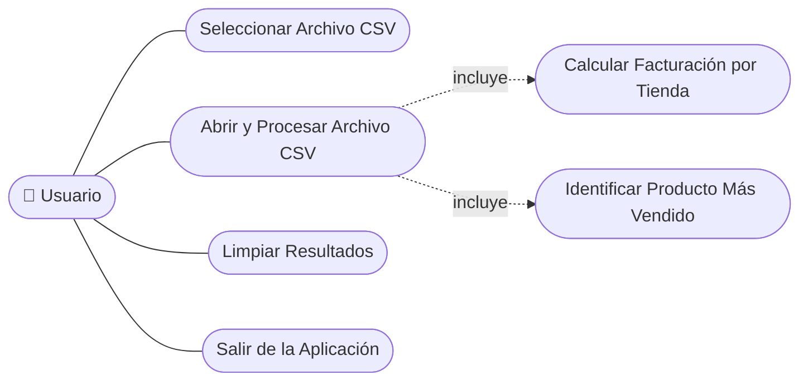

### 📝 Caso de Uso Detallado — UC02: Abrir y Procesar Archivo CSV

| Campo | Descripción |
|:------|:------------|
| **Precondiciones** | Se ha definido una ruta de archivo `.csv` válida mediante UC01. |
| **Flujo Principal** | 1. El usuario hace clic en *Archivo → Abrir...* <br> 2. El sistema lee el archivo línea por línea <br> 3. El sistema omite la fila de encabezado <br> 4. El sistema divide cada línea por `;` <br> 5. El sistema actualiza la lista de facturación por tienda <br> 6. El sistema actualiza el mapa de productos más vendidos <br> 7. El sistema muestra el contenido bruto y los resultados calculados |
| **Flujo Alternativo** | Si el archivo no se puede leer, el sistema muestra un diálogo de error (`JOptionPane.ERROR_MESSAGE`). |
| **Postcondiciones** | Los campos de resultado y el área de vista previa muestran valores actualizados. |

</details>

---

<details>
<summary><h2>3. Matriz de Trazabilidad de Requisitos 🔗</h2></summary>

| Requisito | Caso de Uso | Clase / Método | Diagrama(s) | Verificación |
|:----------|:------------|:----------------|:------------|:--------------|
| RF01 / RN06 | UC01 | `Painel.jMenuProcurarActionPerformed()` | Casos de Uso, Secuencia | Prueba manual en la GUI |
| RF02 / RN01 / RN02 | UC02 | `Painel.jMenuAbrirActionPerformed()` | Actividades, DFD | Prueba manual en la GUI |
| RF03 | UC02 | `Painel.textArea` | Secuencia, Wireframe | Prueba manual en la GUI |
| RF04 / RN03 | UC02, UC03 | `Venda.precoUnitario`, lista `comercio` | Clases, Actividades, DFD | Prueba manual en la GUI |
| RF05 / RN04 | UC03 | `textField1`–`textField4` | Secuencia, Wireframe | Prueba manual en la GUI |
| RF06 / RN05 | UC02, UC04 | mapa `produtosVendidos` | Actividades, DFD, Linaje de Datos | Prueba manual en la GUI |
| RF07 | UC04 | `textField5` | Secuencia, Wireframe | Prueba manual en la GUI |
| RF08 | UC05 | `Painel.jButtonClearActionPerformed()` | Máquina de Estados, Casos de Uso | Prueba manual en la GUI |
| RF09 | UC06 | `Painel.jMenuSairActionPerformed()` | Máquina de Estados, Casos de Uso | Prueba manual en la GUI |
| RF10 | — | `Painel.jMenuSalvarActionPerformed()` | Casos de Uso | Prueba manual en la GUI |
| RNF01 | Todos | `Painel` (menú, atajos) | Componentes, Wireframe | Revisión manual |
| RNF02 | — | `pom.xml` de Maven | Despliegue | Verificación de compilación (`mvn compile`) |
| RNF03 | UC02 | `jMenuAbrirActionPerformed()` (bucle único) | Actividades | Revisión de código |
| RNF05 | UC02 | `try/catch` + `JOptionPane` | Secuencia | Prueba manual en la GUI (archivo inválido) |

</details>

---

<details>
<summary><h2>4. Especificación de Requisitos de Software (SRS) 📄</h2></summary>

### 1. Introducción

- **Propósito**: describir los requisitos funcionales y no funcionales del Analizador de Ventas CSV, una aplicación de escritorio que calcula análisis de ventas a partir de un archivo CSV.
- **Alcance**: aplicación de escritorio monousuario; lee un archivo CSV por sesión; sin capa de persistencia; sin comunicación en red.
- **Definiciones**: ver el glosario en [Requisitos de Dominio](#1-requisitos).

### 2. Descripción General

- **Perspectiva del Producto**: aplicación Java Swing independiente, empaquetada con Maven, punto de entrada `Painel.main()`.
- **Clases de Usuario**: una única clase de usuario — personal de la tienda que realiza análisis de ventas.
- **Entorno Operativo**: cualquier SO de escritorio con JDK 21+ (Windows, Linux, macOS).
- **Restricciones**: el CSV debe estar delimitado por `;`; solo se muestran las primeras 4 tiendas; procesamiento solo en memoria.

### 3. Requisitos Específicos

- Ver [Sección 1 — Requisitos](#1-requisitos) para el conjunto completo de **RF / RNF / RN / Dominio / Datos / Interfaz**.
- Ver [Sección 2 — Casos de Uso](#2-casos-de-uso) para la especificación de comportamiento.
- Ver [Sección 6 — Modelo de Datos y Diccionario de Datos](#6-modelo-de-datos-y-diccionario-de-datos) para la especificación de datos.

### 4. Apéndices

- [Diagramas UML y Estructurales](#5-diagramas-uml-y-estructurales)
- [Diagrama de Flujo de Datos (DFD)](#7-diagrama-de-flujo-de-datos-dfd)
- [Diagrama de Arquitectura y Diagrama de Flujo](#8-diagrama-de-arquitectura-y-diagrama-de-flujo)
- [Persona y Mapa de Viaje del Usuario](#9-persona-y-mapa-de-viaje-del-usuario)
- [Wireframes y Mockups](#10-wireframes-y-mockups)

</details>

---

<details>
<summary><h2>5. Diagramas UML y Estructurales 🗺️</h2></summary>

### 🧍 Diagrama de Casos de Uso

> Ver [Sección 2 — Diagrama de Casos de Uso](#2-casos-de-uso).

### 🧱 Diagrama de Clases

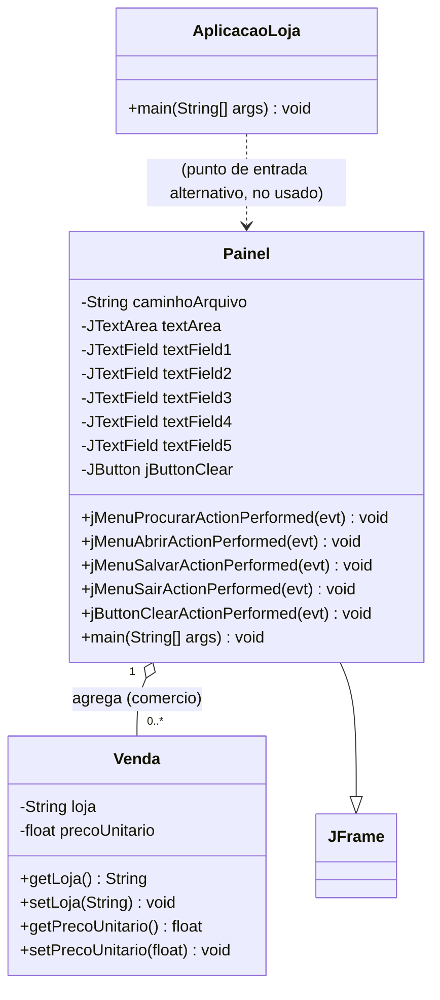

### 🔵 Diagrama de Objetos

> Ejemplo de instantánea en tiempo de ejecución tras procesar un CSV con 2 tiendas.

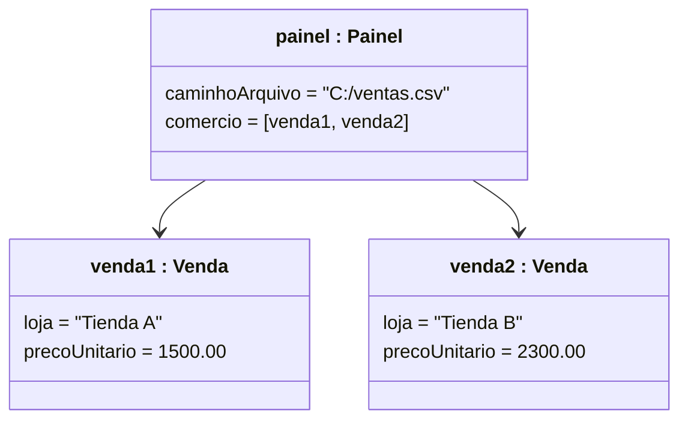

### 🔁 Diagrama de Secuencia — Abrir y Procesar CSV

```mermaid
sequenceDiagram
    actor Usuario
    participant Painel as Painel (JFrame)
    participant FS as Sistema de Archivos
    participant Venda as Venda (modelo)

    Usuario->>Painel: clic en "Abrir..."
    Painel->>FS: new BufferedReader(caminhoArquivo)
    FS-->>Painel: flujo del archivo
    loop para cada línea del CSV
        Painel->>Painel: divide la línea por ";"
        Painel->>Venda: new Venda(tienda, total)
        Painel->>Painel: actualiza lista comercio y mapa produtosVendidos
    end
    Painel->>Painel: actualiza textField1-5 y textArea
    Painel-->>Usuario: muestra facturación y producto más vendido
```

### 💬 Diagrama de Comunicación

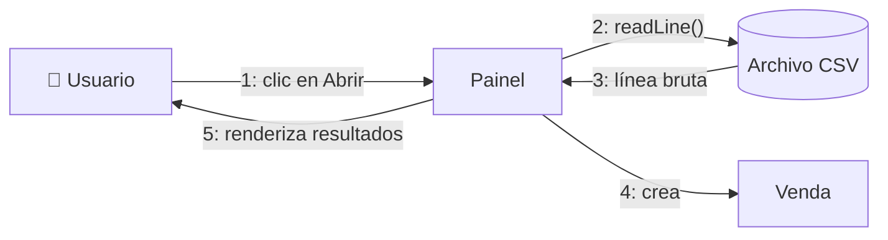

### 🔄 Diagrama de Actividades — Algoritmo de Lectura y Agregación

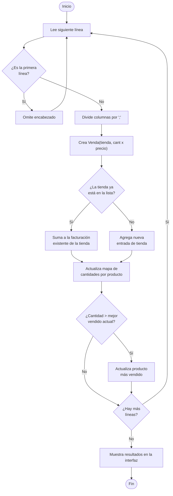

### 🔀 Diagrama de Máquina de Estados — Estado de la Aplicación

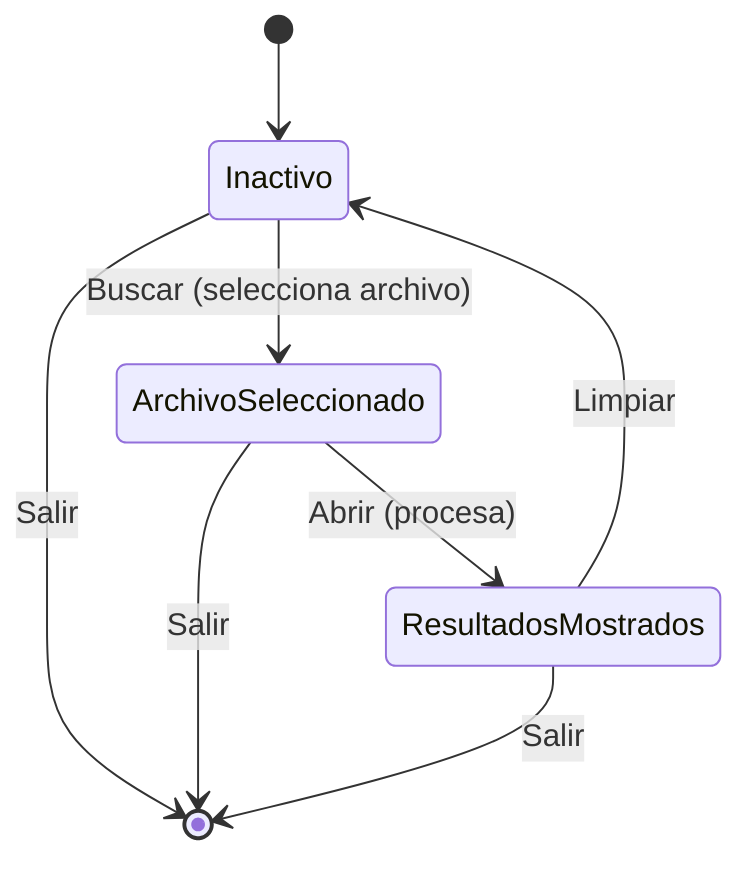

### 🧩 Diagrama de Componentes

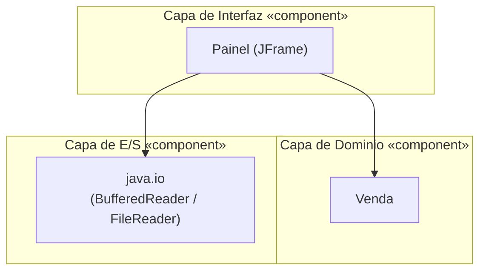

### 🖥️ Diagrama de Despliegue (Deployment)

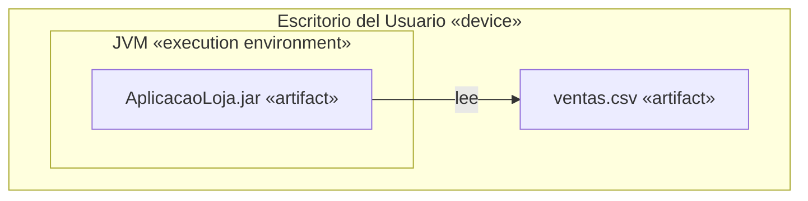

### 📦 Diagrama de Paquetes

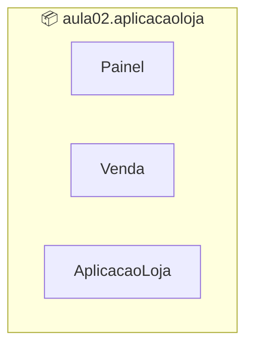

### 🧬 Diagrama de Estructura Compuesta — Internos de Painel

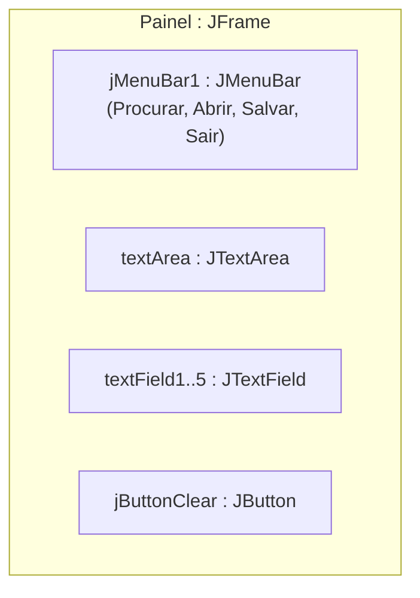

### 🖼️ Diagrama de Visión General de Interacción

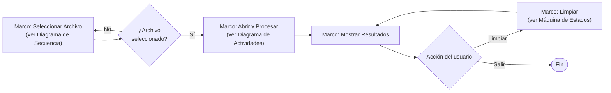

### ⏱️ Diagrama de Tiempo (Timing) — Campos de la Interfaz a lo largo del Tiempo

| Tiempo | `textField1`–`4` (Facturación por Tienda) | `textField5` (Más Vendido) | `textArea` (Vista Previa) |
|:-------|:----------------------------------------------|:--------------------------------|:-------------------------------|
| t0 — Inicio de la aplicación | vacío | vacío | vacío |
| t1 — Archivo seleccionado (`Buscar`) | vacío | vacío | vacío |
| t2 — Archivo abierto (`Abrir`) | vacío | vacío | contenido bruto del CSV |
| t3 — Durante el procesamiento | se llena progresivamente (1 por tienda) | vacío | contenido bruto del CSV |
| t4 — Procesamiento finalizado | facturación por tienda (hasta 4) | producto / cantidad | contenido bruto del CSV |
| t5 — Clic en `LIMPIAR` | vacío | vacío | vacío |

</details>

---

<details>
<summary><h2>6. Modelo de Datos y Diccionario de Datos 🗄️</h2></summary>

### 🔗 Diagrama Entidad-Relación (DER)

> El CSV es un archivo plano, pero conceptualmente cada fila representa una relación entre una **Tienda**, un **Producto** y una **Venta**.

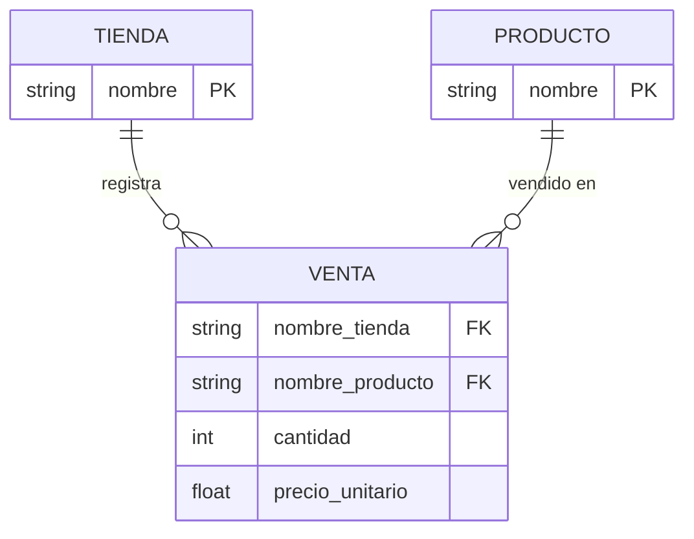

### 🧠 Modelo Conceptual de Datos

- **Tienda** — un punto de venta, identificado por su nombre.
- **Producto** — un artículo que puede venderse, identificado por su nombre.
- **Venta** — una transacción que vincula una Tienda y un Producto, con una cantidad y un precio unitario.

### 🧩 Modelo Lógico de Datos

| Entidad | Atributo | Tipo | Clave |
|:--------|:---------|:-----|:------|
| `TIENDA` | `nombre` | String | PK |
| `PRODUCTO` | `nombre` | String | PK |
| `VENTA` | `nombre_tienda` | String | FK → TIENDA |
| `VENTA` | `nombre_producto` | String | FK → PRODUCTO |
| `VENTA` | `cantidad` | Integer | — |
| `VENTA` | `precio_unitario` | Decimal | — |

### 💽 Modelo Físico de Datos (según implementación)

- **Almacenamiento**: un único archivo `.csv` plano, delimitado por `;`, sin esquema impuesto.
- **Representación en memoria**:
  - Clase `Venda` → `loja: String`, `precoUnitario: float` (ya multiplicado `cantidad × precio unitario`).
  - `ArrayList<Venda> comercio` → una entrada agregada por tienda distinta.
  - `HashMap<String, Integer> produtosVendidos` → nombre del producto → cantidad total vendida.

### 📖 Diccionario de Datos (columnas del CSV, según se leen en `Painel.jMenuAbrirActionPerformed`)

| Índice | Columna | Tipo | Descripción | ¿Usado? |
|:------:|:--------|:-----|:------------|:--------|
| 0 | *(no usado)* | String | Identificador de fila, reservado en el archivo de origen | ❌ |
| 1 | *(no usado)* | String | Campo de fecha, reservado en el archivo de origen | ❌ |
| 2 | `loja` | String | Nombre de la tienda | ✅ `Venda.loja` |
| 3 | *(no usado)* | String | Campo de categoría, reservado en el archivo de origen | ❌ |
| 4 | `produto` | String | Nombre del producto | ✅ clave del mapa de más vendidos |
| 5 | `quantidade` | Integer | Cantidad vendida en esta fila | ✅ `Integer.parseInt(colunas[5])` |
| 6 | `preco_unitario` | Float | Precio unitario (punto decimal `.`) | ✅ `Float.parseFloat(colunas[6])` |

> ⚠️ Las columnas 0, 1 y 3 deben seguir presentes en el archivo (para mantener los índices correctos), aunque la lógica actual no utilice sus valores.

</details>

---

<details>
<summary><h2>7. Diagrama de Flujo de Datos (DFD) 🔄</h2></summary>

### 🌐 Nivel 0 — Diagrama de Contexto

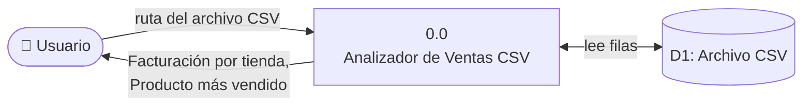

### 🔬 Nivel 1 — DFD Detallado

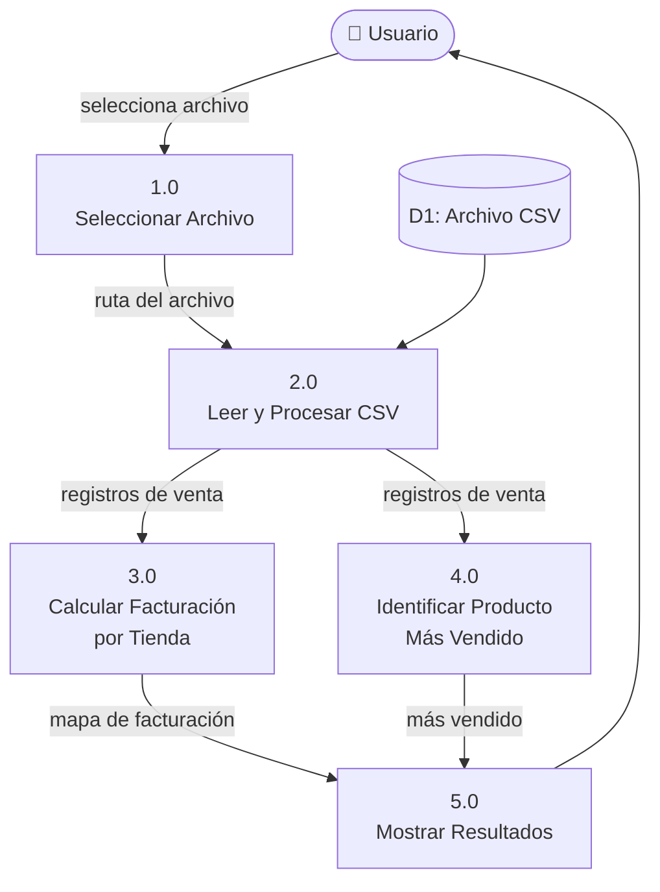

### 🧵 Diagrama de Linaje de Datos

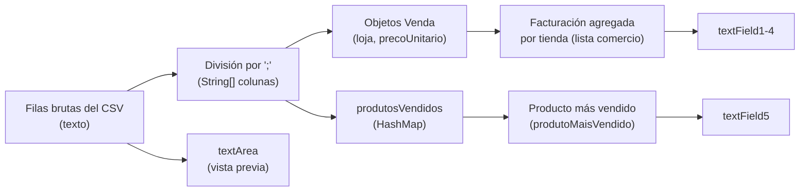

</details>

---

<details>
<summary><h2>8. Diagrama de Arquitectura y Diagrama de Flujo 🏗️</h2></summary>

### 🏛️ Visión General de la Arquitectura

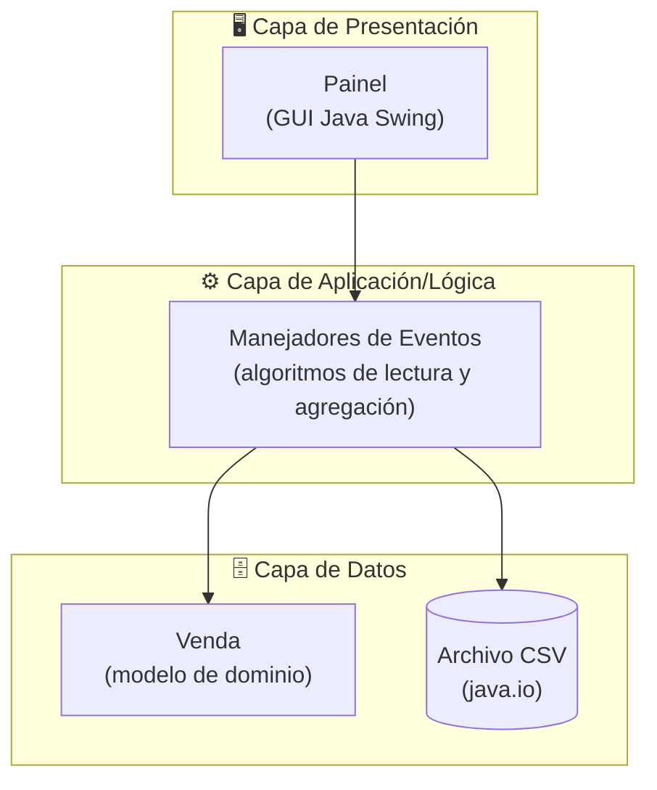

### 🧭 Diagrama de Flujo de la Aplicación

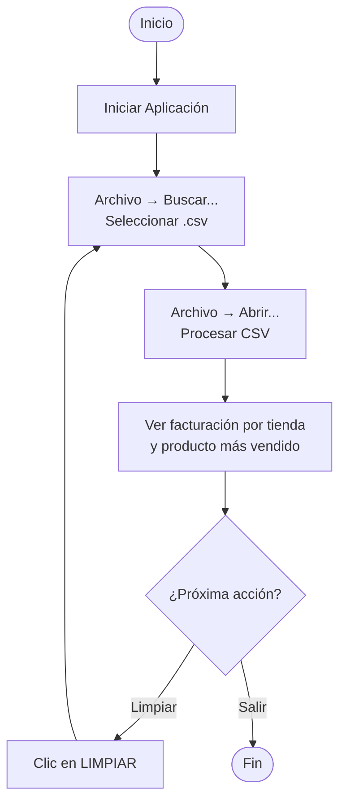

</details>

---

<details>
<summary><h2>9. Persona y Mapa de Viaje del Usuario 👤</h2></summary>

### 🧑 Persona

| Campo | Descripción |
|:------|:------------|
| **Nombre** | Marcos Oliveira |
| **Rol** | Supervisor de Ventas en una pequeña cadena minorista |
| **Edad** | 38 |
| **Nivel técnico** | Medio — cómodo con aplicaciones de escritorio y hojas de cálculo |
| **Objetivo** | Comparar rápidamente la facturación semanal entre sucursales e identificar el producto más vendido |
| **Frustración** | Crear tablas dinámicas manualmente en hojas de cálculo cada semana |
| **Cita** | *"Solo necesito los números, rápido — sin abrir Excel."* |

### 🗺️ Mapa de Viaje del Usuario

| Etapa | Acción | Punto de Contacto | Pensamientos | Emoción | Oportunidad |
|:------|:-------|:--------------------|:--------------|:--------|:--------------|
| 1. Surge la necesidad | Quiere comparar la facturación semanal | Exportación del sistema POS | "Necesito esto rápido" | 😐 Neutral | — |
| 2. Inicia la aplicación | Abre el Analizador de Ventas CSV | Acceso directo de escritorio | "Ventana simple, parece fácil" | 🙂 Curioso | — |
| 3. Selecciona el archivo | `Archivo → Buscar...` | `JFileChooser` | "Fácil encontrar mi archivo" | 🙂 Confiado | — |
| 4. Procesa | `Archivo → Abrir...` | Ventana de la aplicación | "¡Totales instantáneos, genial!" | 😀 Satisfecho | — |
| 5. Analiza | Lee la facturación por tienda y el más vendido | Campos de resultado | "Era justo lo que esperaba" | 😀 Satisfecho | Agregar exportación a PDF/Excel |
| 6. Reinicia / Cierra | Hace clic en `LIMPIAR` o sale | Botón / menú | "Listo para el próximo archivo" | 🙂 Confiado | — |

</details>

---

<details>
<summary><h2>10. Wireframes y Mockups 🎨</h2></summary>

### 📐 Wireframe de Baja Fidelidad

```text
+---------------------------------------------------------------+
| ARCHIVO                                                        |
+---------------------------------------------------------------+
|  TOTAL DE VENTAS POR TIENDA                                    |
|                                                                 |
|  TIENDA: [ Tienda A / 1500.00 ]   +-----------------------+    |
|  TIENDA: [ Tienda B / 2300.00 ]   |                       |    |
|  TIENDA: [ Tienda C / 980.00  ]   |   Vista previa del    |    |
|  TIENDA: [ Tienda D / 1120.00 ]   |   CSV (textArea)      |    |
|                                    +-----------------------+    |
+---------------------------------------------------------------+
|  CANTIDADES                                                    |
|  [ Producto más vendido / cant. unidades ]      ( LIMPIAR )    |
+---------------------------------------------------------------+
```

### 🎯 Notas del Mockup

- **Fondo**: negro (`Color(0, 0, 0)`), etiquetas en negrita y alto contraste — corresponde a `Painel.initComponents()`.
- **Tipografía**: etiquetas de sección (`LOJA:`, `TOTAL DE VENDAS POR LOJA`, `QUANTIDADES`) en negrita, fuente grande (`Dialog`/`Segoe UI`, 24–36pt).
- **Acción principal**: botón `LIMPAR (CLEAR)`, tamaño de fuente 24, ubicado en la esquina inferior derecha junto al campo del más vendido.
- **Barra de menú**: un único menú de nivel superior `ARQUIVO` con los elementos *Procurar*, *Abrir*, *Salvar*, *Sair* (atajos `Ctrl+P`, `Ctrl+A`, `Ctrl+S`, `Esc`).

</details>

---

## 📋 Formato CSV Esperado

> Para un procesamiento correcto, el archivo CSV debe seguir la estructura siguiente (ver [Diccionario de Datos](#6-modelo-de-datos-y-diccionario-de-datos)).

| Propiedad | Valor Esperado |
|:----------|:-----------------|
| **Delimitador** | Punto y coma (`;`) |
| **Columnas** | 7 columnas (índices 0–6) — solo se usan los índices `2`, `4`, `5`, `6` |
| **Encabezado** | La **primera línea** siempre se omite |
| **Codificación** | UTF-8 recomendado |

### 📄 Ejemplo de Archivo CSV

```csv
id;data;loja;categoria;produto;quantidade;preco_unitario
1;2024-01-01;Tienda A;General;Producto X;10;25.00
2;2024-01-01;Tienda A;General;Producto Y;5;40.00
3;2024-01-02;Tienda B;General;Producto X;20;25.00
4;2024-01-02;Tienda B;General;Producto Z;8;15.00
5;2024-01-03;Tienda C;General;Producto Y;12;40.00
6;2024-01-03;Tienda D;General;Producto Z;3;15.00
```

---

## 📂 Estructura del Proyecto

```plaintext
AplicacaoLoja/
│
├── 📄 pom.xml                                  # ⚙️  Configuración y dependencias de Maven
│
└── 📁 src/
    └── 📁 main/
        └── 📁 java/
            └── 📁 aula02/
                └── 📁 aplicacaoloja/
                    ├── 📄 AplicacaoLoja.java   # 🚀 Punto de entrada alternativo (placeholder)
                    ├── 📄 Painel.java          # 🖥️  Interfaz gráfica principal (JFrame) ← CORE
                    └── 📄 Venda.java           # 🏛️  Modelo de dominio — Venta (tienda + precio)
```

---

## 🚀 Instalación y Ejecución

### 📋 Requisitos Previos

| Requisito | Detalle |
|:----------|:--------|
| **JDK** | Versión **21 o superior**, instalada y configurada en `PATH`. |
| **Apache Maven** | Instalado y configurado en `PATH`. |
| **Git** | Para clonar el repositorio. |

---

### 💻 Opción 1 — Línea de Comandos

**1. Clone el repositorio y entre en la carpeta del proyecto:**

```bash
git clone https://github.com/VictorHJesusSantiago/AplicacaoLoja.git
cd AplicacaoLoja
```

**2. Compile el proyecto con Maven:**

```bash
mvn compile
```

**3. Ejecute la clase principal:**

```bash
# Windows / Linux / macOS
java -cp "target/classes" aula02.aplicacaoloja.Painel
```

---

### 🖥️ Opción 2 — IDE (Recomendado)

```
1. Abra su IDE preferido (IntelliJ IDEA, NetBeans o Eclipse)
2. File → Open → Impórtelo como "Proyecto Maven existente"
3. Espere a que Maven sincronice las dependencias
4. Localice: src/main/java/aula02/aplicacaoloja/Painel.java
5. Clic derecho → "Run" (o presione Shift + F10)
```

---

### 🎯 Cómo Usar la Aplicación

| Paso | Acción |
|:----:|:-------|
| 1️⃣ | Inicie la aplicación con los pasos anteriores. |
| 2️⃣ | Haga clic en **Archivo → Buscar...** y seleccione su archivo `.csv`. |
| 3️⃣ | Haga clic en **Archivo → Abrir...** para procesar y ver los resultados. |
| 4️⃣ | Revise la **facturación por tienda** y el **producto más vendido** en los campos mostrados. |
| 5️⃣ | Use el botón **LIMPIAR** para restablecer todos los campos y cargar un nuevo archivo. |

---

## 🤝 Cómo Contribuir

> ¡Las contribuciones son muy bienvenidas! Siga los pasos a continuación para colaborar de forma organizada.

| Paso | Acción | Comando |
|:----:|:-------|:--------|
| 1️⃣ | Haga **Fork** del repositorio a su cuenta. | — |
| 2️⃣ | Cree su rama de funcionalidad a partir de `main`. | `git checkout -b feature/NuevaFuncionalidad` |
| 3️⃣ | Guarde los cambios con un mensaje claro y semántico. | `git commit -m 'feat: Agrega NuevaFuncionalidad'` |
| 4️⃣ | Envíe la rama al repositorio remoto. | `git push origin feature/NuevaFuncionalidad` |
| 5️⃣ | Abra un Pull Request detallando los cambios realizados. | — |

<div align="center">

<br>

**¡Si este proyecto fue útil para sus estudios, deje una estrella ⭐️ en el repositorio!**

</div>

---

## 👨‍💻 Autor

<div align="center">

<br>

**Victor H. J. Santiago**

<br>

[](https://github.com/VictorHJesusSantiago)
[](https://www.linkedin.com/in/victor-henrique-de-jesus-santiago/)

</div>

---

## 📄 Licencia

<div align="center">

Este proyecto se distribuye bajo la **Licencia MIT**.
Consulte el archivo [`LICENSE`](./LICENSE) en el repositorio para más información.


</div>

---

<div align="center">

*Hecho con 📊 y Java por **Victor H. J. Santiago***

</div>
