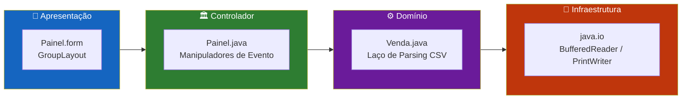
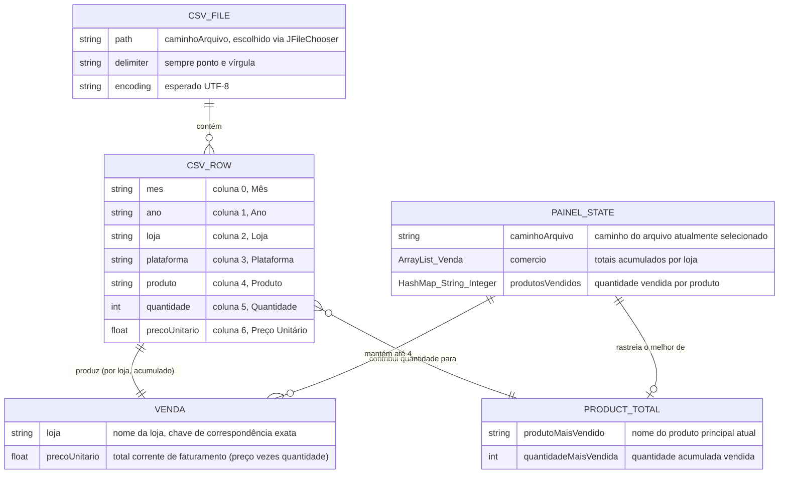
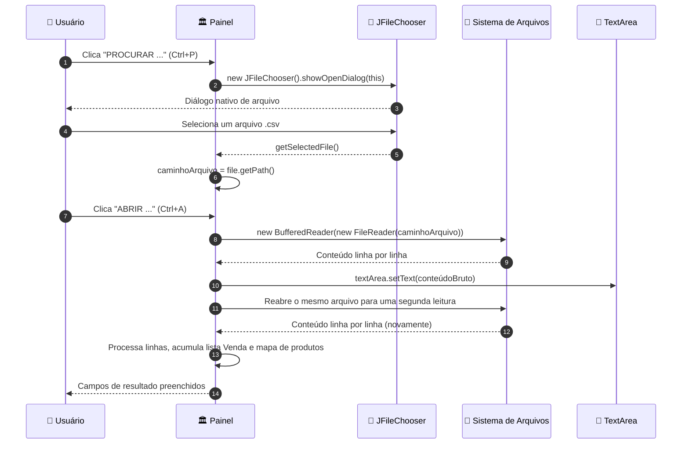
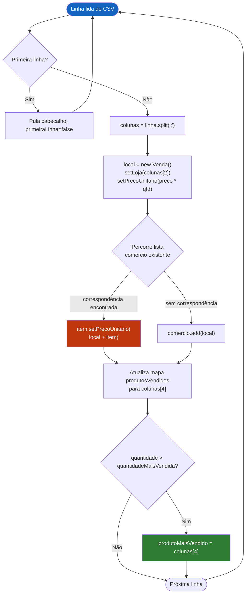
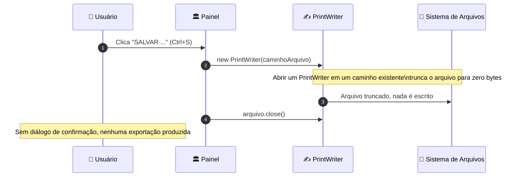
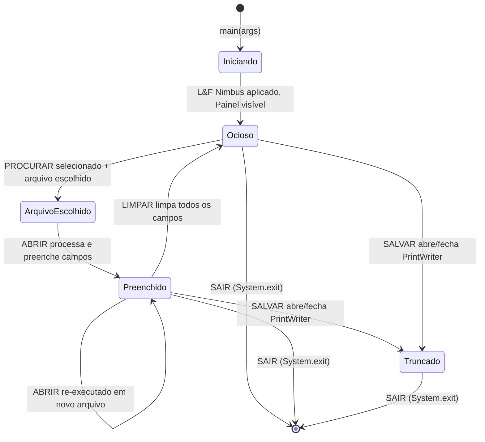
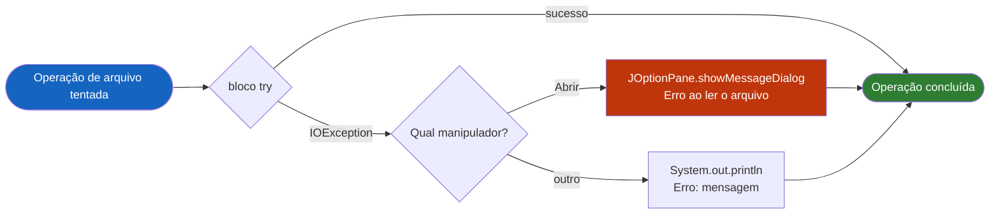
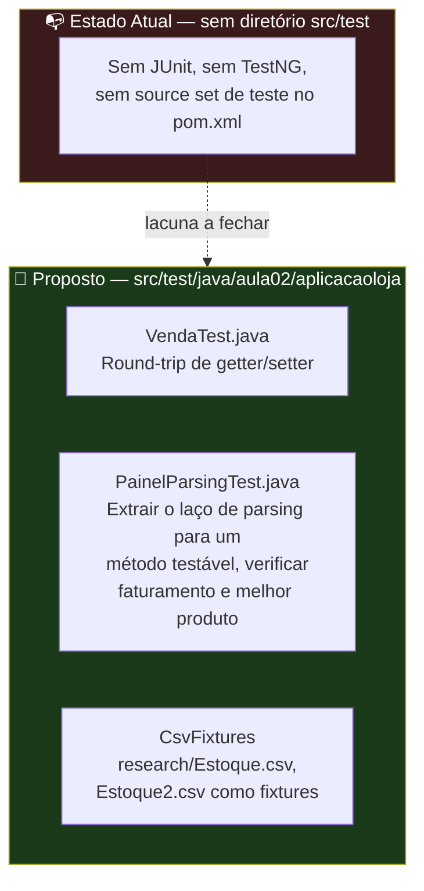

<div align="center">

**🌐 Choose Language / Selecione o Idioma / Elija el Idioma**

[](README.md)&nbsp;&nbsp;&nbsp;[](README_PT.md)&nbsp;&nbsp;&nbsp;[](README_ES.md)

</div>

---

<div align="center">

```
██╗      ██████╗      ██████╗███████╗██╗   ██╗
██║     ██╔═══██╗    ██╔════╝██╔════╝██║   ██║
██║     ██║   ██║    ██║     ███████╗██║   ██║
██║     ██║   ██║    ██║     ╚════██║╚██╗ ██╔╝
███████╗╚██████╔╝    ╚██████╗███████║ ╚████╔╝
╚══════╝ ╚═════╝      ╚═════╝╚══════╝  ╚═══╝
      Leitor de Vendas em CSV com Java Swing
```

---

[](https://openjdk.org/)
[](https://docs.oracle.com/javase/tutorial/uiswing/)
[](https://maven.apache.org/)
[]()
[-217346?style=for-the-badge)]()
[]()

<br/>

> **Uma aplicação desktop em Java Swing que lê arquivos CSV de vendas delimitados por ponto e vírgula**
> e calcula o faturamento por loja e o produto mais vendido, inteiramente em memória.

<br/>


</div>

---

## 📑 Índice

<details>
<summary>▶️ <strong>Clique para expandir / recolher esta seção</strong></summary>

<table>
<tr>
<td valign="top" width="50%">

**🏗️ Sistema**
- [Visão Geral](#-visão-geral)
- [Arquitetura do Sistema](#-arquitetura-do-sistema)
- [Stack Tecnológica](#-stack-tecnológica)
- [Padrões de Projeto Aplicados](#-padrões-de-projeto-aplicados)
- [Estrutura do Projeto](#-estrutura-do-projeto)

**📦 Módulos**
- [Painel — Janela Principal](#-painel--controlador-da-janela-principal)
- [Venda — Modelo de Registro](#-venda--modelo-do-registro-de-venda)
- [AplicacaoLoja — Stub de Entrada](#-aplicacaoloja--stub-do-ponto-de-entrada)
- [totalLoja1 — Stub Não Usado](#-totalloja1--stub-não-utilizado)
- [Ativos de Pesquisa](#-ativos-de-pesquisa--ícones-e-dados-de-exemplo)

</td>
<td valign="top" width="50%">

**💼 Negócio**
- [Regras de Negócio](#-regras-de-negócio)
- [Requisitos Funcionais](#-requisitos-funcionais)
- [Requisitos Não Funcionais](#-requisitos-não-funcionais)

**📐 Design**
- [Modelo de Dados](#-modelo-de-dados)
- [Fluxos do Sistema](#-fluxos-do-sistema)

**🔐 Segurança & Operação**
- [Segurança](#-segurança)
- [Instalação & Execução](#-instalação--execução)
- [Testes Automatizados](#-testes-automatizados)
- [Métricas & Monitoramento](#-métricas--monitoramento)
- [Limitações Conhecidas](#-limitações-conhecidas)

</td>
</tr>
</table>

---

</details>

## 🌟 Visão Geral

<details>
<summary>▶️ <strong>Clique para expandir / recolher esta seção</strong></summary>

**AplicacaoLoja** (empacotado neste repositório como *leitor_de_arquivo_csv*) é uma pequena aplicação desktop escrita em **Java** usando o toolkit **Swing**. Foi construída como um trabalho de disciplina (`aula02`) para uma matéria de Programação Orientada a Objetos, sob o nome de autor registrado no cabeçalho do código-fonte, Victor Henrique de Jesus Santiago.

A aplicação abre uma única janela (`Painel`, um `JFrame`) com uma barra de menus oferecendo quatro ações: procurar um arquivo CSV, abri-lo e analisá-lo, "salvá-lo" e sair. Uma vez aberto o arquivo, o texto bruto é despejado em uma área de texto rolável e, na mesma passada, o código percorre cada linha de dados para acumular o **faturamento por loja** (preço unitário × quantidade) e determinar o **produto mais vendido** pela quantidade acumulada. Os resultados são exibidos em componentes simples de `TextField`/`JTextField`, e não em uma tabela ou gráfico.

Não há banco de dados, acesso à rede, ou qualquer biblioteca externa além do próprio JDK — todo o modelo de persistência é "ler um arquivo `.csv` do disco, calcular em memória, mostrar os números". O `pom.xml` não declara nenhuma dependência, então todo o conjunto de funcionalidades é implementado com `java.io`, `java.util` e `javax.swing` da biblioteca padrão.

### 🎯 Objetivos do Sistema

| Objetivo | Descrição |
|-----------|-------------|
| 📂 **Seleção de Arquivo** | Permitir que o usuário escolha um arquivo `.csv` do disco via `JFileChooser` (menu *ARQUIVO → PROCURAR*) |
| 📖 **Pré-visualização Bruta** | Exibir o conteúdo não processado do arquivo em uma `TextArea` rolável (menu *ARQUIVO → ABRIR*) |
| 🧮 **Agregação de Faturamento** | Somar `Preço Unitário × Quantidade` por nome de loja distinto encontrado no arquivo |
| 🏆 **Detecção do Mais Vendido** | Rastrear a quantidade acumulada vendida por nome de produto e reportar o maior |
| 🖥️ **Exibição de Resultados** | Mostrar até quatro totais de loja em campos de texto dedicados e o produto principal em um quinto |
| 🧹 **Reinicialização** | Limpar a pré-visualização e todos os campos de resultado com um botão **LIMPAR (CLEAR)** |
| 🚪 **Saída** | Encerrar a JVM de forma limpa pelo item de menu *SAIR* ou pela tecla `Esc` |
| 🎓 **Escopo Educacional** | Demonstrar E/S de arquivos, manuseio de eventos Swing e agregação simples em memória, não robustez de produção |

---

</details>

## 🏗️ Arquitetura do Sistema

<details>
<summary>▶️ <strong>Clique para expandir / recolher esta seção</strong></summary>

### Diagrama de Módulos

```mermaid
flowchart TB
    subgraph UI["📱  CAMADA DE APRESENTAÇÃO"]
        direction LR
        FORM["🪟 Painel.form\n─────────────\nGroupLayout NetBeans\nJMenuBar x2\nTextArea + 5 campos"]
        MENU["📋 Ações de Menu\n─────────────\nPROCURAR · ABRIR\nSALVAR · SAIR"]
    end

    subgraph CTRL["🏛️  CONTROLADOR"]
        MAIN["Painel.java\n─────────────────────\n• Listeners de eventos\n• Estado do caminho do arquivo\n• Laço de parsing CSV\n• Lógica de agregação"]
    end

    subgraph CORE["⚙️  DOMÍNIO"]
        direction TB
        PARSE["🔍 Divisão de Linha CSV\nString.split(\";\")\n────────────\n7 colunas por linha"]
        AGG["🧮 Agregação\nHashMap + ArrayList\n────────────\nFaturamento por loja\nQuantidade por produto"]
        MODEL["📦 Venda.java\nRegistro de Venda\n────────────\nloja : String\nprecoUnitario : float"]
    end

    subgraph SYS["💾  SISTEMA DE ARQUIVOS"]
        direction LR
        CSVFILE[("📄 .csv Selecionado\nCaminho escolhido pelo usuário\n─────────────\nDelimitado por ; UTF-8")]
    end

    subgraph OUT["🖥️  SAÍDA"]
        FIELDS["📊 Campos de Resultado\n──────────────────────\ntextField1-4 : totais por loja\ntextField5 : melhor produto"]
    end

    FORM -->|"addActionListener"| MAIN
    MENU -->|"actionPerformed"| MAIN
    MAIN -->|"JFileChooser"| CSVFILE
    MAIN --> PARSE
    PARSE --> MODEL
    PARSE --> AGG
    MODEL --> AGG
    AGG --> FIELDS
    CSVFILE -->|"BufferedReader"| PARSE
    MAIN -->|"setText"| FIELDS

    style UI fill:#1e3a5f,color:#fff,stroke:#4a90d9
    style CTRL fill:#1a3a1a,color:#fff,stroke:#4caf50
    style CORE fill:#3a1a1a,color:#fff,stroke:#e57373
    style SYS fill:#3a2a1a,color:#fff,stroke:#ffb74d
    style OUT fill:#2a1a3a,color:#fff,stroke:#ce93d8
```

### Camadas da Arquitetura



---

</details>

## 🛠️ Stack Tecnológica

<details>
<summary>▶️ <strong>Clique para expandir / recolher esta seção</strong></summary>

<table>
<thead>
<tr>
<th>Camada</th>
<th>Tecnologia</th>
<th>Versão</th>
<th>Finalidade</th>
</tr>
</thead>
<tbody>
<tr>
<td rowspan="2"><strong>🧠 Linguagem</strong></td>
<td>Java</td>
<td>21</td>
<td>Linguagem do código-fonte (<code>maven.compiler.source</code>/<code>target</code> em <code>pom.xml</code>)</td>
</tr>
<tr>
<td>XML</td>
<td>—</td>
<td><code>Painel.form</code> (descritor de GUI do NetBeans), <code>pom.xml</code>, <code>nbactions.xml</code></td>
</tr>
<tr>
<td rowspan="3"><strong>🖥️ Toolkit de UI</strong></td>
<td>Java Swing</td>
<td>Incluído no JDK</td>
<td><code>JFrame</code>, <code>JMenuBar</code>, <code>JFileChooser</code>, <code>JOptionPane</code></td>
</tr>
<tr>
<td>AWT</td>
<td>Incluído no JDK</td>
<td>Componentes legados <code>java.awt.TextField</code>, <code>java.awt.TextArea</code>, <code>java.awt.Label</code> misturados no formulário</td>
</tr>
<tr>
<td>NetBeans GUI Builder</td>
<td>Form v1.3</td>
<td>Gerou o <code>GroupLayout</code> em <code>initComponents()</code></td>
</tr>
<tr>
<td rowspan="2"><strong>💾 E/S</strong></td>
<td><code>java.io</code></td>
<td>Incluído no JDK</td>
<td><code>BufferedReader</code>, <code>FileReader</code>, <code>PrintWriter</code> para leitura/escrita do arquivo CSV</td>
</tr>
<tr>
<td><code>java.util</code></td>
<td>Incluído no JDK</td>
<td><code>ArrayList&lt;Venda&gt;</code>, <code>HashMap&lt;String,Integer&gt;</code> para agregação em memória</td>
</tr>
<tr>
<td rowspan="2"><strong>🔧 Build</strong></td>
<td>Apache Maven</td>
<td>model 4.0.0</td>
<td><code>pom.xml</code> — groupId <code>Aula02</code>, artifactId <code>AplicacaoLoja</code>, packaging <code>jar</code></td>
</tr>
<tr>
<td>exec-maven-plugin</td>
<td>3.0.0</td>
<td>Referenciado em <code>nbactions.xml</code> para executar/depurar <code>Painel</code> direto da IDE</td>
</tr>
<tr>
<td><strong>🧪 Testes</strong></td>
<td>Nenhum</td>
<td>—</td>
<td>Não existe diretório <code>src/test</code> ou dependência de teste no projeto</td>
</tr>
</tbody>
</table>

---

</details>

## 🎨 Padrões de Projeto Aplicados

<details>
<summary>▶️ <strong>Clique para expandir / recolher esta seção</strong></summary>

| Padrão | Onde | Justificativa |
|---------|-------|-----------|
| 👂 **Observer / Callback** | `addActionListener` em todo botão, item de menu e campo em `initComponents()` | O modelo de eventos do Swing conduz toda interação do usuário através de listeners registrados |
| 🧭 **Facade (leve)** | `jMenuAbrirActionPerformed` | Um único manipulador esconde a leitura do arquivo, a renderização do texto bruto e toda a passada de agregação atrás de um único clique de menu |
| 📦 **Simples Contêiner de Dados (POJO)** | `Venda.java` | Uma classe mínima de getters/setters carregando `loja` e `precoUnitario`, usada como unidade de agregação |
| 🗺️ **Acumulador / Map-Reduce (manual)** | `HashMap<String, Integer> produtosVendidos` em `jMenuAbrirActionPerformed` | Totais correntes por chave de produto, atualizados a cada linha, refletindo um passo de reduce manual |
| 🚦 **Cláusula de Guarda (parcial)** | `if (!primeiraLinha)` para pular a linha de cabeçalho | O salto antecipado mantém o corpo do parsing livre de ramificações de tratamento do cabeçalho |
| 🏷️ **Campo de Estado** | Campo de instância `caminhoArquivo` | Mantém o caminho do arquivo escolhido entre as ações de menu "Procurar" e "Abrir" |
| 🔁 **Busca por Varredura Linear** | `for (int i=0; i<comercio.size(); i++)` dentro de `jMenuAbrirActionPerformed` | Busca de loja existente iterando o `ArrayList<Venda>` em vez de usar um mapa, coerente com a escala pequena e didática da classe |

---

</details>

## 📁 Estrutura do Projeto

<details>
<summary>▶️ <strong>Clique para expandir / recolher esta seção</strong></summary>

```
leitor_de_arquivo_csv/
│
├── 📄 .gitignore                              # Ignora target/, *.class, segredos, arquivos de SO/IDE
│
├── 📂 AplicacaoLoja/                          # ★ O projeto Maven real (raiz de código-fonte verdadeira)
│   ├── 📄 pom.xml                             # Descritor Maven: Java 21, empacotamento jar, sem dependências
│   ├── 📄 nbactions.xml                       # Ações run/debug/profile do NetBeans (classe principal = Painel)
│   ├── 📄 aplicacao_loja.txt                  # Revisão de rascunho anterior de Painel.java, mantida como referência
│   ├── 📄 atribuicoes_icon.txt                # Lista de atribuições do Flaticon para cada ícone de menu/painel
│   ├── 📄 AplicacaoLoja-1.0-SNAPSHOT.jar      # Artefato jar pré-construído versionado no repositório
│   │
│   ├── 📂 research/                           # 📊 Dados de exemplo e ícones usados pela interface
│   │   ├── 📄 Estoque.csv                     # CSV de vendas de exemplo (Mês;Ano;Loja;Plataforma;Produto;Quantidade;Preço)
│   │   ├── 📄 Estoque2.csv                    # Segundo CSV de vendas de exemplo
│   │   ├── 📄 leituraCSV.csv                  # Dataset maior e não relacionado de municípios, usado para testar leitura
│   │   └── 📄 *.png                           # Ícones de menu abrir/salvar/sair/procurar/mes/ano/lojas/...
│   │
│   ├── 📂 src/main/java/
│   │   ├── 📄 totalLoja1.java                 # Classe stub sem pacote, vazia (não utilizada)
│   │   └── 📂 aula02/aplicacaoloja/
│   │       ├── 📄 AplicacaoLoja.java          # Stub de entrada declarado no pom.xml, main() vazio
│   │       ├── 📄 Painel.java                 # ★ JFrame principal — GUI, eventos, parsing CSV, agregação (449 linhas)
│   │       ├── 📄 Painel.form                 # Descritor de GroupLayout do NetBeans consumido por initComponents()
│   │       ├── 📄 Venda.java                  # POJO: loja (String) + precoUnitario (float)
│   │       └── 📄 library_folder_20326.ico    # Ícone da aplicação
│   │
│   └── 📂 target/                             # Saída de build do Maven (arquivos .class compilados, metadados)
│
├── 📄 README.md                                # 🇺🇸 English (principal)
├── 📄 README_PT.md                             # 🇧🇷 Português
└── 📄 README_ES.md                             # 🇪🇸 Español
```

---

</details>

## 📦 Módulos do Sistema

<details>
<summary>▶️ <strong>Clique para expandir / recolher esta seção</strong></summary>

### 🏛️ Painel — Controlador da Janela Principal

`Painel` (`aula02.aplicacaoloja.Painel`) estende `javax.swing.JFrame` e é a única classe visual da aplicação. Ela guarda o estado do caminho do arquivo, todos os manipuladores de eventos e a lógica de parsing/agregação de CSV em um único arquivo de 449 linhas.

| Responsabilidade | Implementação |
|-----------------|----------------|
| Configuração da janela | `initComponents()` — `GroupLayout` gerado pelo NetBeans, duas `JMenuBar`, uma visível (`jMenuBar1`) |
| Estado do caminho do arquivo | `String caminhoArquivo` — definido pelo manipulador de Procurar, lido por Abrir e Salvar |
| Ponto de entrada | `public static void main(String[] args)` — aplica o look-and-feel Nimbus se disponível, depois `new Painel().setVisible(true)` |
| Ações de menu | `jMenuProcurarActionPerformed`, `jMenuAbrirActionPerformed`, `jMenuSalvarActionPerformed`, `jMenuSairActionPerformed` |
| Ação de limpeza | `jButtonClearActionPerformed` — limpa a área de texto e os cinco campos de resultado |
| Stubs não usados | `textField1ActionPerformed` … `textField5ActionPerformed` — corpos de listener vazios gerados automaticamente pelo editor de formulário |

---

### 📦 Venda — Modelo do Registro de Venda

`Venda` é um POJO com visibilidade de pacote usado para acumular um total corrente por loja enquanto o CSV é percorrido.

| Campo | Tipo | Acessores |
|-------|------|-----------|
| `loja` | `String` | `getLoja()` / `setLoja(String)` |
| `precoUnitario` | `float` | `getPrecoUnitario()` / `setPrecoUnitario(float)` — apesar do nome ("preço unitário"), este campo é reutilizado para guardar o **total corrente de faturamento** da loja |

> [!NOTE]
> O nome do campo `precoUnitario` é enganoso: em `Painel.jMenuAbrirActionPerformed` ele recebe `Float.parseFloat(colunas[6]) * Integer.parseInt(colunas[5])`, ou seja, preço × quantidade, então na verdade armazena o faturamento acumulado, não um preço por unidade.

---

### 🚪 AplicacaoLoja — Stub do Ponto de Entrada

`AplicacaoLoja` (`aula02.aplicacaoloja.AplicacaoLoja`) é a classe declarada como `exec.mainClass` no `pom.xml`. Seu corpo de `main(String[] args)` está vazio — a aplicação é na verdade iniciada por `Painel.main()`, conforme sobrescrito por `nbactions.xml` nas ações de run/debug/profile da IDE.

| Propriedade | Valor |
|----------|-------|
| Classe principal declarada (pom.xml) | `aula02.aplicacaoloja.AplicacaoLoja` |
| Classe realmente iniciada (nbactions.xml) | `aula02.aplicacaoloja.Painel` |
| Corpo | Vazio — não faz nada se invocado diretamente |

---

### 🧩 totalLoja1 — Stub Não Utilizado

Uma classe sem pacote em `src/main/java/totalLoja1.java`, gerada a partir de um template de classe do NetBeans e nunca referenciada em nenhum outro lugar do código. Contém apenas um comentário de documentação e nenhum membro.

---

### 🖼️ Ativos de Pesquisa — Ícones e Dados de Exemplo

O diretório `research/` fornece os ícones de menu (`procurar.png`, `abrir.png`, `salvar.png`, `sair.png`) referenciados por caminhos absolutos do Windows em `initComponents()` (ex.: `E:\IFPR\POO I\AplicacaoLoja\research\procurar.png`), além de ícones de categoria (`mes.png`, `ano.png`, `lojas.png`, `plataforma.png`, `produtos.png`, `quantidade.png`, `preco.png`, `moeda.png`) que não estão atualmente conectados a nenhum componente Swing, e dois CSVs de exemplo (`Estoque.csv`, `Estoque2.csv`) que seguem o esquema `Mês;Ano;Loja;Plataforma;Produto;Quantidade;Preço Unitário` esperado pelo parser.

> [!WARNING]
> Os caminhos de ícone fixos em `Painel.java` (`E:\IFPR\POO I\AplicacaoLoja\research\*.png`) apontam para a máquina local do autor original e falharão silenciosamente ao carregar em qualquer outro computador, deixando os itens de menu sem ícones, mas funcionais.

---

</details>

## 💼 Regras de Negócio

<details>
<summary>▶️ <strong>Clique para expandir / recolher esta seção</strong></summary>

### 📄 Regras de Formato CSV

| # | Regra | Aplicação |
|---|------|-------------|
| RN-01 | As colunas devem ser separadas por ponto e vírgula (`;`) | `String divisorCSV = ";"` usado em `linha.split(divisorCSV)` |
| RN-02 | A primeira linha do arquivo é sempre tratada como cabeçalho e ignorada | Flag `Boolean primeiraLinha`, verificada antes de processar cada linha |
| RN-03 | Cada linha de dados deve ter pelo menos 7 colunas (índices 0-6) | `colunas[2]`, `colunas[4]`, `colunas[5]`, `colunas[6]` são acessados diretamente, sem verificação de tamanho |
| RN-04 | A coluna 2 é o nome da loja, a 4 o produto, a 5 a quantidade e a 6 o preço unitário | Índices de coluna fixos em `jMenuAbrirActionPerformed` |

### 🧮 Regras de Agregação

| # | Regra | Aplicação |
|---|------|-------------|
| RN-05 | Faturamento da loja = soma de `(preço unitário × quantidade)` de todas as linhas daquela loja | `local.setPrecoUnitario(Float.parseFloat(colunas[6]) * Integer.parseInt(colunas[5]))`, mesclado ao `Venda` existente quando a loja se repete |
| RN-06 | Uma loja é identificada por correspondência exata de string no nome | `item.getLoja().equals(local.getLoja())` |
| RN-07 | O produto mais vendido é o que tem a maior quantidade acumulada em todas as linhas | `HashMap<String, Integer> produtosVendidos`, com `quantidadeMaisVendida` rastreado como o máximo corrente |
| RN-08 | Apenas as quatro primeiras lojas distintas encontradas são exibidas, uma por campo de resultado | A atribuição de campos de resultado dentro do laço de `comercio` só trata os índices `0`-`3` |

### 🖱️ Regras de Comportamento da Interface

| # | Regra | Aplicação |
|---|------|-------------|
| RN-09 | O botão **LIMPAR** reinicia a pré-visualização e os cinco campos de resultado | `jButtonClearActionPerformed` chama `setText("")` em `textArea` e `textField1`-`textField5` |
| RN-10 | O item de menu **SALVAR** trunca o arquivo aberto no momento em vez de gravar conteúdo nele | `new PrintWriter(caminhoArquivo)` abre (e assim esvazia) o arquivo, depois fecha imediatamente sem escrever |
| RN-11 | O item de menu **SAIR** encerra a JVM imediatamente | `System.exit(0)` |
| RN-12 | Abrir um arquivo sem seleção prévia, ou com caminho ilegível, mostra um diálogo de erro em vez de travar a thread da UI | `try/catch (IOException e)` ao redor da leitura, reportado via `JOptionPane.showMessageDialog` |

---

</details>

## ✅ Requisitos Funcionais

<details>
<summary>▶️ <strong>Clique para expandir / recolher esta seção</strong></summary>

| ID | Requisito | Prioridade | Status |
|----|-------------|----------|--------|
| **RF-01** | O sistema deve permitir que o usuário procure e selecione um arquivo `.csv` via diálogo de seleção de arquivo | 🔴 Alta | ✅ Implementado |
| **RF-02** | O sistema deve ler o conteúdo bruto do arquivo selecionado em uma área de texto rolável | 🔴 Alta | ✅ Implementado |
| **RF-03** | O sistema deve processar o arquivo delimitado por `;`, ignorando a primeira linha (cabeçalho) | 🔴 Alta | ✅ Implementado |
| **RF-04** | O sistema deve calcular o faturamento total por loja como preço unitário × quantidade, somado entre linhas | 🔴 Alta | ✅ Implementado |
| **RF-05** | O sistema deve exibir até quatro totais de lojas distintas em campos separados | 🟡 Média | ✅ Implementado |
| **RF-06** | O sistema deve determinar o produto com maior quantidade acumulada vendida | 🔴 Alta | ✅ Implementado |
| **RF-07** | O sistema deve exibir o nome do produto mais vendido e a quantidade total | 🟡 Média | ✅ Implementado |
| **RF-08** | O sistema deve fornecer uma ação LIMPAR que reinicia a pré-visualização e todos os campos de resultado | 🟢 Baixa | ✅ Implementado |
| **RF-09** | O sistema deve fornecer uma ação SAIR que encerra a aplicação | 🟢 Baixa | ✅ Implementado |
| **RF-10** | O sistema deve fornecer um item de menu SALVAR sob o menu ARQUIVO | 🟢 Baixa | ✅ Implementado |
| **RF-11** | A ação SALVAR deve persistir resultados editados de volta no CSV de origem | 🟡 Média | ⬜ Planejado |
| **RF-12** | O sistema deve reportar erros de leitura/parsing ao usuário via diálogo, em vez de falhar silenciosamente | 🟡 Média | ✅ Implementado |
| **RF-13** | O sistema deve vincular aceleradores de teclado (`Ctrl+P`, `Ctrl+A`, `Ctrl+S`, `Esc`) às quatro ações de menu | 🟢 Baixa | ✅ Implementado |
| **RF-14** | O sistema deve aplicar o look-and-feel Nimbus quando disponível na inicialização | 🟢 Baixa | ✅ Implementado |
| **RF-15** | O sistema deve rejeitar ou tratar com segurança linhas CSV com menos de 7 colunas | 🟡 Média | ⬜ Planejado |
| **RF-16** | O sistema deve suportar mais de quatro lojas distintas na exibição de resultados | 🟢 Baixa | ⬜ Planejado |
| **RF-17** | O sistema deve evitar ler o arquivo selecionado duas vezes por ação "Abrir" | 🟡 Média | ⬜ Planejado |
| **RF-18** | O sistema deve apresentar resultados em uma tabela ordenável em vez de campos de texto fixos | 🟢 Baixa | ⬜ Planejado |

---

</details>

## ⚡ Requisitos Não Funcionais

<details>
<summary>▶️ <strong>Clique para expandir / recolher esta seção</strong></summary>

| ID | Categoria | Requisito | Meta |
|----|----------|-------------|--------|
| **RNF-01** | ⚡ Desempenho | O parsing do CSV roda em uma única passada em memória por leitura | `O(n)` sobre a quantidade de linhas, `O(n·k)` para a busca linear de lojas, onde `k` ≤ 4 |
| **RNF-02** | 📦 Footprint | Nenhuma dependência externa em tempo de execução além do JDK | `pom.xml` declara zero `<dependencies>` |
| **RNF-03** | 🧠 Memória | Todo o arquivo é armazenado como texto mais um `Venda` por loja distinta | Limitado pelo tamanho do arquivo de entrada; sem streaming para arquivos muito grandes |
| **RNF-04** | 📱 Portabilidade | Roda em qualquer SO com um JDK compatível e suporte a Swing | Requer **JDK 21** (`maven.compiler.source`/`target`) |
| **RNF-05** | 🎨 Usabilidade | As ações de menu são acessíveis por aceleradores de teclado | `Ctrl+P`, `Ctrl+A`, `Ctrl+S`, `Esc` |
| **RNF-06** | 🔧 Manutenibilidade | Código organizado como um projeto Maven sob um único pacote | `aula02.aplicacaoloja` |
| **RNF-07** | 🔧 Reprodutibilidade de Build | Build descrito declarativamente com versão de modelo Maven fixa | `pom.xml` `modelVersion 4.0.0` |
| **RNF-08** | 🔐 Confiabilidade | Erros de E/S são capturados e expostos, não engolidos silenciosamente | `try/catch (IOException e)` em torno de cada operação de arquivo |
| **RNF-09** | 🌍 Codificação | Arquivos-fonte declaram UTF-8 como codificação de build | `project.build.sourceEncoding = UTF-8` em `pom.xml` |
| **RNF-10** | ♿ Acessibilidade | O texto da interface é legível em um tamanho de fonte padrão grande | `label2`-`label5` usam 36pt, `jLabel1`/`jLabel2` usam 24pt em negrito |
| **RNF-11** | 🧪 Testabilidade | Cobertura de regressão automatizada para a lógica de parsing/agregação | Atualmente ausente (ver [Testes Automatizados](#-testes-automatizados)) |
| **RNF-12** | 📐 Consistência | Ativos de ícone acompanham o código com atribuição documentada | `atribuicoes_icon.txt` lista a fonte no Flaticon de cada ícone |

---

</details>

## 🗄️ Modelo de Dados

<details>
<summary>▶️ <strong>Clique para expandir / recolher esta seção</strong></summary>

Este projeto **não tem banco de dados nem camada de persistência**. O "modelo de dados" é o formato do arquivo CSV que ele lê e os objetos Java em memória construídos durante o parsing.

### Diagrama Entidade-Relacionamento



### Especificação de Colunas do CSV

| # | Coluna (cabeçalho PT) | Tipo Java usado | Consumido por |
|---|---------------------|-----------------|-------------|
| 0 | `Mês` | não processado | Exibido apenas na pré-visualização bruta |
| 1 | `Ano` | não processado | Exibido apenas na pré-visualização bruta |
| 2 | `Loja` | `String` | `local.setLoja(colunas[2])` — chave de agrupamento por loja |
| 3 | `Plataforma` | não processado | Exibido apenas na pré-visualização bruta |
| 4 | `Produto` | `String` | Chave do mapa `produtosVendidos` |
| 5 | `Quantidade` | `int` (`Integer.parseInt`) | Multiplicado no faturamento; acumulado por produto |
| 6 | `Preço Unitário` | `float` (`Float.parseFloat`) | Multiplicado pela quantidade para gerar o faturamento da linha |

### Formato do Estado em Memória

| Estrutura | Tipo | Ciclo de vida | Finalidade |
|-----------|------|----------|---------|
| `comercio` | `ArrayList<Venda>` | Local a `jMenuAbrirActionPerformed`, reconstruído a cada clique em "Abrir" | Mantém um `Venda` por loja distinta vista até o momento |
| `produtosVendidos` | `HashMap<String, Integer>` | Local a `jMenuAbrirActionPerformed`, reconstruído a cada clique em "Abrir" | Total corrente de quantidade por nome de produto |
| `caminhoArquivo` | `String` (campo de instância) | Vive durante o ciclo de vida da janela `Painel` | O único caminho de arquivo de referência compartilhado por Procurar/Abrir/Salvar |

---

</details>

## 🔄 Fluxos do Sistema

<details>
<summary>▶️ <strong>Clique para expandir / recolher esta seção</strong></summary>

### Fluxo de Seleção e Parsing de Arquivo



### Fluxo de Agregação de Faturamento



### Fluxo da Ação Salvar



### Máquina de Estados do Ciclo de Vida da Janela



### Fluxo de Tratamento de Erros



---

</details>

## 🔐 Segurança

<details>
<summary>▶️ <strong>Clique para expandir / recolher esta seção</strong></summary>

### Controles Implementados

| Controle | Implementação | Efeito |
|---------|-----------------|--------|
| 🗂️ **Seleção de arquivo controlada pelo usuário** | `JFileChooser` restrito a `FILES_ONLY` | O usuário, e não uma entrada externa, escolhe qual arquivo é lido |
| 🔐 **Sem acesso à rede** | Nenhum socket, cliente HTTP ou permissão de rede em todo o código | Os dados nunca saem da máquina local por meio desta aplicação |
| 📵 **Sem dependência de terceiros** | `pom.xml` declara zero `<dependencies>` | Superfície de cadeia de suprimentos de terceiros igual a zero |
| 🧾 **Contenção de erros** | `try/catch (IOException e)` em torno de cada leitura de arquivo | Um arquivo malformado ou ausente não trava a thread de eventos do Swing |
| 🔒 **Sem execução dinâmica de código** | Nenhum carregamento de classe via reflection, nenhum motor de scripting | O parser só chama `String.split`, `Integer.parseInt`, `Float.parseFloat` |

### Limitações de Segurança Conhecidas

> [!WARNING]
> Este é um protótipo educacional. As lacunas a seguir devem ser fechadas antes de qualquer uso em produção ou multiusuário.

| Limitação | Risco | Caminho de mitigação |
|------------|------|-----------------|
| 🗑️ **SALVAR trunca o arquivo sem confirmação** | Um clique acidental no item de menu SALVAR apaga silenciosamente o CSV aberto para zero bytes | Exigir um diálogo explícito de "Salvar Como" e nunca abrir um `PrintWriter` no caminho original sem gravar conteúdo de volta |
| 🧨 **Sem validação de contagem de colunas** | Uma linha malformada com menos de 7 colunas lança uma `ArrayIndexOutOfBoundsException` não tratada, propagando-se para fora do laço de parsing | Validar `colunas.length >= 7` antes de indexar e pular/reportar linhas ruins |
| 🔢 **`NumberFormatException` não capturada durante o parsing** | Uma célula não numérica de `Quantidade` ou `Preço Unitário` trava o parsing em vez de ser reportada ao usuário | Envolver `Integer.parseInt` / `Float.parseFloat` em seu próprio try/catch com mensagem voltada ao usuário |
| 🖥️ **Caminhos absolutos de ícone fixos no código** | Caminhos como `E:\IFPR\POO I\AplicacaoLoja\research\procurar.png` vazam a estrutura de diretório local do autor original e falham em qualquer outra máquina | Carregar ícones como recursos do classpath (ex.: via `getClass().getResource(...)`) em vez de caminhos absolutos de sistema de arquivos |
| 📄 **Sem validação de caminho ou tipo de arquivo** | `JFileChooser` aceita qualquer arquivo, não só `.csv`; um arquivo enorme ou binário seria lido inteiramente para memória | Adicionar um `FileNameExtensionFilter("CSV", "csv")` e uma proteção de tamanho antes de ler |
| 🧵 **E/S de arquivo roda na Event Dispatch Thread do Swing** | Um CSV muito grande congela a UI enquanto é lido e processado | Mover a E/S de arquivo para uma thread em segundo plano (ex.: `SwingWorker`) |
| 📦 **Jar pré-construído versionado no repositório** | `AplicacaoLoja-1.0-SNAPSHOT.jar` é versionado junto ao código-fonte, podendo desatualizar em relação a ele e inflar o repositório | Construir artefatos sob demanda via `mvn package`; excluir `*.jar` do controle de versão |

---

</details>

## 🚀 Instalação & Execução

<details>
<summary>▶️ <strong>Clique para expandir / recolher esta seção</strong></summary>

### Pré-requisitos

```bash
# Java Development Kit 21 ou superior (compatível com as configurações do compilador no pom.xml)
java -version         # esperado 21+

# Apache Maven 3.8+ (qualquer versão recente funciona; sem fixação de plugins além de exec-maven-plugin 3.0.0)
mvn -version
```

### Build

```bash
# A partir do diretório AplicacaoLoja/ (a raiz real do projeto Maven)
cd AplicacaoLoja

# Compila os fontes
mvn compile

# Empacota em um jar executável (sem dependências a incluir — jar simples)
mvn package
# Saída: target/AplicacaoLoja-1.0-SNAPSHOT.jar

# Remove toda a saída de build
mvn clean
```

### Execução

```bash
# Recomendado: executa a classe de GUI real diretamente (corresponde a nbactions.xml)
mvn compile exec:java -Dexec.mainClass=aula02.aplicacaoloja.Painel

# Alternativa: executa a classe declarada no pom.xml (atualmente um stub vazio)
mvn compile exec:java -Dexec.mainClass=aula02.aplicacaoloja.AplicacaoLoja

# Ou execute a classe Painel do jar empacotado pelo classpath
java -cp target/classes aula02.aplicacaoloja.Painel
```

**Uso na aplicação**

1. Inicie a aplicação — a janela `Painel` abre com a área de pré-visualização vazia.
2. Menu **ARQUIVO → PROCURAR ...** (`Ctrl+P`) → escolha um arquivo `.csv`, ex.: `research/Estoque.csv`.
3. Menu **ARQUIVO → ABRIR ...** (`Ctrl+A`) → o conteúdo bruto do arquivo preenche a área de texto e os campos de resultado são populados com os totais das lojas e o produto mais vendido.
4. Pressione **LIMPAR (CLEAR)** para reiniciar a pré-visualização e todos os campos de resultado.
5. Menu **ARQUIVO → SAIR ...** (`Esc`) para fechar a aplicação.

> [!WARNING]
> Evite o item de menu **SALVAR** em um arquivo que você deseja manter — veja [Limitações de Segurança Conhecidas](#-segurança).

### Alvos do Maven

| Alvo | Finalidade |
|--------|---------|
| `mvn compile` | Compila todos os fontes Java sob `src/main/java` |
| `mvn package` | Produz `target/AplicacaoLoja-1.0-SNAPSHOT.jar` |
| `mvn clean` | Apaga o diretório `target/` |
| `mvn exec:java -Dexec.mainClass=aula02.aplicacaoloja.Painel` | Executa a GUI real (recomendado) |
| `mvn exec:java -Dexec.mainClass=aula02.aplicacaoloja.AplicacaoLoja` | Executa o stub de ponto de entrada vazio declarado no `pom.xml` |

### Configuração de Build

| Configuração | Valor | Declarado em |
|---------|-------|-------------|
| `groupId` | `Aula02` | `pom.xml` |
| `artifactId` | `AplicacaoLoja` | `pom.xml` |
| `version` | `1.0-SNAPSHOT` | `pom.xml` |
| `packaging` | `jar` | `pom.xml` |
| `project.build.sourceEncoding` | `UTF-8` | `pom.xml` |
| `maven.compiler.source` / `target` | `21` | `pom.xml` |
| `exec.mainClass` (padrão do pom) | `aula02.aplicacaoloja.AplicacaoLoja` | `pom.xml` |
| `exec.mainClass` (sobrescrito pela IDE) | `aula02.aplicacaoloja.Painel` | `nbactions.xml` |

---

</details>

## 🧪 Testes Automatizados

<details>
<summary>▶️ <strong>Clique para expandir / recolher esta seção</strong></summary>

### Arquitetura de Testes



| Source set | Status | Notas |
|------------|--------|-------|
| `src/test/java` | ❌ Não existe | Também não há `<dependencies>` de JUnit/TestNG no `pom.xml` |
| Testes instrumentados / de UI | ❌ Nenhum | Nenhum equivalente a Espresso/AssertJ-Swing/FEST configurado |

### Executando os Testes

```bash
# Atualmente não há source set de teste para executar.
# Uma vez adicionados testes sob src/test/java, eles rodariam com:
mvn test
```

### Checklist de Aceitação Manual

Até que existam testes automatizados, o checklist a seguir é a suíte de regressão de fato:

| # | Cenário | Resultado esperado |
|---|----------|-----------------|
| 1 | Iniciar a aplicação | Janela `Painel` abre, todos os campos vazios |
| 2 | PROCURAR → selecionar `research/Estoque.csv` | `caminhoArquivo` definido, ainda sem alteração visível |
| 3 | ABRIR após selecionar um CSV válido | Texto bruto preenche a área de texto, `textField1`-`textField4` mostram até quatro totais de loja, `textField5` mostra o melhor produto |
| 4 | ABRIR sem nunca ter usado PROCURAR | `caminhoArquivo` é `null`, um diálogo de erro é exibido (`FileReader(null)` lança exceção) |
| 5 | ABRIR um CSV com mais de 4 lojas distintas | Apenas os últimos quatro índices processados (0-3) acabam refletidos nos quatro campos, conforme RN-08 |
| 6 | LIMPAR após ABRIR | Área de texto e os cinco campos reiniciam vazios |
| 7 | SALVAR no arquivo aberto atualmente | O arquivo é silenciosamente truncado para 0 bytes (ver seção de Segurança) |
| 8 | SAIR / `Esc` | A janela da aplicação fecha e a JVM encerra |
| 9 | Abrir uma linha CSV com quantidade ou preço não numérico | A aplicação lança uma `NumberFormatException` não tratada no console, a agregação para para aquele arquivo |
| 10 | Abrir uma linha CSV com menos de 7 colunas | A aplicação lança uma `ArrayIndexOutOfBoundsException` não tratada |

---

</details>

## 📊 Métricas & Monitoramento

<details>
<summary>▶️ <strong>Clique para expandir / recolher esta seção</strong></summary>

### Métricas do Código

| Métrica | Valor |
|--------|-------|
| Arquivos-fonte Java | 4 (`Painel.java`, `Venda.java`, `AplicacaoLoja.java`, `totalLoja1.java`) |
| Linhas de Java (`Painel.java`) | 449 |
| Linhas de Java (`Venda.java`) | 27 |
| Pacotes | 1 (`aula02.aplicacaoloja`) + 1 classe sem pacote (`totalLoja1`) |
| Janelas de GUI (`JFrame`) | 1 (`Painel`) |
| Ações de menu conectadas à lógica | 4 (`Procurar`, `Abrir`, `Salvar`, `Sair`) + 1 botão (`Limpar`) |
| Dependências externas em tempo de execução | 0 |
| Fixtures de CSV de exemplo | 2 dedicadas (`Estoque.csv`, `Estoque2.csv`) + 1 dataset grande não relacionado (`leituraCSV.csv`) |
| Testes automatizados | 0 |

### Sinais de Runtime

| Sinal | Fonte | Onde observar |
|--------|--------|------------------|
| Erros de leitura de arquivo | `catch (IOException e)` em `jMenuAbrirActionPerformed` | Diálogo `JOptionPane` intitulado "Erro" |
| Erros de parsing/agregação | Mesmo bloco `catch`, segundo try em torno de `BufferedReader br` | `System.out.println("Erro: " + e.getMessage())` |
| Erros de salvamento | `catch (IOException e)` em `jMenuSalvarActionPerformed` | `System.out.println("Ocorreu um erro: " + e.getMessage())` |
| Saída da aplicação | `System.exit(0)` em `jMenuSairActionPerformed` | Código de saída do processo `0` |

### Comandos de Diagnóstico Úteis

```bash
# Confirma que a versão do JDK corresponde ao target do compilador no pom.xml
java -version

# Lista dependências declaradas (esperado: lista vazia)
mvn dependency:tree

# Compila com saída detalhada para detectar problemas de encoding/avisos
mvn -X compile

# Observa a saída do console enquanto executa a GUI (captura logs de erro via println)
mvn exec:java -Dexec.mainClass=aula02.aplicacaoloja.Painel
```

### Códigos de Retorno / Saída Padronizados

| Código | Origem | Significado |
|------|--------|---------|
| `0` | `System.exit(0)` em `jMenuSairActionPerformed` | Saída normal da aplicação via o item de menu SAIR |
| não-zero | Padrão da JVM | Exceção não tratada (ex.: `ArrayIndexOutOfBoundsException`, `NumberFormatException`) propagando-se de um manipulador de eventos |

---

</details>

## ⚠️ Limitações Conhecidas

<details>
<summary>▶️ <strong>Clique para expandir / recolher esta seção</strong></summary>

> [!IMPORTANT]
> Este projeto foi construído como exercício de disciplina de Programação Orientada a Objetos. Favorece intencionalmente a demonstração de E/S de arquivos e manuseio de eventos Swing em vez de robustez de produção.

| Categoria | Problema | Status |
|----------|-------|--------|
| 🗑️ **Perda de dados** | O item de menu SALVAR trunca o arquivo aberto para zero bytes em vez de salvar qualquer coisa | ⚠️ Aberto |
| 📖 **Leitura dupla de arquivo** | `jMenuAbrirActionPerformed` abre e lê `caminhoArquivo` duas vezes por clique — uma para a pré-visualização bruta, outra para o parsing | ⚠️ Aberto |
| 🧨 **Sem proteção de contagem de colunas** | Linhas com menos de 7 colunas lançam `ArrayIndexOutOfBoundsException` | ⚠️ Aberto |
| 🔢 **Sem validação numérica** | Células de quantidade/preço não numéricas lançam `NumberFormatException` não tratada | ⚠️ Aberto |
| 🔒 **Limite de quatro lojas** | Apenas as quatro primeiras lojas distintas são exibidas; uma quinta loja é silenciosamente descartada da exibição | ⚠️ Aberto |
| 🖥️ **Caminhos absolutos de ícone fixos** | Ícones referenciam `E:\IFPR\POO I\...`, quebrando em qualquer máquina que não seja a do autor original | ⚠️ Aberto |
| 🧵 **E/S bloqueante na thread da UI** | Arquivos grandes congelam a thread de despacho de eventos do Swing durante a leitura | ⚠️ Aberto |
| 🧪 **Sem testes automatizados** | Não existe diretório `src/test` ou dependência de teste | ⚠️ Aberto |
| 🚪 **Ponto de entrada declarado vazio** | O `exec.mainClass` do `pom.xml` (`AplicacaoLoja`) não faz nada; a aplicação real é `Painel` | ⚠️ Aberto |
| 🧩 **Classe stub não utilizada** | `totalLoja1.java` não tem membros e não é referenciada em nenhum lugar | ➕ Intencional (resquício de andaime, inofensivo) |
| 📦 **Jar pré-construído versionado no git** | `AplicacaoLoja-1.0-SNAPSHOT.jar` pode desatualizar em relação ao código-fonte | ⚠️ Aberto |
| 🌍 **Strings de UI fixas em português** | Rótulos, mensagens e diálogos são literais em português dentro de `Painel.java` | ➕ Intencional (corresponde ao idioma do trabalho) |

> [!TIP]
> A correção de maior valor é consertar a ação **SALVAR**: hoje ela destrói os dados do usuário a cada clique. Substituir `new PrintWriter(caminhoArquivo)` por um fluxo explícito de "Salvar Como" que realmente grave conteúdo removeria o comportamento mais perigoso da aplicação.

</details>

---

<div align="center">

---

### 📊 AplicacaoLoja — Leitor de Vendas em CSV

*Leia a planilha, some as lojas, nomeie o mais vendido*


<br/>

```
"Uma planilha é apenas a história de um negócio,
 contada um ponto e vírgula de cada vez."
```

</div>
