<div align="center">


# 📊 Analisador de Vendas CSV

**Uma aplicação desktop em Java Swing para ler, processar e analisar dados de vendas a partir de arquivos CSV — com documentação completa de Engenharia de Software.**

<br>


<br>

🌐 **Choose Language / Selecione o idioma / Elija su idioma**

[](README.md)
[](README_PT.md)
[](README_ES.md)

</div>

---

## 📖 Sobre o Projeto

> O **Analisador de Vendas CSV** é uma ferramenta desktop construída em **Java** com interface gráfica em **Java Swing**, desenvolvida como parte de uma disciplina de Programação Orientada a Objetos (POO).

A aplicação permite ao usuário carregar um arquivo `.csv` contendo registros de vendas e processa automaticamente os dados para exibir análises relevantes: **faturamento por loja**, o **produto mais vendido** e uma visualização bruta do conteúdo do arquivo. O projeto é gerenciado com **Apache Maven** e segue o pacote `aula02.aplicacaoloja`.

Este README também documenta o **conjunto completo de artefatos de Engenharia de Software** produzidos para o projeto — requisitos, casos de uso, diagramas UML, modelos de dados, DFDs, arquitetura, personas e wireframes — clique em cada seção abaixo para expandi-la.

---

## 🛠️ Pilha de Tecnologias

| Tecnologia | Função no Projeto |
|:-----------|:-------------------|
| **Java 21+** | Linguagem principal — leitura, processamento e análise dos dados. |
| **Java Swing** | Interface gráfica desktop (`JFrame`, `JFileChooser`, `JTextArea`, `JMenuBar`). |
| **Apache Maven** | Gerenciamento do projeto, dependências e ciclo de build. |

---

## 📚 Tabela de Conteúdos

> Clique em qualquer link abaixo para ir até a seção e, em seguida, clique no título da seção para expandir/recolher.

| # | Seção |
|:-:|:------|
| 1 | [📋 Requisitos](#1-requisitos) |
| 2 | [🧩 Casos de Uso](#2-casos-de-uso) |
| 3 | [🔗 Matriz de Rastreabilidade de Requisitos](#3-matriz-de-rastreabilidade-de-requisitos) |
| 4 | [📄 Documento de Especificação de Requisitos de Software (SRS)](#4-documento-de-especificação-de-requisitos-de-software-srs) |
| 5 | [🗺️ Diagramas UML e Estruturais](#5-diagramas-uml-e-estruturais) |
| 6 | [🗄️ Modelo de Dados e Dicionário de Dados](#6-modelo-de-dados-e-dicionário-de-dados) |
| 7 | [🔄 Diagrama de Fluxo de Dados (DFD)](#7-diagrama-de-fluxo-de-dados-dfd) |
| 8 | [🏗️ Diagrama de Arquitetura e Fluxograma](#8-diagrama-de-arquitetura-e-fluxograma) |
| 9 | [👤 Persona e Mapa de Jornada do Usuário](#9-persona-e-mapa-de-jornada-do-usuário) |
| 10 | [🎨 Wireframes e Mockups](#10-wireframes-e-mockups) |

---

<details>
<summary><h2>1. Requisitos 📋</h2></summary>

### ✅ Requisitos Funcionais (RF)

| ID | Descrição |
|:---|:----------|
| **RF01** | O sistema deve permitir que o usuário selecione um arquivo `.csv` por meio de uma caixa de diálogo (*Arquivo → Procurar...*). |
| **RF02** | O sistema deve ler e processar um arquivo CSV delimitado por `;`, ignorando a linha de cabeçalho. |
| **RF03** | O sistema deve exibir o conteúdo bruto do arquivo CSV em uma área de texto (*Arquivo → Abrir...*). |
| **RF04** | O sistema deve calcular o faturamento total (`quantidade × preço unitário`) por loja. |
| **RF05** | O sistema deve exibir o faturamento de até 4 lojas distintas em campos separados. |
| **RF06** | O sistema deve identificar o produto com a maior quantidade total vendida em todas as linhas. |
| **RF07** | O sistema deve exibir o nome e a quantidade total vendida do produto mais vendido. |
| **RF08** | O sistema deve fornecer uma ação **LIMPAR** que reinicia todos os campos de resultado e a área de pré-visualização. |
| **RF09** | O sistema deve fornecer uma ação **Sair** (*Arquivo → Sair*) que encerra a aplicação. |
| **RF10** | O sistema deve fornecer uma ação **Salvar** (*Arquivo → Salvar*) como item de menu legado/extra. |

### ⚙️ Requisitos Não Funcionais (RNF)

| ID | Categoria | Descrição |
|:---|:----------|:----------|
| **RNF01** | Usabilidade | A interface deve ser orientada por menus, com atalhos de teclado (`Ctrl+P`, `Ctrl+A`, `Ctrl+S`, `Esc`). |
| **RNF02** | Portabilidade | A aplicação deve executar em qualquer SO com **JDK 21+** instalado (Swing multiplataforma). |
| **RNF03** | Desempenho | O CSV deve ser processado em uma única passagem (`O(n)`), totalmente em memória. |
| **RNF04** | Manutenibilidade | O código deve ser organizado como projeto Maven sob o pacote `aula02.aplicacaoloja`. |
| **RNF05** | Confiabilidade | Erros de E/S devem ser capturados e exibidos ao usuário via diálogos `JOptionPane`. |
| **RNF06** | Codificação | Arquivos CSV devem usar codificação **UTF-8** para exibição correta dos caracteres. |

### 📐 Regras de Negócio (RN)

| ID | Regra |
|:---|:------|
| **RN01** | O delimitador do CSV **deve** ser ponto e vírgula (`;`). |
| **RN02** | A **primeira linha** do CSV é sempre tratada como cabeçalho e ignorada. |
| **RN03** | Faturamento por loja = **soma de (quantidade × preço unitário)** de todas as linhas pertencentes àquela loja. |
| **RN04** | Apenas as **primeiras 4 lojas distintas** encontradas no arquivo são exibidas (uma por campo de resultado). |
| **RN05** | O produto mais vendido é aquele com a **maior quantidade acumulada** em todas as linhas. |
| **RN06** | Uma loja é identificada por **correspondência exata de string** na coluna de nome da loja. |

### 🌐 Requisitos de Domínio

- **Domínio**: análise de vendas no varejo para pequenas/médias empresas com múltiplas filiais.
- **Glossário**: `Loja` = Store, `Produto` = Product, `Venda` = Sale, `Faturamento` = Revenue, `Quantidade` = Quantity.
- O sistema assume que cada linha do CSV representa **uma transação de venda** de um produto em uma loja.

### 🗃️ Requisitos de Dados

- **Entrada**: um único arquivo `.csv`, delimitado por `;`, codificado em UTF-8, com uma linha de cabeçalho + linhas de dados (ver [Dicionário de Dados](#6-modelo-de-dados-e-dicionário-de-dados)).
- **Saída**: apenas em memória — os resultados são exibidos na interface e **não são persistidos** em disco (sem banco de dados).
- **Volume**: projetado para arquivos pequenos/médios que cabem confortavelmente em memória.

### 🖥️ Requisitos de Interface

- **Gráfica**: uma única janela `JFrame` com `JMenuBar` (`Arquivo`: *Procurar*, *Abrir*, *Salvar*, *Sair*), uma `JTextArea` para pré-visualização, cinco `JTextField` para resultados e um `JButton` (`LIMPAR`).
- **Sistema de Arquivos**: integração via `JFileChooser` (seleção de arquivo) e `java.io.BufferedReader`/`FileReader` (leitura do arquivo).
- **Sem interfaces de rede ou APIs externas** são necessárias.

</details>

---

<details>
<summary><h2>2. Casos de Uso 🧩</h2></summary>

### 🎭 Atores

| Ator | Descrição |
|:-----|:----------|
| **Usuário** | O funcionário/gerente da loja que carrega e analisa o arquivo CSV de vendas. |

### 📋 Resumo dos Casos de Uso

| ID | Caso de Uso | Ator | Descrição |
|:---|:------------|:-----|:----------|
| **UC01** | Selecionar Arquivo CSV | Usuário | Abre uma caixa de seleção para escolher o arquivo `.csv` a ser analisado. |
| **UC02** | Abrir e Processar Arquivo CSV | Usuário | Lê, processa e agrega os dados do arquivo selecionado. |
| **UC03** | Calcular Faturamento por Loja | *(incluído pelo UC02)* | Soma `quantidade × preço unitário` agrupado por loja. |
| **UC04** | Identificar Produto Mais Vendido | *(incluído pelo UC02)* | Encontra o produto com a maior quantidade acumulada. |
| **UC05** | Limpar Resultados | Usuário | Reinicia todos os campos e a área de pré-visualização. |
| **UC06** | Sair da Aplicação | Usuário | Encerra a aplicação. |

### 🗺️ Diagrama de Casos de Uso

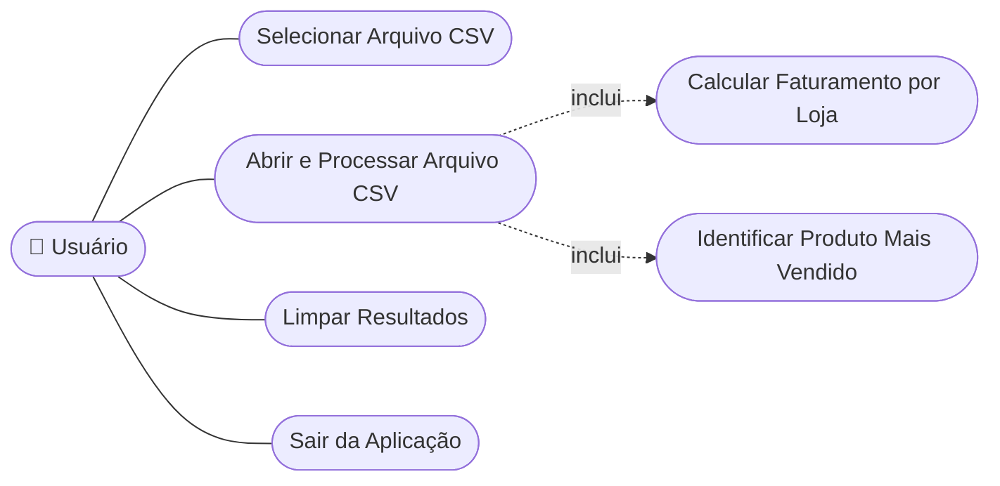

### 📝 Caso de Uso Detalhado — UC02: Abrir e Processar Arquivo CSV

| Campo | Descrição |
|:------|:----------|
| **Pré-condições** | Um caminho de arquivo `.csv` válido foi definido via UC01. |
| **Fluxo Principal** | 1. Usuário clica em *Arquivo → Abrir...* <br> 2. Sistema lê o arquivo linha a linha <br> 3. Sistema ignora a linha de cabeçalho <br> 4. Sistema divide cada linha por `;` <br> 5. Sistema atualiza a lista de faturamento por loja <br> 6. Sistema atualiza o mapa de produtos mais vendidos <br> 7. Sistema exibe o conteúdo bruto e os resultados calculados |
| **Fluxo Alternativo** | Se o arquivo não puder ser lido, o sistema exibe um diálogo de erro (`JOptionPane.ERROR_MESSAGE`). |
| **Pós-condições** | Os campos de resultado e a área de pré-visualização exibem valores atualizados. |

</details>

---

<details>
<summary><h2>3. Matriz de Rastreabilidade de Requisitos 🔗</h2></summary>

| Requisito | Caso de Uso | Classe / Método | Diagrama(s) | Verificação |
|:----------|:------------|:-----------------|:------------|:------------|
| RF01 / RN06 | UC01 | `Painel.jMenuProcurarActionPerformed()` | Casos de Uso, Sequência | Teste manual na GUI |
| RF02 / RN01 / RN02 | UC02 | `Painel.jMenuAbrirActionPerformed()` | Atividades, DFD | Teste manual na GUI |
| RF03 | UC02 | `Painel.textArea` | Sequência, Wireframe | Teste manual na GUI |
| RF04 / RN03 | UC02, UC03 | `Venda.precoUnitario`, lista `comercio` | Classes, Atividades, DFD | Teste manual na GUI |
| RF05 / RN04 | UC03 | `textField1`–`textField4` | Sequência, Wireframe | Teste manual na GUI |
| RF06 / RN05 | UC02, UC04 | mapa `produtosVendidos` | Atividades, DFD, Linhagem de Dados | Teste manual na GUI |
| RF07 | UC04 | `textField5` | Sequência, Wireframe | Teste manual na GUI |
| RF08 | UC05 | `Painel.jButtonClearActionPerformed()` | Máquina de Estados, Casos de Uso | Teste manual na GUI |
| RF09 | UC06 | `Painel.jMenuSairActionPerformed()` | Máquina de Estados, Casos de Uso | Teste manual na GUI |
| RF10 | — | `Painel.jMenuSalvarActionPerformed()` | Casos de Uso | Teste manual na GUI |
| RNF01 | Todos | `Painel` (menu, atalhos) | Componentes, Wireframe | Revisão manual |
| RNF02 | — | `pom.xml` do Maven | Implantação | Verificação de build (`mvn compile`) |
| RNF03 | UC02 | `jMenuAbrirActionPerformed()` (laço único) | Atividades | Revisão de código |
| RNF05 | UC02 | `try/catch` + `JOptionPane` | Sequência | Teste manual na GUI (arquivo inválido) |

</details>

---

<details>
<summary><h2>4. Documento de Especificação de Requisitos de Software (SRS) 📄</h2></summary>

### 1. Introdução

- **Propósito**: descrever os requisitos funcionais e não funcionais do Analisador de Vendas CSV, uma aplicação desktop que calcula análises de vendas a partir de um arquivo CSV.
- **Escopo**: aplicação desktop monousuário; lê um arquivo CSV por sessão; sem camada de persistência; sem comunicação em rede.
- **Definições**: ver o glossário em [Requisitos de Domínio](#1-requisitos).

### 2. Descrição Geral

- **Perspectiva do Produto**: aplicação Java Swing autônoma, empacotada com Maven, ponto de entrada `Painel.main()`.
- **Classes de Usuário**: uma única classe de usuário — equipe da loja realizando análise de vendas.
- **Ambiente Operacional**: qualquer SO desktop com JDK 21+ (Windows, Linux, macOS).
- **Restrições**: o CSV deve ser delimitado por `;`; apenas as 4 primeiras lojas são exibidas; processamento somente em memória.

### 3. Requisitos Específicos

- Ver [Seção 1 — Requisitos](#1-requisitos) para o conjunto completo de **RF / RNF / RN / Domínio / Dados / Interface**.
- Ver [Seção 2 — Casos de Uso](#2-casos-de-uso) para a especificação comportamental.
- Ver [Seção 6 — Modelo de Dados e Dicionário de Dados](#6-modelo-de-dados-e-dicionário-de-dados) para a especificação de dados.

### 4. Apêndices

- [Diagramas UML e Estruturais](#5-diagramas-uml-e-estruturais)
- [Diagrama de Fluxo de Dados (DFD)](#7-diagrama-de-fluxo-de-dados-dfd)
- [Diagrama de Arquitetura e Fluxograma](#8-diagrama-de-arquitetura-e-fluxograma)
- [Persona e Mapa de Jornada do Usuário](#9-persona-e-mapa-de-jornada-do-usuário)
- [Wireframes e Mockups](#10-wireframes-e-mockups)

</details>

---

<details>
<summary><h2>5. Diagramas UML e Estruturais 🗺️</h2></summary>

### 🧍 Diagrama de Casos de Uso

> Ver [Seção 2 — Diagrama de Casos de Uso](#2-casos-de-uso).

### 🧱 Diagrama de Classes

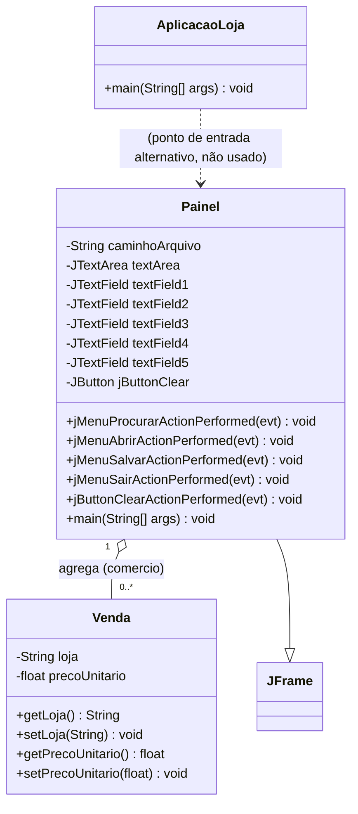

### 🔵 Diagrama de Objetos

> Exemplo de instantâneo em tempo de execução após processar um CSV com 2 lojas.

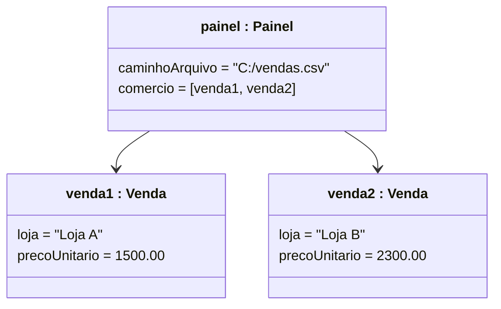

### 🔁 Diagrama de Sequência — Abrir e Processar CSV

```mermaid
sequenceDiagram
    actor Usuario as Usuário
    participant Painel as Painel (JFrame)
    participant FS as Sistema de Arquivos
    participant Venda as Venda (modelo)

    Usuario->>Painel: clica em "Abrir..."
    Painel->>FS: new BufferedReader(caminhoArquivo)
    FS-->>Painel: fluxo do arquivo
    loop para cada linha do CSV
        Painel->>Painel: divide a linha por ";"
        Painel->>Venda: new Venda(loja, total)
        Painel->>Painel: atualiza lista comercio e mapa produtosVendidos
    end
    Painel->>Painel: atualiza textField1-5 e textArea
    Painel-->>Usuario: exibe faturamento e produto mais vendido
```

### 💬 Diagrama de Comunicação

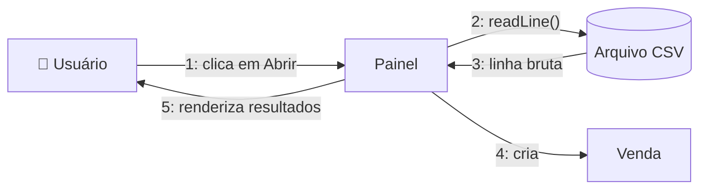

### 🔄 Diagrama de Atividades — Algoritmo de Leitura e Agregação

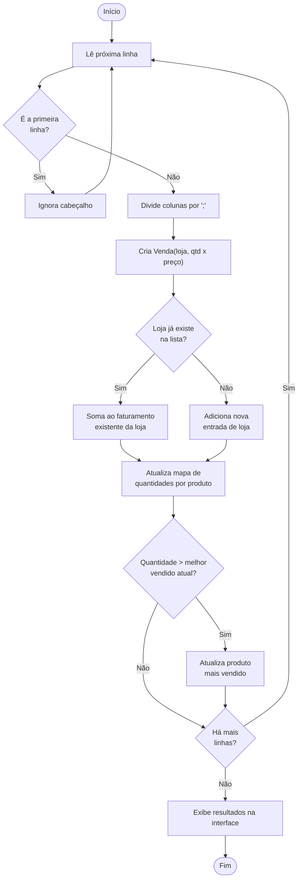

### 🔀 Diagrama de Máquina de Estados — Estado da Aplicação

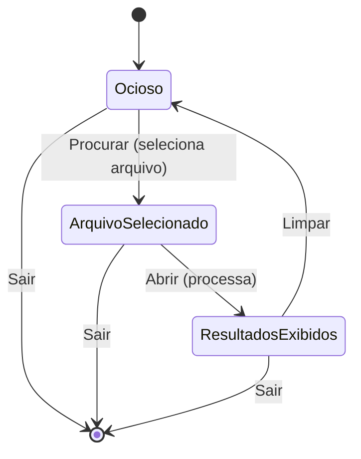

### 🧩 Diagrama de Componentes

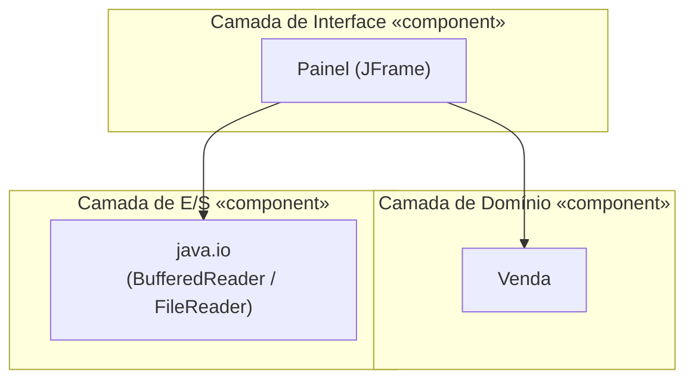

### 🖥️ Diagrama de Implantação (Deployment)

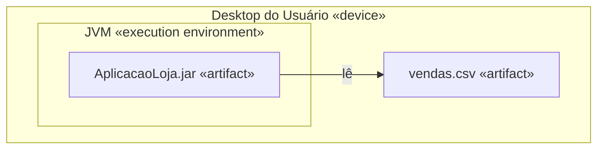

### 📦 Diagrama de Pacotes

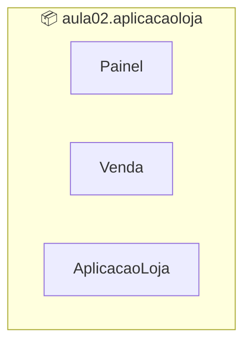

### 🧬 Diagrama de Estrutura Composta — Internos do Painel

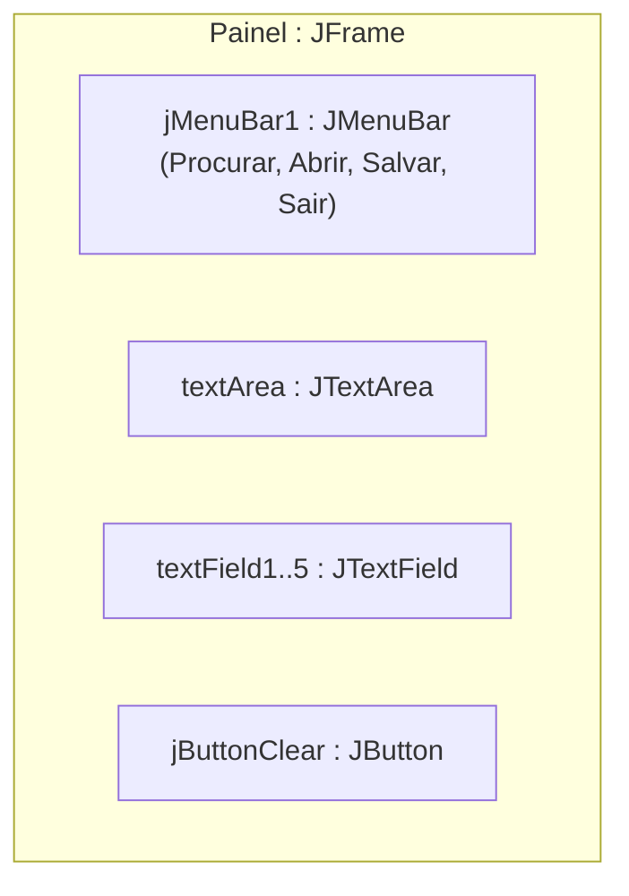

### 🖼️ Diagrama de Visão Geral de Interação

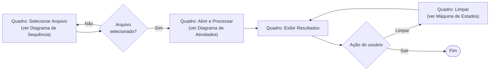

### ⏱️ Diagrama de Tempo (Timing) — Campos da Interface ao longo do Tempo

| Tempo | `textField1`–`4` (Faturamento por Loja) | `textField5` (Mais Vendido) | `textArea` (Pré-visualização) |
|:------|:-------------------------------------------|:--------------------------------|:----------------------------------|
| t0 — Início da aplicação | vazio | vazio | vazio |
| t1 — Arquivo selecionado (`Procurar`) | vazio | vazio | vazio |
| t2 — Arquivo aberto (`Abrir`) | vazio | vazio | conteúdo bruto do CSV |
| t3 — Durante o processamento | preenchido progressivamente (1 por loja) | vazio | conteúdo bruto do CSV |
| t4 — Processamento concluído | faturamento por loja (até 4) | produto / quantidade | conteúdo bruto do CSV |
| t5 — Clique em `LIMPAR` | vazio | vazio | vazio |

</details>

---

<details>
<summary><h2>6. Modelo de Dados e Dicionário de Dados 🗄️</h2></summary>

### 🔗 Diagrama Entidade-Relacionamento (DER)

> O CSV é um arquivo plano, mas conceitualmente cada linha representa uma relação entre uma **Loja**, um **Produto** e uma **Venda**.

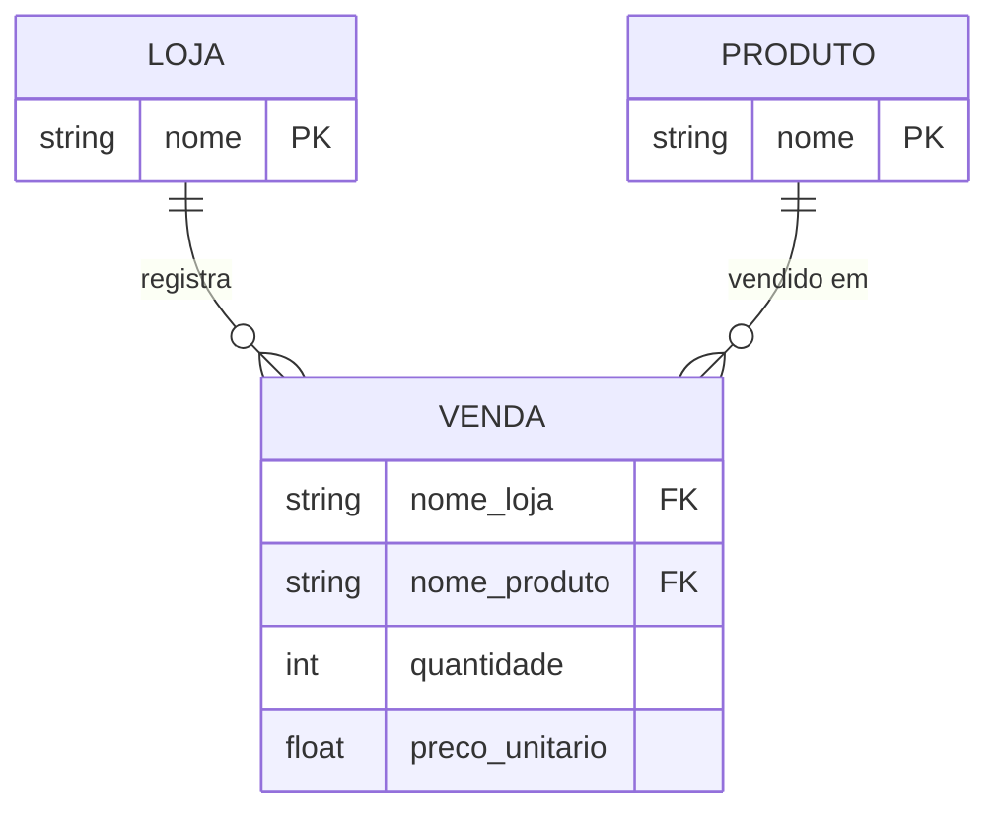

### 🧠 Modelo Conceitual de Dados

- **Loja** — um ponto de venda, identificado pelo nome.
- **Produto** — um item que pode ser vendido, identificado pelo nome.
- **Venda** — uma transação que liga uma Loja e um Produto, com quantidade e preço unitário.

### 🧩 Modelo Lógico de Dados

| Entidade | Atributo | Tipo | Chave |
|:---------|:---------|:-----|:------|
| `LOJA` | `nome` | String | PK |
| `PRODUTO` | `nome` | String | PK |
| `VENDA` | `nome_loja` | String | FK → LOJA |
| `VENDA` | `nome_produto` | String | FK → PRODUTO |
| `VENDA` | `quantidade` | Integer | — |
| `VENDA` | `preco_unitario` | Decimal | — |

### 💽 Modelo Físico de Dados (como implementado)

- **Armazenamento**: um único arquivo `.csv` plano, delimitado por `;`, sem esquema imposto.
- **Representação em memória**:
  - Classe `Venda` → `loja: String`, `precoUnitario: float` (já multiplicado `quantidade × preço unitário`).
  - `ArrayList<Venda> comercio` → uma entrada agregada por loja distinta.
  - `HashMap<String, Integer> produtosVendidos` → nome do produto → quantidade total vendida.

### 📖 Dicionário de Dados (colunas do CSV, conforme lido por `Painel.jMenuAbrirActionPerformed`)

| Índice | Coluna | Tipo | Descrição | Usado? |
|:------:|:-------|:-----|:----------|:-------|
| 0 | *(não usado)* | String | Identificador da linha, reservado no arquivo de origem | ❌ |
| 1 | *(não usado)* | String | Campo de data, reservado no arquivo de origem | ❌ |
| 2 | `loja` | String | Nome da loja | ✅ `Venda.loja` |
| 3 | *(não usado)* | String | Campo de categoria, reservado no arquivo de origem | ❌ |
| 4 | `produto` | String | Nome do produto | ✅ chave do mapa de mais vendidos |
| 5 | `quantidade` | Integer | Quantidade vendida nesta linha | ✅ `Integer.parseInt(colunas[5])` |
| 6 | `preco_unitario` | Float | Preço unitário (ponto decimal `.`) | ✅ `Float.parseFloat(colunas[6])` |

> ⚠️ As colunas 0, 1 e 3 devem permanecer presentes no arquivo (para manter os índices corretos), mesmo que a lógica atual não utilize seus valores.

</details>

---

<details>
<summary><h2>7. Diagrama de Fluxo de Dados (DFD) 🔄</h2></summary>

### 🌐 Nível 0 — Diagrama de Contexto

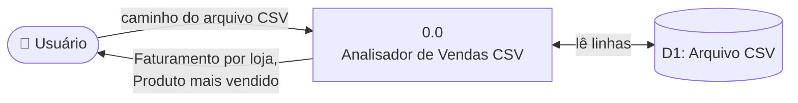

### 🔬 Nível 1 — DFD Detalhado

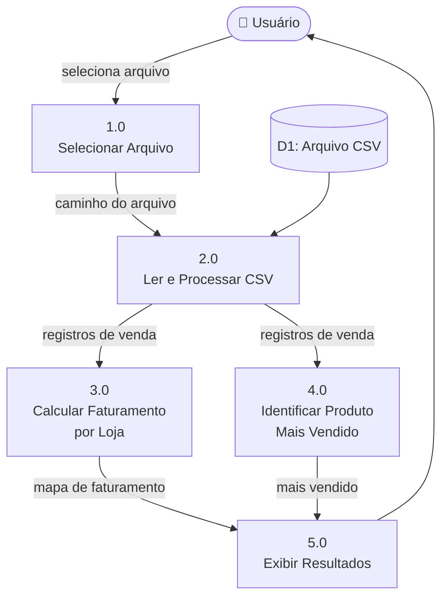

### 🧵 Diagrama de Linhagem de Dados

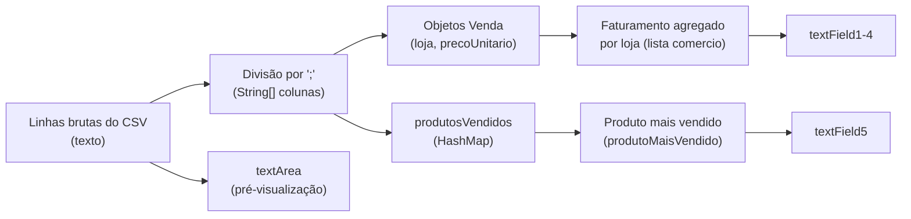

</details>

---

<details>
<summary><h2>8. Diagrama de Arquitetura e Fluxograma 🏗️</h2></summary>

### 🏛️ Visão Geral da Arquitetura

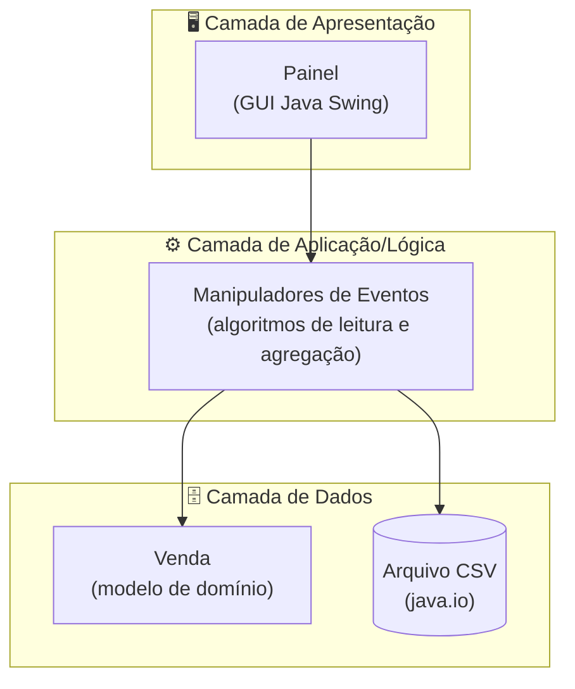

### 🧭 Fluxograma da Aplicação

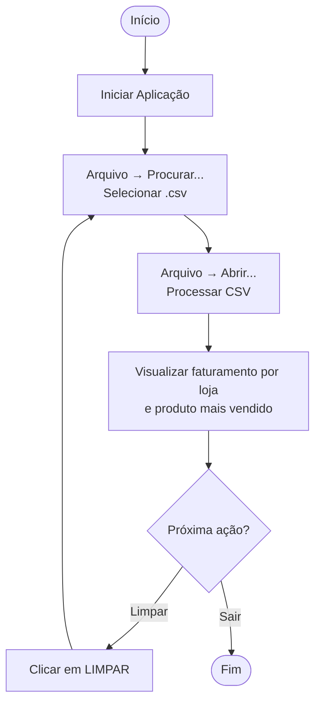

</details>

---

<details>
<summary><h2>9. Persona e Mapa de Jornada do Usuário 👤</h2></summary>

### 🧑 Persona

| Campo | Descrição |
|:------|:----------|
| **Nome** | Marcos Oliveira |
| **Cargo** | Supervisor de Vendas em uma pequena rede de varejo |
| **Idade** | 38 |
| **Conhecimento técnico** | Médio — confortável com aplicações desktop e planilhas |
| **Objetivo** | Comparar rapidamente o faturamento semanal entre as filiais e identificar o produto mais vendido |
| **Frustração** | Montar tabelas dinâmicas manualmente em planilhas toda semana |
| **Frase** | *"Eu só preciso dos números, rápido — sem abrir o Excel."* |

### 🗺️ Mapa de Jornada do Usuário

| Etapa | Ação | Ponto de Contato | Pensamentos | Emoção | Oportunidade |
|:------|:-----|:------------------|:-------------|:-------|:--------------|
| 1. Surge a necessidade | Quer comparar o faturamento semanal | Exportação do sistema de PDV | "Preciso disso rápido" | 😐 Neutro | — |
| 2. Inicia a aplicação | Abre o Analisador de Vendas CSV | Atalho na área de trabalho | "Janela simples, parece fácil" | 🙂 Curioso | — |
| 3. Seleciona o arquivo | `Arquivo → Procurar...` | `JFileChooser` | "Fácil encontrar meu arquivo" | 🙂 Confiante | — |
| 4. Processa | `Arquivo → Abrir...` | Janela da aplicação | "Totais instantâneos, ótimo!" | 😀 Satisfeito | — |
| 5. Analisa | Lê o faturamento por loja e o mais vendido | Campos de resultado | "Era exatamente o que eu esperava" | 😀 Satisfeito | Adicionar exportação para PDF/Excel |
| 6. Reinicia / Encerra | Clica em `LIMPAR` ou sai | Botão / menu | "Pronto para o próximo arquivo" | 🙂 Confiante | — |

</details>

---

<details>
<summary><h2>10. Wireframes e Mockups 🎨</h2></summary>

### 📐 Wireframe de Baixa Fidelidade

```text
+---------------------------------------------------------------+
| ARQUIVO                                                        |
+---------------------------------------------------------------+
|  TOTAL DE VENDAS POR LOJA                                      |
|                                                                 |
|  LOJA: [ Loja A / 1500.00 ]       +-----------------------+    |
|  LOJA: [ Loja B / 2300.00 ]       |                       |    |
|  LOJA: [ Loja C / 980.00  ]       |   Pré-visualização    |    |
|  LOJA: [ Loja D / 1120.00 ]       |   do CSV (textArea)   |    |
|                                    +-----------------------+    |
+---------------------------------------------------------------+
|  QUANTIDADES                                                   |
|  [ Nome do produto mais vendido / qtd unidades ]  ( LIMPAR )   |
+---------------------------------------------------------------+
```

### 🎯 Notas do Mockup

- **Fundo**: preto (`Color(0, 0, 0)`), rótulos em alto contraste e negrito — corresponde a `Painel.initComponents()`.
- **Tipografia**: rótulos de seção (`LOJA:`, `TOTAL DE VENDAS POR LOJA`, `QUANTIDADES`) em negrito, fonte grande (`Dialog`/`Segoe UI`, 24–36pt).
- **Ação primária**: botão `LIMPAR (CLEAR)`, fonte tamanho 24, posicionado no canto inferior direito, próximo ao campo do mais vendido.
- **Barra de menu**: um único menu de nível superior `ARQUIVO` com os itens *Procurar*, *Abrir*, *Salvar*, *Sair* (atalhos `Ctrl+P`, `Ctrl+A`, `Ctrl+S`, `Esc`).

</details>

---

## 📋 Formato do CSV Esperado

> Para o processamento correto, o arquivo CSV deve seguir a estrutura abaixo (ver [Dicionário de Dados](#6-modelo-de-dados-e-dicionário-de-dados)).

| Propriedade | Valor Esperado |
|:------------|:----------------|
| **Delimitador** | Ponto e vírgula (`;`) |
| **Colunas** | 7 colunas (índices 0–6) — apenas os índices `2`, `4`, `5`, `6` são usados |
| **Cabeçalho** | A **primeira linha** é sempre ignorada |
| **Codificação** | UTF-8 recomendado |

### 📄 Exemplo de Arquivo CSV

```csv
id;data;loja;categoria;produto;quantidade;preco_unitario
1;2024-01-01;Loja A;Geral;Produto X;10;25.00
2;2024-01-01;Loja A;Geral;Produto Y;5;40.00
3;2024-01-02;Loja B;Geral;Produto X;20;25.00
4;2024-01-02;Loja B;Geral;Produto Z;8;15.00
5;2024-01-03;Loja C;Geral;Produto Y;12;40.00
6;2024-01-03;Loja D;Geral;Produto Z;3;15.00
```

---

## 📂 Estrutura do Projeto

```plaintext
AplicacaoLoja/
│
├── 📄 pom.xml                                  # ⚙️  Configurações e dependências do Maven
│
└── 📁 src/
    └── 📁 main/
        └── 📁 java/
            └── 📁 aula02/
                └── 📁 aplicacaoloja/
                    ├── 📄 AplicacaoLoja.java   # 🚀 Ponto de entrada alternativo (placeholder)
                    ├── 📄 Painel.java          # 🖥️  Interface gráfica principal (JFrame) ← CORE
                    └── 📄 Venda.java           # 🏛️  Modelo de domínio — Venda (loja + preço)
```

---

## 🚀 Como Compilar e Executar

### 📋 Pré-requisitos

| Requisito | Detalhe |
|:----------|:--------|
| **JDK** | Versão **21 ou superior** instalada e configurada no `PATH`. |
| **Apache Maven** | Instalado e configurado no `PATH`. |
| **Git** | Para clonar o repositório. |

---

### 💻 Opção 1 — Linha de Comando

**1. Clone o repositório e acesse a pasta do projeto:**

```bash
git clone https://github.com/VictorHJesusSantiago/AplicacaoLoja.git
cd AplicacaoLoja
```

**2. Compile o projeto com Maven:**

```bash
mvn compile
```

**3. Execute a classe principal:**

```bash
# Windows / Linux / macOS
java -cp "target/classes" aula02.aplicacaoloja.Painel
```

---

### 🖥️ Opção 2 — IDE (Recomendado)

```
1. Abra sua IDE preferida (IntelliJ IDEA, NetBeans ou Eclipse)
2. File → Open → Importe como "Projeto Maven existente"
3. Aguarde o Maven sincronizar as dependências
4. Localize: src/main/java/aula02/aplicacaoloja/Painel.java
5. Clique com o botão direito → "Run" (ou pressione Shift + F10)
```

---

### 🎯 Como Usar a Aplicação

| Passo | Ação |
|:-----:|:-----|
| 1️⃣ | Inicie a aplicação pelo método acima. |
| 2️⃣ | Clique em **Arquivo → Procurar...** e selecione seu arquivo `.csv`. |
| 3️⃣ | Clique em **Arquivo → Abrir...** para processar e visualizar os resultados. |
| 4️⃣ | Analise o **faturamento por loja** e o **produto mais vendido** nos campos exibidos. |
| 5️⃣ | Use o botão **LIMPAR** para resetar todos os campos e carregar um novo arquivo. |

---

## 🤝 Como Contribuir

> Contribuições são muito bem-vindas! Siga as etapas abaixo para colaborar de forma organizada.

| Passo | Ação | Comando |
|:-----:|:-----|:--------|
| 1️⃣ | **Fork** o repositório para a sua conta. | — |
| 2️⃣ | Crie sua feature branch a partir da `main`. | `git checkout -b feature/NovaFeature` |
| 3️⃣ | Salve as alterações com mensagem clara e semântica. | `git commit -m 'feat: Adiciona NovaFeature'` |
| 4️⃣ | Envie a branch para o repositório remoto. | `git push origin feature/NovaFeature` |
| 5️⃣ | Abra um Pull Request detalhando as mudanças realizadas. | — |

<div align="center">

<br>

**Se este projeto foi útil para os seus estudos, deixe uma estrela ⭐️ no repositório!**

</div>

---

## 👨‍💻 Autor

<div align="center">

<br>

**Victor H. J. Santiago**

<br>

[](https://github.com/VictorHJesusSantiago)
[](https://www.linkedin.com/in/victor-henrique-de-jesus-santiago/)

</div>

---

## 📄 Licença

<div align="center">

Este projeto está distribuído sob a **Licença MIT**.
Consulte o arquivo [`LICENSE`](./LICENSE) no repositório para mais informações.


</div>

---

<div align="center">

*Feito com 📊 e Java por **Victor H. J. Santiago***

</div>
